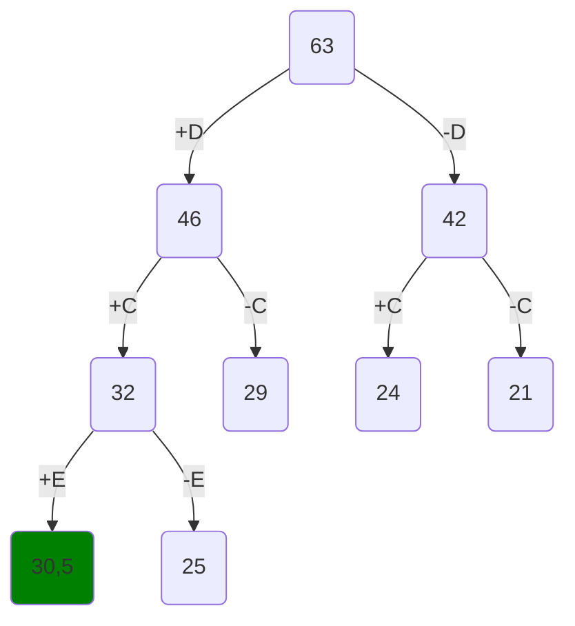
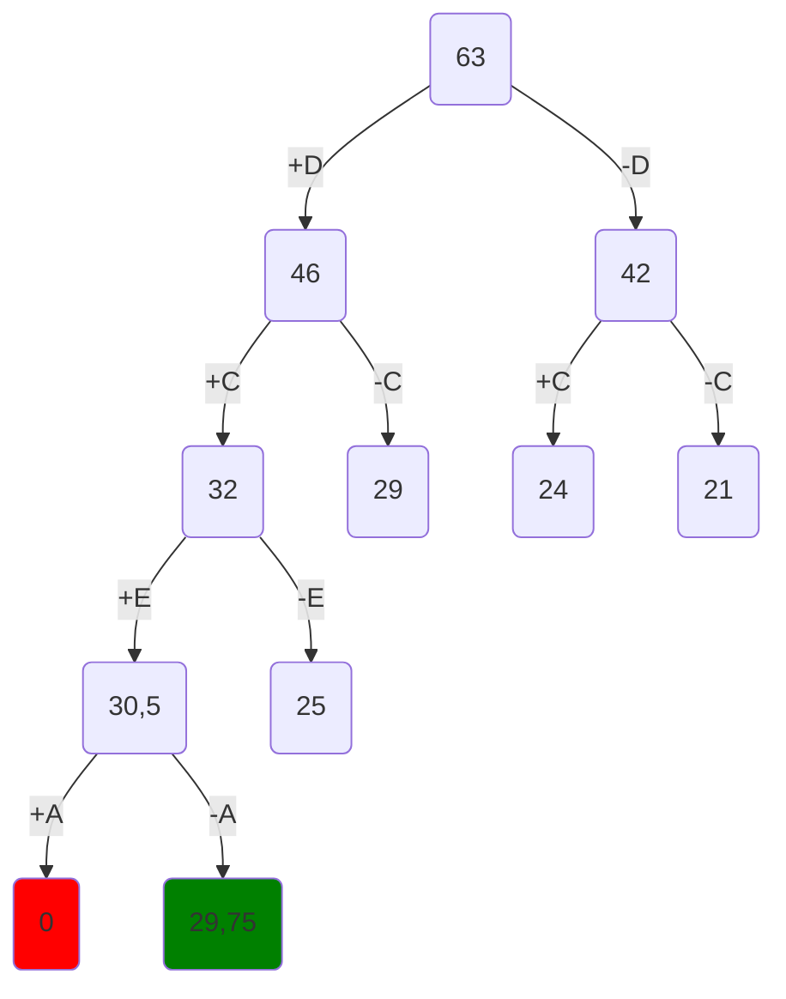
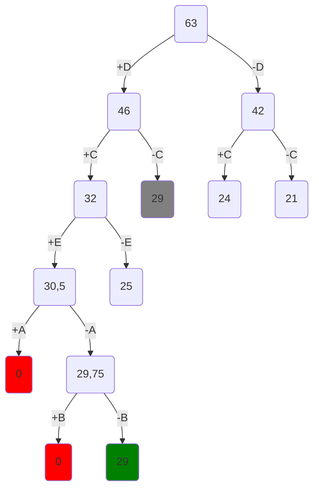

# Задание №18
# Задача о рюкзаке. Метод ветвей и границ.

Для каждого варианта представлены условия задачи, в соответствии с которыми необходимо: 
1. Решить задачу о рюкзаке с применением метода ветвей и границ.
2. Оформить решение задачи по шагам с подробными комментариями, таблицами и диаграммами.
3. **В узлах построенного дерева привести расчет оценки и указать порядковый номер, по которым можно проверить порядок исследования узлов дерева**, либо оформить решение с пошаговым построением дерева (как в примере README).
4. В ответе указать:
   - максимально возможную стоимость предметов в рюкзаке,
   - набор предметов, обеспечивающих максимальную стоимость,
   - общий вес предметов в рюкзаке,
   - свободное место в рюкзаке.

---

### Вариант 9:

| Предметы  |  A  | B  | C | D  | E  |
|:----------|:---:|:--:|:-:|:--:|:--:|
| Стоимость |  5  | 3  | 6 | 12 | 11 |
| Вес       | 10  | 12 | 3 | 4  | 11 |

Ограничение вместимости: 21

---

## Решение

Определим такой набор предметов, который помещается в рюкзак и имеет максимально возможну стоимость, при помощи метода ветвей и границ.

### Шаг 1

Суммарный вес всех предметов равен 40, соответственно, они все не помещаются в рюкзак с ограничением вместимости 21.

Рассчитаем для каждого предмета удельную стоимость, поделив его стоимость на вес. Сразу же отсортируем предметы в порядке убывания удельной стоимости:

| Предметы          |  D  | C  | E  | A  | B  |
|:------------------|:---:|:--:|:--:|:--:|:--:|
| Стоимость         |  12 | 6  | 11 | 5  | 3  |
| Вес               |  4  | 3  | 11 | 10 | 12 |
| Удельная стоимость|  3  | 2  |  1 | ½ | ¼ |

Вычислим оценку сверху суммарной стоимости предметов в рюкзаке. Так как вместимость рюкзака 21, а максимальная ценность предмета составляет 3, то стоимость набора предметов, помещающихся в рюкзак, не может превышать $21 \cdot 3 = 63$.

---

### Шаг 2

Разложим множество всех вариантов наборов предметов на два подмножества и начнём строить дерево вариантов. Первое подмножество будет в себя включать все варианты, при которых самый ценный предмет из оставшихся поместили в рюкзак, этому случаю соответствует левый потомок дерева. Все остальные варианты, когда самый ценный предмет не положили, составляют второе подмножество, которому соответствует правый потомок. Корнем дерева является полученная ранее оценка сверху.

Начнём с самого ценного предмета $D$. 
1. Если его положить в рюкзак, стоимость предметов в нём увеличивается на 12, а вместимость уменьшается на 4. Можем вычислить оценку перспективности этого варианта (для оценки сверху считаем, что весь оставшийся объём можно заполнить следующим по стоимости предметом):

$$
12 + (21-4) \cdot 2 = 46.
$$

2. Если предмет $D$ в рюкзак не добавляется, то считаем оценку сверху для всех наборов остальных предметов, используя удельную стоимость следующего по ценности предмета:

$$
21 \cdot 2 = 42.
$$

У левого потомка оценка выше, соответственно, выгоднее дальше рассматривать этот вариант.

---

### Шаг 3

Учитываем, что на предыдущем шаге предмет $D$ положили в рюкзак, то есть суммарная стоимость предметов в нём 12, а вместимость $21-4=17$. Рассмотрим следующий по стоимости предмет $C$.

1. Если его положить в рюкзак, то суммарная стоимость увеличится на 6, а вместимость уменьшится на 3. Оставшееся место заполним следующим по ценности предметом $E$ с удельной стоимостью 1:

$$
12+6+(21-4-3) \cdot 1 = 32.
$$

2. Если предмет $C$ не класть в рюкзак, то свободное место заполним предметом $E$:

$$
12+(21-4) \cdot 1 = 29.
$$

Наиболее перспективным оказывается вариант на уровне выше с оценкой 42, продолжим строить дерево из этого узла.

---

### Шаг 4

В данное подмножество входят все варианты наборов предметов без предмета $D$, т.е. рюкзак пока пуст. Рассмотрим следующий по ценности предмет $C$.

1. Пусть предмет $C$ положили в рюкзак, тогда суммарная стоимость выбранных предметов увеличивается на 6, а вместимость уменьшается на 3. Оставшееся в рюкзаке место заполним следующим по ценности предметом $E$ с удельной стоимостью 1:

$$
6+(21-3) \cdot 1 = 24.
$$

2. Если предмет $C$ не положить в рюкзак, то для остальных предметов оценка сверху:

$$
21 \cdot 1 = 21.
$$

На данный момент наиболее перспективным является вариант с оценкой 32, в котором предметы $C$ и $D$ положили в рюкзак.

---

Шаг 5

В рюкзаке находятся предметы $C$ и $D$. Рассмотрим теперь, следует ли к ним добавлять следующий по ценности предмет $E$.

1. Если предмет $E$ положить в рюкзак, его вместимость уменьшится на 11, а суммарная стоимость увеличится на 11. Для оценки оставшееся место в рюкзаке заполним следующим по ценности предметом $A$:

$$
12+6+11+(21-4-3-11) \cdot \frac{1}{2} = 30,5.
$$

2. Если предмет $E$ не класть в рюкзак, то оставшееся место заполним следующим по ценности предметом $A$. Получим оценку для правого потомка:

$$
12+6+(21-4-3) \cdot \frac{1}{2}=25.
$$

Самым перспективным оказывается вариант с оценкой 30,5.

---

### Шаг 5

Пусть в рюкзаке уже находятся предметы $C$, $D$, $E$. Рассмотрим следующий предмет $A$.

1. Если его положить в рюкзак, то суммарный вес предметов в нём $4+3+11+10=28$ превысит максимальную вместимость 21. Следовательно, не существует ни одного варианта, при котором предметы $A$, $C$, $D$ и $E$ будут находиться в рюкзаке, перспективность такого подмножества равна 0.

2. Если предмет $A$ не класть в рюкзак, а всё оставшееся место заполнить предметом $B$ ценностью $\frac{1}{4}$, имеем оценку перспективности для правого потомка:

$$
12+6+11+(21-4-3-11) \cdot \frac{1}{4} = 29,75.
$$

Это самый перспективный вариант.

--- 

### Шаг 6

В рюкзаке находятся предметы $C$, $D$, $E$, а предмет $A$ в него не положили. Рассмотрим последний предмет $B$.

1. Если его положить в рюкзак, то суммарный вес предметов $4+3+11+12=30$ превысит саму вместимость рюкзака 21. Соответственно, предмет $B$ в таком случае в рюкзак не поместится.

2. Предмет $B$ - последний предмет, если его не класть в рюкзак, то суммарная стоимость предметов $C$, $D$ и $E$:

$$
12 + 6 + 11 = 29.
$$

Суммарная стоимость предметов 29 является ответом, так как были рассмотрены все предметы и полученное значение является самым "перспективным".

Заметим, что такое же значение 29 встречается у другой вершины (в случае, когда в рюкзак положили предмет $D$, а предмет $C$ не положили). Теоретически, для подмножеств этого варианта оценка может не снизиться, однако оценка сверху говорит о том, что при их переборе нельзя получить значение больше 29. Следовательно, эту ветвь можно не рассматривать, так как она не даст решение "лучше" найденного.

---

## Ответ

Максимальной суммарной стоимости предметов в рюкзаке c данным ограничением вместимости можно добиться при помощи набора предметов $C$, $D$, $E$. Их суммарная стоимость составляет 29, общий вес предметов - 18, остаточная вместимость рюкзака равна 3.
