# Задание №19+ Вариант 1

# Транспортная задача. Решение с использованием алгоритма поиска максимального потока минимальной стоимости.

Для выполнения задания необходимо:
1. Решить поставленную задачу с использованием алгоритма поиска максимального потока минимальной стоимости.
2. Оформить решение задачи по шагам с подробными комментариями и диаграммами.
3. В ответе указать:
   - объем товаров, перевозимых от каждого поставщика к каждому потребителю,
   - общую стоимость транспортировки.

## **Постановка задачи**

Два завода (пусть A и B) имеют производительность 5 и 9, а два складских помещения (пусть C и D) имеют вместимость 7 и 5. Матрица затрат на перевозку одной единицы товара (строки – это заводы, столбцы – это склады) имеет вид:

$$
 \begin{pmatrix}    
  6 & 9 \\ 
  7 & 6 \\ 
 \end{pmatrix}    
$$

Требуется:
1. Найти стоимость перевозки с первого завода на второй склад 5 единиц товара, а со второго завода на первый склад 7 единиц товара;
2. Используя алгоритм поиска максимального потока минимальной стоимости, скорректировать указанный выше вариант перевозки товаров, так чтобы объём перевозимых товаров не изменился, а стоимость их перевозки стала минимальной.
---

## Пропускная способность дуг сети и стоимость транспортировки

Пусть:
- S - источник материалов, рабочей силы и прочих факторов для производительности заводов
- A - первый завод
- B - второй завод
- C - первый склад
- D - второй склад
- T - сток товаров, которые выходят на продажу

Тогда представим таблицу:

| Дуги                                          | SA | SB | AC | AD | BC | BD | CT | DT |
|:----------------------------------------------|:--:|:--:|:--:|:--:|:--:|:--:|:--:|:--:|
| Пропускная способность p(e)                   | 5  | 9  | 7  | 5  | 7  | 5  | 7  | 5  |
| Стоимость транспортировки единицы потока c(e) | 0  | 0  | 6  | 9  | 7  | 6  | 0  | 0  |

## Стоимость перевозки с первого завода на второй склад 5 единиц товара, а со второго завода на первый склад 7 единиц товара

$AD * c(e) + BC * c(e) = 5 * 9 +  7 * 7 = 45 + 49 = 94 (у.е.)$

## Сеть с источником **s**, стоком **t** и указанными пропускными способностями дуг

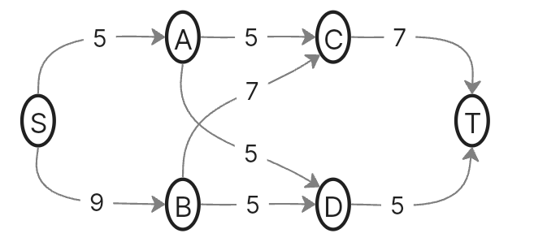

## Определим максимальный поток методом поиска увеличивающих путей в остаточной сети

### 1. Остаточная сеть

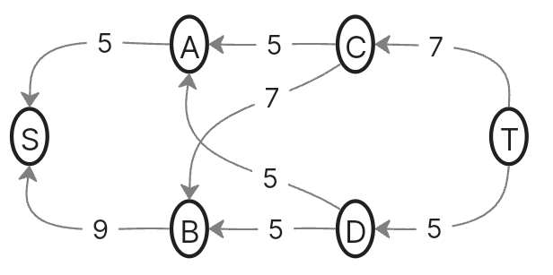

### 2. Поиск увеличивающего пути

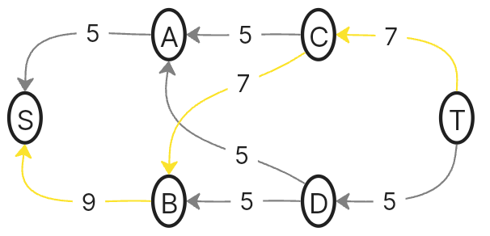

### 3. Уменьшаем вес дуг на найденном пути

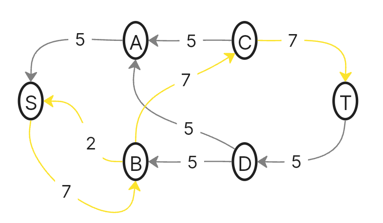

### 4. Поиск увеличивающего пути

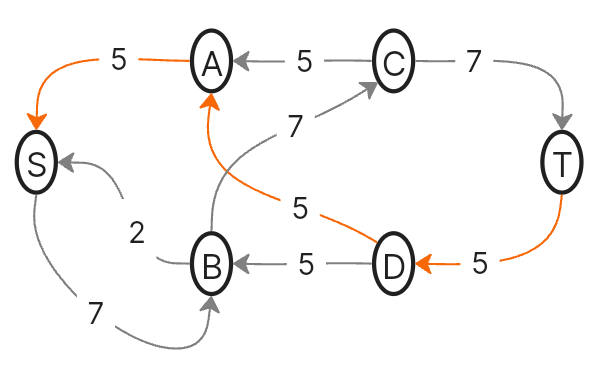

### 5. Уменьшаем вес дуг на найденном пути

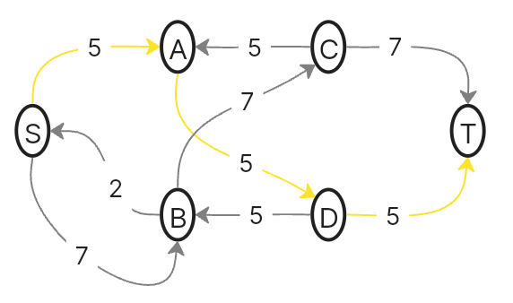

### 6. Найден максимальный поток

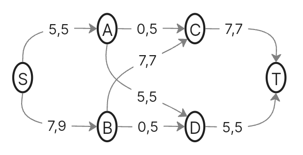

Обратим внимание на то, что задача несбалансированна, так как максимальный поток ограничен складами  (7 + 5 = 12), а не производительностью заводов (5 + 9 = 14).

## Рассчитаем стоимость полученного максимального потока

| Дуги                                          | SA | SB | AC | AD | BC | BD | CT | DT | Итого  |
|:----------------------------------------------|:--:|:--:|:--:|:--:|:--:|:--:|:--:|:--:|:------:|
| Пропускная способность p(e)                   | 5  | 9  | 5  | 5  | 7  | 5  | 7  | 5  |        |
| Локальный поток f(e)                          | 5  | 7  | 0  | 5  | 7  | 0  | 7  | 5  |        |
| Стоимость транспортировки единицы потока c(e) | 0  | 0  | 6  | 9  | 7  | 6  | 0  | 0  |        |
| Суммарная стоимость f(e)*c(e)                 | 0  | 0  | 0  | 45 | 49 | 0  | 0  | 0  | **94** |

Стоимость полученного потока составляет 94. 

## Попробуем уменьшить стоимость потока для чего построим остаточную сеть

### 1. Остаточная сеть стоимости транспортировки

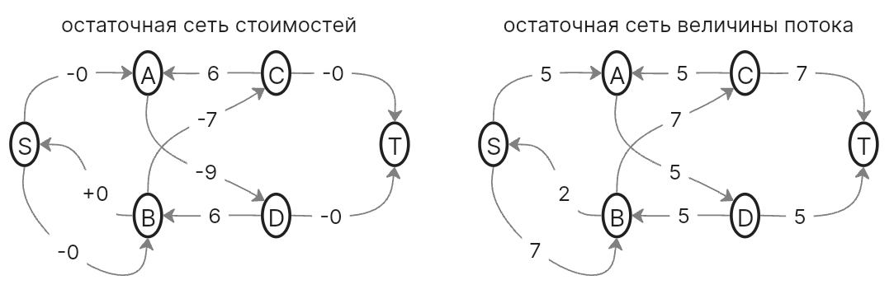

### 2. В остаточной сети найден ориентированный цикл отрицательной стоимости

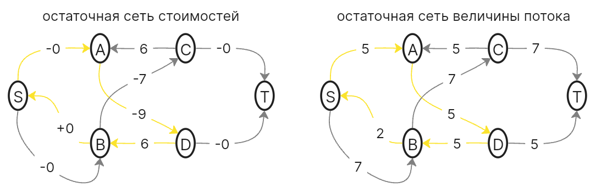

### 3. Изменим остаточную сеть величины потока (уменьшим рёбра на минимальный вес в цикле) и скорректируем остаточную сеть стоимости транспортировки

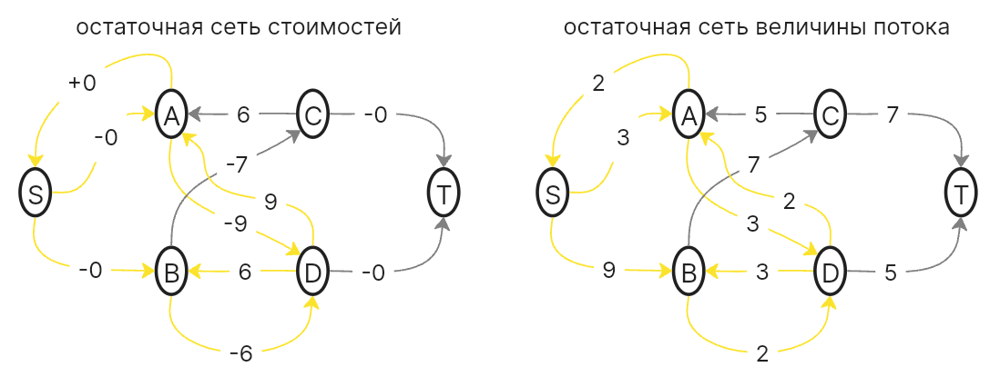

### 4. В остаточной сети найден ориентированный цикл отрицательной стоимости

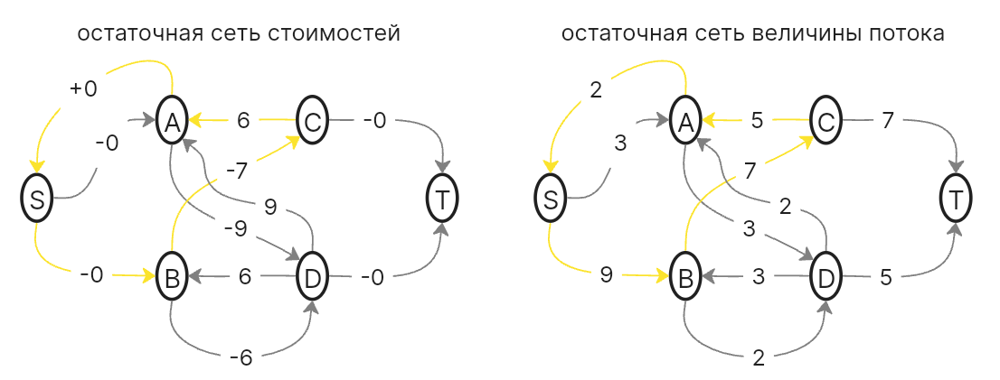

### 5. Изменим остаточную сеть величины потока (уменьшим рёбра на минимальный вес в цикле) и скорректируем остаточную сеть стоимости транспортировки

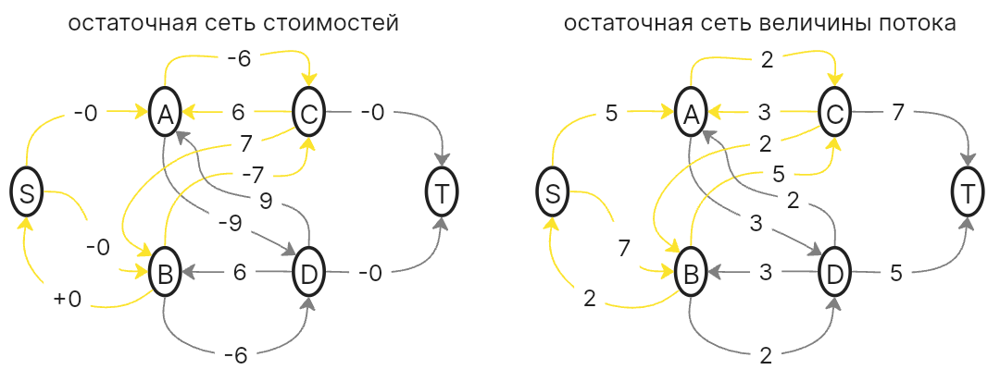

### 6. В остаточной сети найден ориентированный цикл отрицательной стоимости

### 7. Изменим остаточную сеть величины потока (уменьшим рёбра на минимальный вес в цикле) и скорректируем остаточную сеть стоимости транспортировки

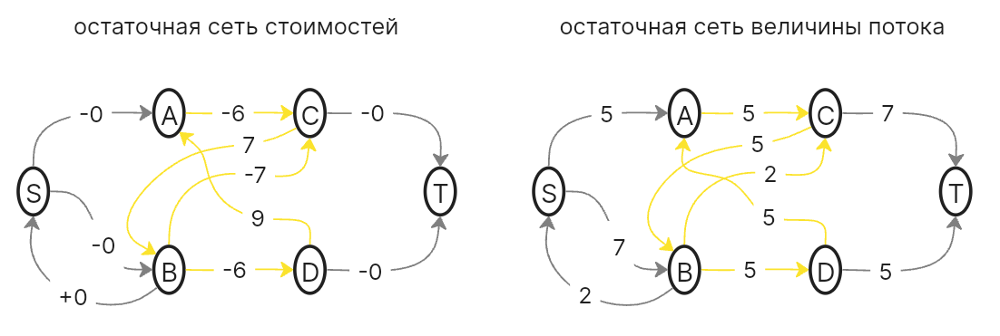

### 8. В остаточной сети отсутствуют циклы отрицательной стоимости, следовательно, стоимость максимального потока минимальна

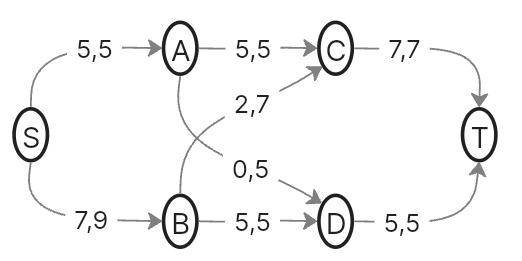

## Рассчитаем стоимость полученного максимального потока минимальной стоимости

| Дуги                                          | SA | SB | AC | AD | BC | BD | CT | DT | Итого  |
|:----------------------------------------------|:--:|:--:|:--:|:--:|:--:|:--:|:--:|:--:|:------:|
| Пропускная способность p(e)                   | 5  | 9  | 5  | 5  | 7  | 5  | 7  | 5  |        |
| Локальный поток f(e)                          | 5  | 7  | 5  | 0  | 2  | 5  | 7  | 5  |        |
| Стоимость транспортировки единицы потока c(e) | 0  | 0  | 6  | 9  | 7  | 6  | 0  | 0  |        |
| Суммарная стоимость f(e)*c(e)                 | 0  | 0  | 30 | 0  | 14 | 30 | 0  | 0  | **74** |

Стоимость полученного потока составляет 74. 

## Ответ:

1. Стоимость перевозки с первого завода на второй склад 5 единиц товара, а со второго завода на первый склад 7 единиц товара равна 94 у.е.

2. Максимальный объём перевозимых товаров равен 12, минимальная стоимость транспортировки равна 74, она реализуется следующим образом:

С первого завода (А, производительностью 5) направляется 5 единиц товара на первый склад (С, вместительностью 7). Со второго завода (В, производительностью 9, из которых задействовано 7) направляется 2 единицы товара на первый склад (С, где заполнили оставшееся место после первого завода) и 5 единиц товара на второй склад (D, вместительностью 5).