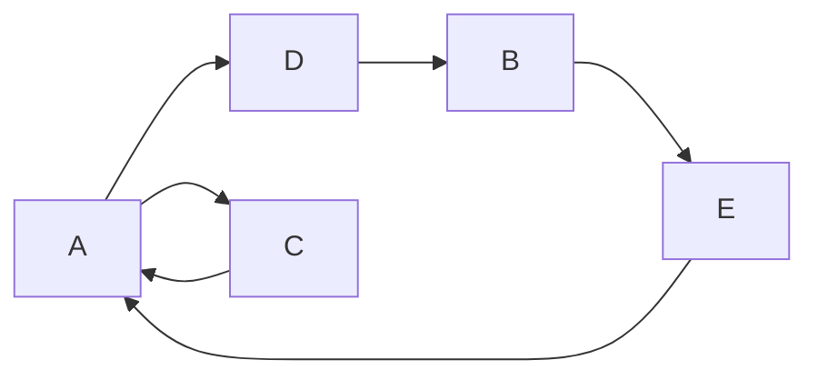
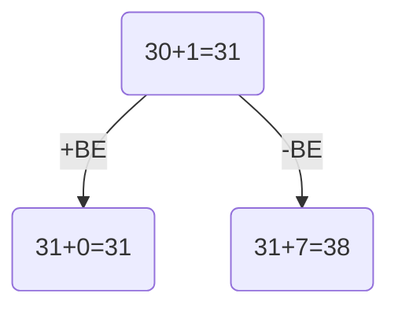
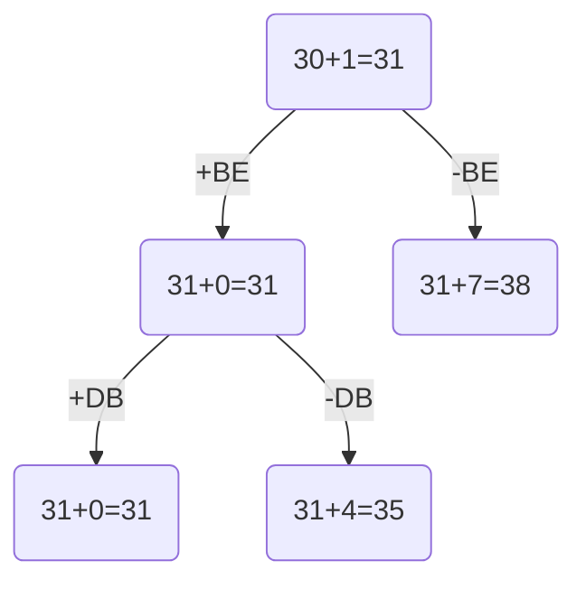
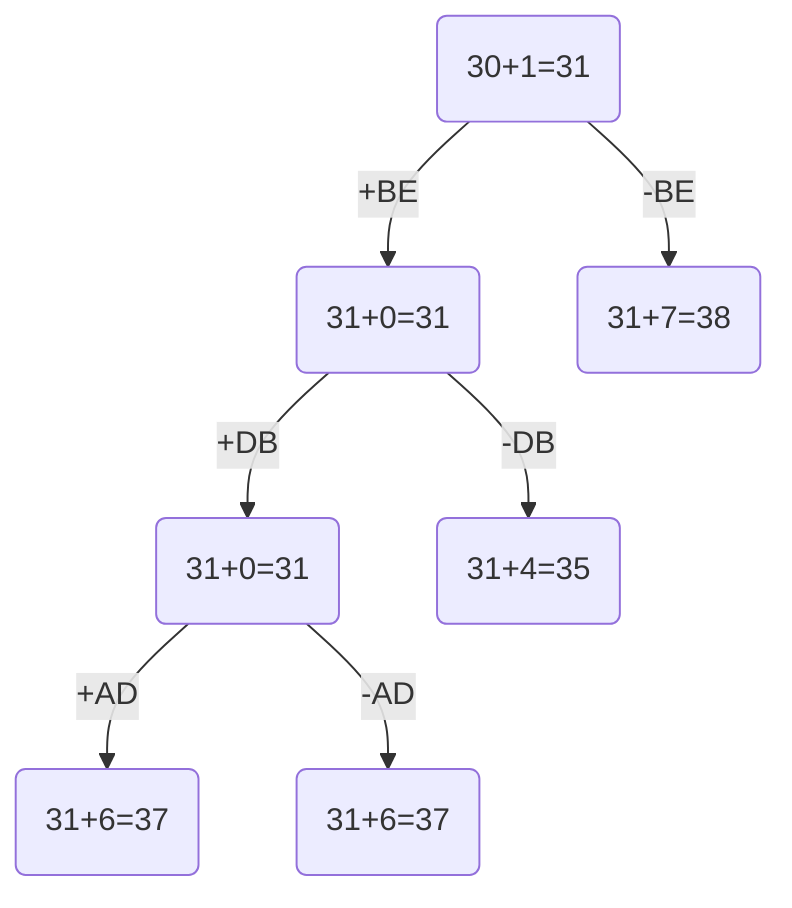
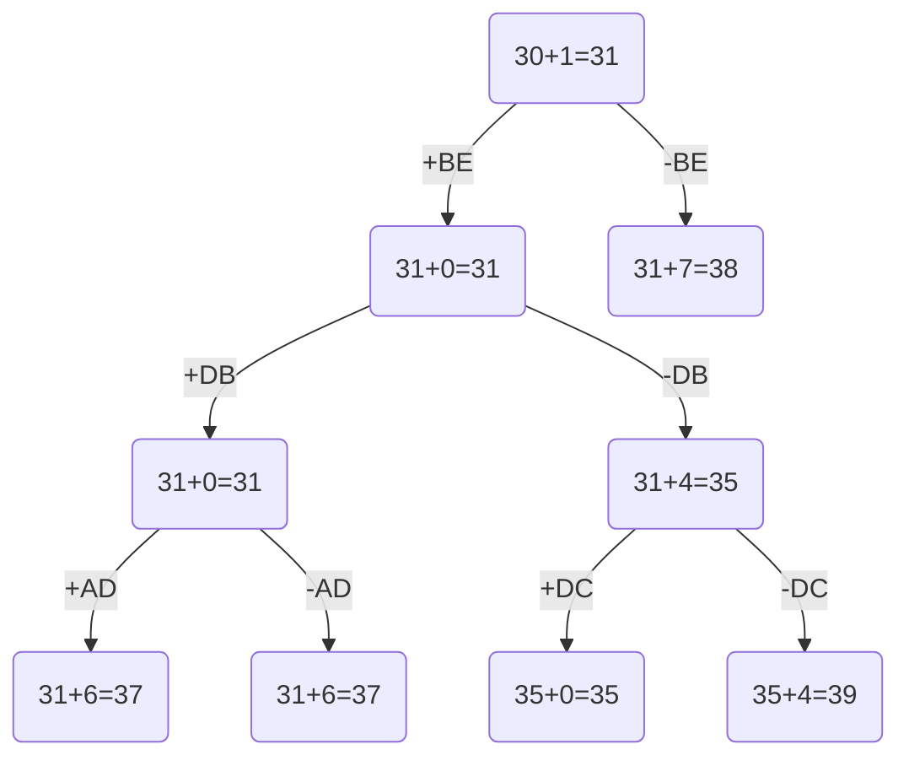
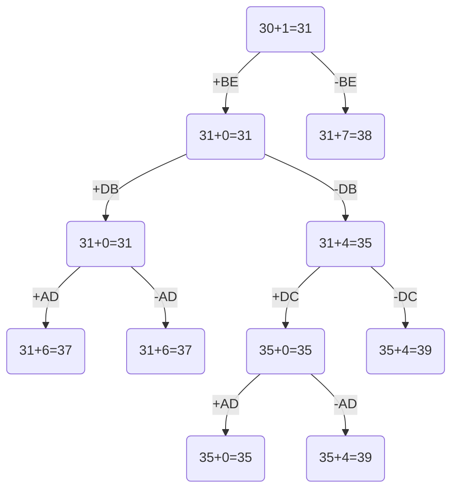
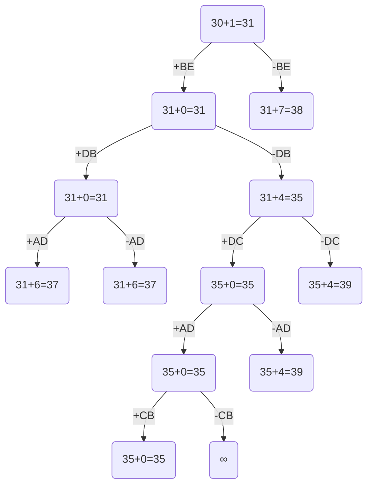

# Задание №19. Вариант 2
# Задача коммивояжера. Метод ветвей и границ.

Необходимо: 
1. Решить задачу коммивояжера с применением метода ветвей и границ.
2. Оформить решение задачи по шагам с подробными комментариями, таблицами и диаграммами.
3. **В узлах построенного дерева привести расчет оценки и указать порядковый номер, по которым можно проверить порядок исследования узлов дерева**, либо оформить решение с пошаговым построением дерева.
4. В ответе указать:
   - найденный маршрут,
   - длину найденного маршрута.

## Постановка задачи
Имеется N городов, связанных дорогами. Расстояния между городами известны. Коммивояжер (бродячий торговец) должен выйти из первого города, посетить по одному разу в некотором порядке города 2,3...n и вернуться в первый город. В каком порядке следует посещать города, чтобы замкнутый путь коммивояжера имел кратчайшее расстояние?

## Математическая модель
Для моделирования задачи можно использовать теорию графов. Города можно перенумеровать и представить в виде вершин графа, а рёбра (*i*, *j*) между вершинами *i* и *j* будут соответствовать пути между этими городами. Каждому ребру (*i*, *j*) можно сопоставить расстояние между городами Сij ⩾ 0. Таким образом, задачу можно сформулировать так: 

Дан полный граф с n вершинами, длина ребра (i,j)= Сij. Найти гамильтонов цикл минимальной длины.

Гамильтоновым циклом называется маршрут, включающий ровно по одному разу каждую вершину графа.

## Пример решения задачи коммивояжера

### Матрица расстояний:

|       | **A** | **B** | **C** | **D** | **E** |
|-------|:-----:|:-----:|:-----:|:-----:|:-----:|
| **A** | **∞** |  11   |   8   |   7   |  10   |
| **B** |  15   | **∞** |  11   |   9   |   5   |
| **C** |   7   |   8   | **∞** |  13   |  15   |
| **D** |  12   |   5   |   9   | **∞** |  14   |
| **E** |   6   |   9   |  13   |   7   | **∞** |

### 1. Проведем редукцию строк матрицы

|       | **A** | **B** | **C** | **D** | **E** |  Min  |
|-------|:-----:|:-----:|:-----:|:-----:|:-----:|:-----:|
| **A** | **∞** |  11   |   8   |   7   |  10   |   7   |
| **B** |  15   | **∞** |  11   |   9   |   5   |   5   |
| **C** |   7   |   8   | **∞** |  13   |  15   |   7   |
| **D** |  12   |   5   |   9   | **∞** |  14   |   5   |
| **E** |   6   |   9   |  13   |   7   | **∞** |   6   |
| Sum   |       |       |       |       |       |  30   |

Сумма констант редукции по строкам 30

Марица после редукции строк:

|       | **A** | **B** | **C** | **D** | **E** |
|-------|:-----:|:-----:|:-----:|:-----:|:-----:|
| **A** | **∞** |   4   |   1   |   0   |   3   |
| **B** |  10   | **∞** |   6   |   4   |   0   |
| **C** |   0   |   1   | **∞** |   6   |   8   |
| **D** |   7   |   0   |   4   | **∞** |   9   |
| **E** |   0   |   3   |   7   |   1   | **∞** |

### 2. Проведем редукцию столбцов матрицы

|       | **A** | **B** | **C** | **D** | **E** |  SUM  |
|-------|:-----:|:-----:|:-----:|:-----:|:-----:|:-----:|
| **A** | **∞** |   4   |   1   |   0   |   3   |       |
| **B** |  10   | **∞** |   6   |   4   |   0   |       |
| **C** |   0   |   1   | **∞** |   6   |   8   |       |
| **D** |   7   |   0   |   4   | **∞** |   9   |       |
| **E** |   0   |   3   |   7   |   1   | **∞** |       |
| Min   |   0   |   0   |   1   |   0   |   0   |   1   |

Сумма констант редукции по столбцам 1

Марица после редукции столбцов:

|       | **A** | **B** | **C** | **D** | **E** |
|-------|:-----:|:-----:|:-----:|:-----:|:-----:|
| **A** | **∞** |   4   |   0   |   0   |   3   |
| **B** |  10   | **∞** |   5   |   4   |   0   |
| **C** |   0   |   1   | **∞** |   6   |   8   |
| **D** |   7   |   0   |   3   | **∞** |   9   |
| **E** |   0   |   3   |   6   |   1   | **∞** |

### 3. Оценка длины маршрута

В данном случае из 6 нулевых элементов получился следующий граф:

В нём нет гамильтонова цикла. Сумма констант редукции в данном примере оказалась равна 30 + 1 = 31. Это означает, что искомый кратчайший гамильтонов цикл не может быть короче, чем 31. Значит, 31 – это нижняя оценка целевой функции $f(x_{1},x_{2},...,x_{n})$ и она же – оценка перспективности корня бинарного «дерева решений».

### 4. Найдем решение задачи с использованием метода ветвей и границ и алгоритма Литтла

Чтобы выбрать дугу, по которой будет осуществляться ветвление в корне «дерева решений», вычислим «штраф» каждого из 6 нулевых элементов редуцированной в матрицы. Штраф нулевого элемента, расположенного в $i$-й строке $j$-м столбце, равен сумме минимального элемента $i$-й строки и $j$-го столбца, если сам этот нулевой элемент временно исключить из рассмотрения:

|   Дуга   |   *AC*   |   *AD*   |  **BE**  |   *CA*   |   *DB*   |   *EA*   |
|   :---   |   :---   |   :---   |   :---   |   :---   |   :---   |   :---   |
|  Штраф   |  $0+3=3$ |  $0+1=1$ |  $4+3=7$ |  $1+0=1$ |  $3+1=4$ |  $1+0=1$ |

Максимальный штраф в данном случае равен 7, его имеет нулевой элемент $BE$. Поэтому, согласно алгоритму Литтла, ветвление в корне «дерева решений» следует выполнять по дуге $BE$.

Пусть левому потомку корневой вершины «дерева решений» соответствует множество всех гамильтоновых циклов, содержащих дугу BE, а правому потомку - не содержащих дугу BE. Выполним оценивание перспективности обоих этих потомков. Для этого вычислим нижнюю оценку целевой функции $f(x_{1},x_{2},...,x_{n})$ отдельно для циклов, содержащих и не содержащих дугу BE. 

В алгоритме Литтла оценка правого потомка любой вершины получается сложением оценки этой вершины и её штрафа. В данном случае оценка правого потомка корневой вершины будет равна $31+7=38$. При этом правый потомок корневой вершины соответствует задаче коммивояжёра для графа, у которого длина дуги BE заменена на $\infty$. 

Оценка левого потомка корневой вершины получается сложением оценки корневой вершины и всех констант редукции новой матрицы. Эта новая матрица получается из исходной матрицы после удаление из неё строки и столбца, содержащего элемент BE. Кроме того, в ней элемент EB заменён на $\infty$. В данном случае новая матрица имеет вид:

|       | **A** | **B** | **C** | **D** |
|-------|:-----:|:-----:|:-----:|:-----:|
| **A** | **∞** |   4   |   0   |   0   |
| **C** |   0   |   1   | **∞** |   6   |
| **D** |   7   |   0   |   3   | **∞** |
| **E** |   0   | **∞** |   6   |   1   |

Матрица левого потомка корневой вершины по смыслу соответствует новой задаче коммивояжёра, у которой граф содержит 4 вершины: $BE$, $A$, $C$, и $D$. При этом все дуги, входящие в первоначальном графе в вершину $B$, в новом графе входят в вершину $BE$, а все дуги, выходящие из вершины $E$, теперь выходят из вершины $BE$. 

Ниже приведена «матрица I» левого потомка после редукции и её константы редукции (матрице не потребовалась редукция из-за наличия нулей во всех строках и столбцах):

|   I   | **A** | **B** | **C** | **D** |       |
|-------|:-----:|:-----:|:-----:|:-----:|:-----:|
| **A** | **∞** |   4   |   0   |   0   |   0   |
| **C** |   0   |   1   | **∞** |   6   |   0   |
| **D** |   7   |   0   |   3   | **∞** |   0   |
| **E** |   0   | **∞** |   6   |   1   |   0   |
|       |   0   |   0   |   0   |   0   |   0   |

Согласно алгоритму Литтла, оценка левого потомка корневой вершины равна $31+0=31$. В итоге получаем начальный фрагмент «дерева решений»: 

### 5. Продолжим решение задачи с использованием метода ветвей и границ и алгоритма Литтла

|   I   | **A** | **B** | **C** | **D** |
|-------|:-----:|:-----:|:-----:|:-----:|
| **A** | **∞** |   4   |   0   |   0   |
| **C** |   0   |   1   | **∞** |   6   |
| **D** |   7   |   0   |   3   | **∞** |
| **E** |   0   | **∞** |   6   |   1   |

Чтобы определить дугу, по которой будет осуществляться ветвление в ЛЕВОМ (более перспективном) потомке корневой вершины, вычислим штраф каждого из 5 нулевых элементов редуцированной в матрицы I:

|   Дуга   |   *AC*   |   *AD*   |   *CA*   |  **DB**  |   *EA*   |
|   :---   |   :---   |   :---   |   :---   |   :---   |   :---   |
|  Штраф   |  $0+3=3$ |  $0+1=1$ |  $1+0=1$ |  $3+1=4$ |  $1+0=1$ |

Максимальный штраф имеет элемент DB, поэтому ветвление в данной вершине «дерева решений» будет выполняться по принципу: левый потомок отвечает гамильтоновым циклам, проходящим через дугу DB, а правый потомок – циклам, не проходящим через эту дугу. Оценка перспективности правого потомка получается легко, она равна $31 + 4 = 35$.

Оценку же перспективности левого потомка вычислить сложнее. Для этого нужно сначала из матрицы I получить новую матрицу II размера 3x3, а затем выполнить её редукцию. Матрица 3x3 получается удалением из матрицы I строки и столбца, в котором расположен элемент DB. Одновременно с этим по алгоритму Литтла мы должны блокировать не просто обратную дугу текущего шага ($BD$), а дугу, которая замыкает весь текущий построенный путь в преждевременный цикл ($D \to B \to E$), чтобы коммивояжер не поехал обратно и не замкнул маршрут из 3 городов (что нарушит условие задачи, так как городов 5), нам нужно запретить путь из конца текущей цепочки в ее начало. Меняем $ED$ на $\infty$. В итоге получаем:

|  II   | **A** | **C** | **D** |
|-------|:-----:|:-----:|:-----:|
| **A** | **∞** |   0   |   0   |
| **C** |   0   | **∞** |   6   |
| **E** |   0   |   6   | **∞** |

Эта матрица по смыслу соответствует новой задаче коммивояжёра, у которой граф содержит 4 вершины: $BE$, $DB$, $A$ и $C$. При этом все дуги, входящие прежде в вершину $D$, теперь входят в вершину $DB$, а все дуги, выходящие из вершины $B$, теперь выходят из вершины $DB$.

Ниже приведена матрица II, получающаяся после редукции матрицы 3x3, и её константы редукции (матрице не потребовалась редукция из-за наличия нулей во всех строках и столбцах):

|  II   | **A** | **C** | **D** |       |
|-------|:-----:|:-----:|:-----:|:-----:|
| **A** | **∞** |   0   |   0   |   0   |
| **C** |   0   | **∞** |   6   |   0   |
| **E** |   0   |   6   | **∞** |   0   |
|       |   0   |   0   |   0   |   0   |

Поскольку сумма констант редукции равна 0, то оценка перспективности левого потомка, отвечающего матрице II, равна $31+0=31$. В итоге получаем второй ярус в «дереве решений»:

### 6. Продолжим решение задачи с использованием метода ветвей и границ и алгоритма Литтла

|  II   | **A** | **C** | **D** |
|-------|:-----:|:-----:|:-----:|
| **A** | **∞** |   0   |   0   |
| **C** |   0   | **∞** |   6   |
| **E** |   0   |   6   | **∞** |

Чтобы определить дугу, по которой будет осуществляться ветвление снова в левом потомке, вычислим штраф каждого из 4 нулевых элементов редуцированной в матрицы II:

|   Дуга   |   *AC*   |  **AD**  |   *CA*   |   *EA*   |
|   :---   |   :---   |   :---   |   :---   |   :---   |
|  Штраф   |  $0+6=6$ |  $0+6=6$ |  $6+0=6$ |  $6+0=6$ |

Максимальный штраф имеют все элементы, поэтому возьмём тот вариант, который соединяется с нашим циклом ($D \to B \to E$), например, AD. Значит, ветвление в данной вершине «дерева решений» будет выполняться по принципу: левый потомок отвечает гамильтоновым циклам, проходящим через дугу AD, а правый потомок – циклам, не проходящим через эту дугу. Оценка перспективности правого потомка получается легко, она равна $31 + 6 = 37$.

Оценку же перспективности левого потомка вычислить сложнее. Для этого нужно сначала из матрицы II получить новую матрицу III размера 2x2, а затем выполнить её редукцию. Матрица 2x2 получается удалением из матрицы II строки и столбца, в котором расположен элемент AD. Одновременно с этим по алгоритму Литтла мы должны блокировать дугу, которая замыкает весь текущий построенный путь в преждевременный цикл ($A \to D \to B \to E$), чтобы коммивояжер не поехал обратно и не замкнул маршрут из 4 городов. Меняем $EA$ на $\infty$. В итоге получаем:

|  III  | **A** | **C** |
|-------|:-----:|:-----:|
| **C** |   0   | **∞** |
| **E** | **∞** |   6   |

Эта матрица по смыслу соответствует новой задаче коммивояжёра, у которой граф содержит 4 вершины: $BE$, $DB$, $AD$ и $C$. При этом все дуги, входящие прежде в вершину $A$, теперь входят в вершину $AD$, а все дуги, выходящие из вершины $D$, теперь выходят из вершины $AD$.

Ниже приведена матрица III, получающаяся после редукции матрицы 2x2, и её константы редукции:

|  III  | **A** | **C** |       |
|-------|:-----:|:-----:|:-----:|
| **C** |   0   | **∞** |   0   |
| **E** | **∞** |   0   |   6   |
|       |   0   |   0   |   6   |

Поскольку сумма констант редукции равна 6, то оценка перспективности левого потомка, отвечающего матрице III, равна $31+6=37$. В итоге получаем третий ярус в «дереве решений»:

### 7. Продолжим решение задачи с использованием метода ветвей и границ и алгоритма Литтла

|   I   | **A** | **B** | **C** | **D** |
|-------|:-----:|:-----:|:-----:|:-----:|
| **A** | **∞** |   4   |   0   |   0   |
| **C** |   0   |   1   | **∞** |   6   |
| **D** |   7   |   0   |   3   | **∞** |
| **E** |   0   | **∞** |   6   |   1   |

Чтобы определить дугу, по которой будет осуществляться ветвление из самого перспективного потомка (35), необходимо принудительно отказаться от дуги DB (поставить ∞) и провести редукцию матрицы I. Получаем матрицу IV и её константы редукции:

|  IV   | **A** | **B** | **C** | **D** |       |
|-------|:-----:|:-----:|:-----:|:-----:|:-----:|
| **A** | **∞** |   3   |   0   |   0   |   0   |
| **C** |   0   |   0   | **∞** |   6   |   0   |
| **D** |   4   | **∞** |   0   | **∞** |   3   |
| **E** |   0   | **∞** |   6   |   1   |   0   |
|       |   0   |   1   |   0   |   0   |   4   |

Получаем подтверждение оценки данного узла: $31 + 4 = 35$

Вычислим штраф каждого из 6 нулевых элементов редуцированной в матрицы IV:

|   Дуга   |   *AC*   |   *AD*   |   *CA*   |   *CB*   |  **DC**  |   *EA*   |
|   :---   |   :---   |   :---   |   :---   |   :---   |   :---   |   :---   |
|  Штраф   |  $0+0=0$ |  $0+1=1$ |  $0+0=0$ |  $0+3=3$ |  $4+0=4$ |  $1+0=1$ |

Максимальный штраф имеет элемент DC, поэтому ветвление в данной вершине «дерева решений» будет выполняться по принципу: левый потомок отвечает гамильтоновым циклам, проходящим через дугу DC, а правый потомок – циклам, не проходящим через эту дугу. Оценка перспективности правого потомка получается легко, она равна $35 + 4 = 39$.

Оценку же перспективности левого потомка вычислить сложнее. Для этого нужно сначала из матрицы IV получить новую матрицу V размера 3x3, а затем выполнить её редукцию. Матрица 3x3 получается удалением из матрицы IV строки и столбца, в котором расположен элемент DC. Одновременно с этим по алгоритму Литтла мы должны блокировать дугу, которая замыкает построенный путь. Меняем $CD$ на $\infty$. В итоге получаем:

|   V   | **A** | **B** | **D** |
|-------|:-----:|:-----:|:-----:|
| **A** | **∞** |   3   |   0   |
| **C** |   0   |   0   | **∞** |
| **E** |   0   | **∞** |   1   |

Эта матрица по смыслу соответствует новой задаче коммивояжёра, у которой граф содержит 3 вершины: $BE$, $DC$ и $A$. При этом все дуги, входящие прежде в вершину $D$, теперь входят в вершину $DC$, а все дуги, выходящие из вершины $C$, теперь выходят из вершины $DC$.

Ниже приведена матрица VI, получающаяся после редукции матрицы 2x2, и её константы редукции:

|  VI   | **A** | **B** | **D** |       |
|-------|:-----:|:-----:|:-----:|:-----:|
| **A** | **∞** |   3   |   0   |   0   |
| **C** |   0   |   0   | **∞** |   0   |
| **E** |   0   | **∞** |   1   |   0   |
|       |   0   |   0   |   0   |   0   |

Поскольку сумма констант редукции равна 0, то оценка перспективности левого потомка, отвечающего матрице VI, равна $35+0=35$. В итоге дополняем третий ярус в «дереве решений»:

### 8. Продолжим решение задачи с использованием метода ветвей и границ и алгоритма Литтла

|   V   | **A** | **B** | **D** |
|-------|:-----:|:-----:|:-----:|
| **A** | **∞** |   3   |   0   |
| **C** |   0   |   0   | **∞** |
| **E** |   0   | **∞** |   1   |

Чтобы определить дугу, по которой будет осуществляться ветвление из самого перспективного потомка (35), вычислим штраф каждого из 4 нулевых элементов редуцированной в матрицы V:

|   Дуга   |  **AD**  |   *CA*   |   *CB*   |   *EA*   |
|   :---   |   :---   |   :---   |   :---   |   :---   |
|  Штраф   |  $3+1=4$ |  $0+0=0$ |  $0+3=3$ |  $1+0=1$ |

Максимальный штраф имеет элемент AD, поэтому ветвление в данной вершине «дерева решений» будет выполняться по принципу: левый потомок отвечает гамильтоновым циклам, проходящим через дугу AD, а правый потомок – циклам, не проходящим через эту дугу. Оценка перспективности правого потомка получается легко, она равна $35 + 4 = 39$.

Оценку же перспективности левого потомка вычислить сложнее. Для этого нужно сначала из матрицы V получить новую матрицу VI размера 2x2, а затем выполнить её редукцию. Матрица 2x2 получается удалением из матрицы V строки и столбца, в котором расположен элемент AD. Одновременно с этим по алгоритму Литтла мы должны блокировать дугу, которая замыкает построенный путь ($B \to E$ и $A \to D \to C$). Меняем $CA$ на $\infty$. В итоге получаем:

|  VI   | **A** | **B** |
|-------|:-----:|:-----:|
| **C** | **∞** |   0   |
| **E** |   0   | **∞** |

Эта матрица по смыслу соответствует новой задаче коммивояжёра, у которой граф содержит 3 вершины: $BE$, $DC$ и $AD$. При этом все дуги, входящие прежде в вершину $A$, теперь входят в вершину $AD$, а все дуги, выходящие из вершины $D$, теперь выходят из вершины $AD$.

Ниже приведена матрица VI, получающаяся после редукции матрицы 2x2, и её константы редукции:

|  VI   | **A** | **B** |       |
|-------|:-----:|:-----:|:-----:|
| **C** | **∞** |   0   |   0   |
| **E** |   0   | **∞** |   0   |
|       |   0   |   0   |   0   |

Поскольку сумма констант редукции равна 0, то оценка перспективности левого потомка, отвечающего матрице VI, равна $35+0=35$. В итоге получаем четвёртый ярус в «дереве решений»:

### 9. Продолжим решение задачи с использованием метода ветвей и границ и алгоритма Литтла

|  VI   | **A** | **B** |
|-------|:-----:|:-----:|
| **C** | **∞** |   0   |
| **E** |   0   | **∞** |

Штрафы обоих нулевых элементов CB и EA соответствующих концевой вершине (35) матрицы VI равны ∞, поэтому для ветвления можно выбрать любую из дуг CB и EA. Предположим, что мы выбрали дугу CB. Тогда правый потомок данной вершины будет иметь оценку $35+∞=∞$.

Получаем матрицу VII и проводим её редукцию:

|  VII  | **A** |       |
|-------|:-----:|:-----:|
| **E** |   0   |   0   |
|       |   0   |   0   |

И левый потомок получает оценку $35+0=35$. Данная вершина необходима нам для соединения двух кусков ($B \to E$ и $A \to D \to C$).

### 10. Продолжим решение задачи с использованием метода ветвей и границ и алгоритма Литтла

Самая перспективная вершина в этом дереве – это концевая вершина с оценкой 35. Ей соответствует матрица размера 1x1 следующего вида:

|  VII  | **A** |
|-------|:-----:|
| **E** |   0   |

Данная вершина отвечает дуге $EA$, а путь в неё из корня «дерева решений» искомому маршруту коммивояжёра $A \to D \to C \to B \to E \to A$. Проверкой убеждаемся, что его длина действительно равна 35.

|       | **A** | **B** | **C** | **D** | **E** |
|-------|:-----:|:-----:|:-----:|:-----:|:-----:|
| **A** | **∞** |  11   |   8   |   7   |  10   |
| **B** |  15   | **∞** |  11   |   9   |   5   |
| **C** |   7   |   8   | **∞** |  13   |  15   |
| **D** |  12   |   5   |   9   | **∞** |  14   |
| **E** |   6   |   9   |  13   |   7   | **∞** |

$7 + 9 + 8 + 5 + 6 = 35$

### Ответ
- Кратчайший маршрут $A \to D \to C \to B \to E \to A$.
- Длина маршрута 35.
