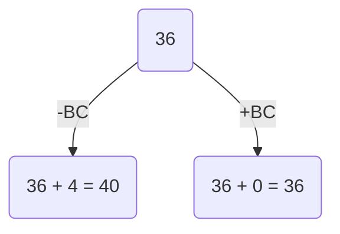
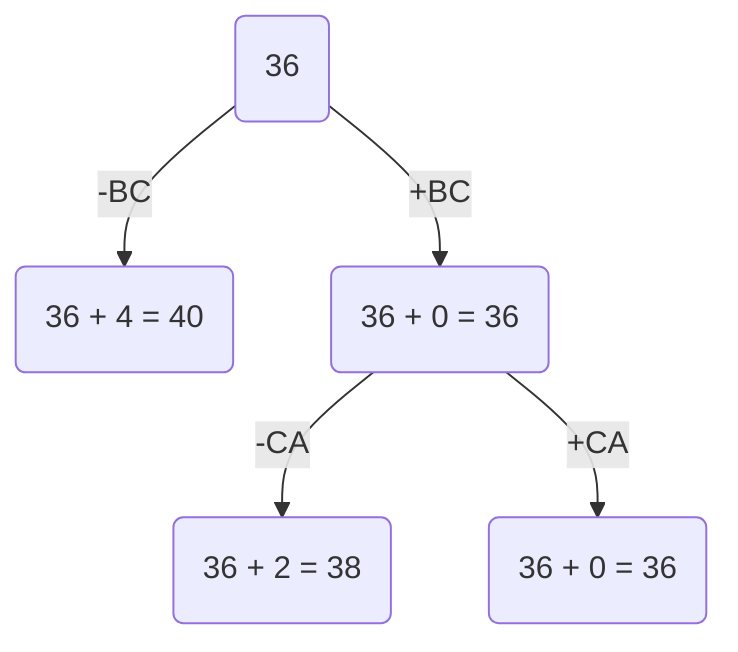
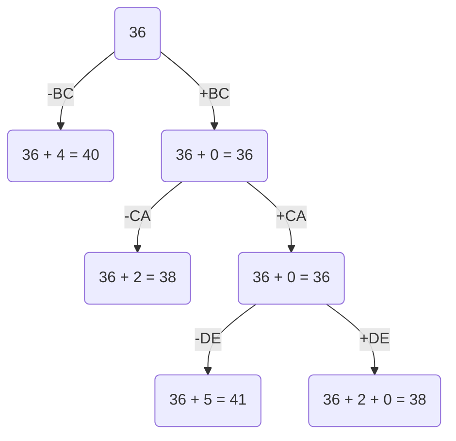
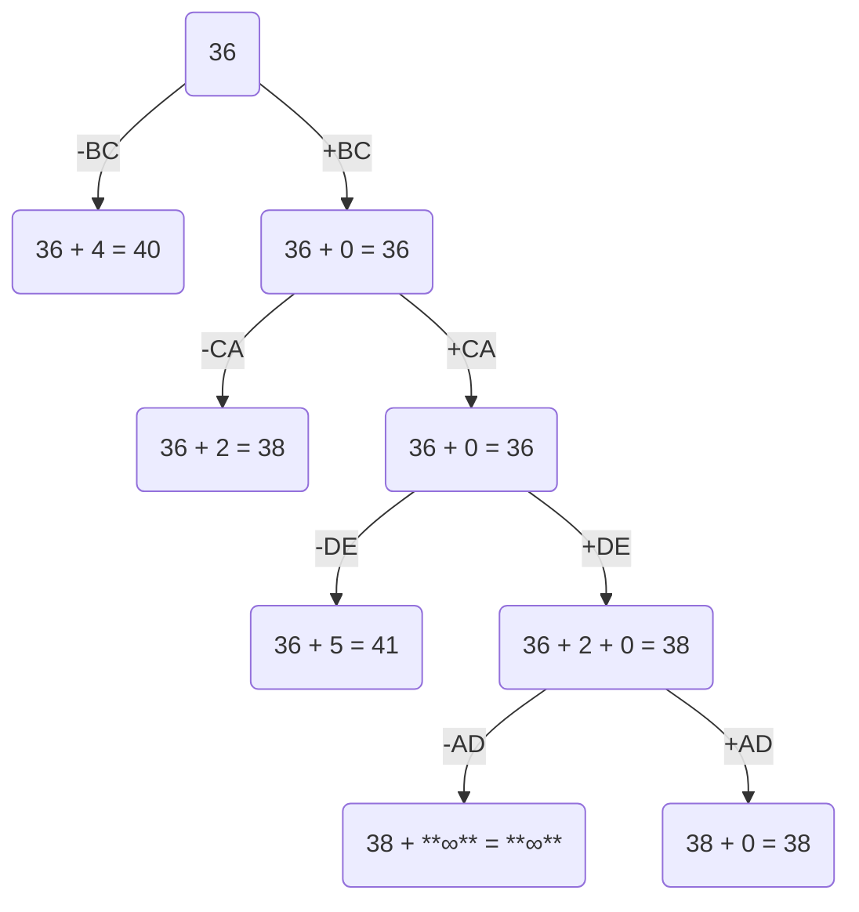

# Задание №19
# Задача коммивояжера. Метод ветвей и границ.

### Вариант 3:

Матрица расстояний:

|       | **A** | **B** | **C** | **D** | **E** |
|-------|:-----:|:-----:|:-----:|:-----:|:-----:|
| **A** | **∞** |   8   |  14   |   8   |   6   |
| **B** |   9   | **∞** |   9   |  15   |  10   |
| **C** |   7   |  11   | **∞** |  10   |   9   |
| **D** |   9   |  14   |  13   | **∞** |   9   |
| **E** |   6   |   5   |  10   |   5   | **∞** |

### Шаг 1. Редукция строк матрицы

|         | **A** | **B** | **C** | **D** | **E** | **Min**|
|---------|:-----:|:-----:|:-----:|:-----:|:-----:|:------:|
| **A**   | **∞** |   8   |  14   |   8   |   6   |    6   |
| **B**   |   9   | **∞** |   9   |  15   |  10   |    9   |
| **C**   |   7   |  11   | **∞** |  10   |   9   |    7   |
| **D**   |   9   |  14   |  13   | **∞** |   9   |    9   |
| **E**   |   6   |   5   |  10   |   5   | **∞** |    5   |
| **Sum** |       |       |       |       |       |   36   |

Сумма констант редукции по строкам - 36. Матрица после редукции имеет вид:

|       | **A** | **B** | **C** | **D** | **E** |
|-------|:-----:|:-----:|:-----:|:-----:|:-----:|
| **A** | **∞** |   2   |   8   |   2   |   0   |
| **B** |   0   | **∞** |   0   |   7   |   1   |
| **C** |   0   |   4   | **∞** |   3   |   2   |
| **D** |   0   |   5   |   4   | **∞** |   0   |
| **E** |   1   |   0   |   5   |   0   | **∞** |

### Шаг 2. Редукция столбцов матрицы

|         | **A** | **B** | **C** | **D** | **E** | **Sum** |
|---------|:-----:|:-----:|:-----:|:-----:|:-----:|:-------:|
| **A**   | **∞** |   2   |   8   |   2   |   0   |         |
| **B**   |   0   | **∞** |   0   |   7   |   1   |         |
| **C**   |   0   |   4   | **∞** |   3   |   2   |         |
| **D**   |   0   |   5   |   4   | **∞** |   0   |         |
| **E**   |   1   |   0   |   5   |   0   | **∞** |         |
| **Min** |   0   |   0   |   0   |   0   |   0   |    0    |

Сумма констант редукции по столбцам - 0. Матрица после редукции по столбцам не изменилась (все константы равны 0).

### Шаг 3. Оценка длины маршрута

 Оценка длины маршрута снизу: 36 + 0 = 36

### Шаг 4. Поиск решения с использованием метода ветвей и границ.

#### Ребро 1.
Рассчитаем штрафы для ребер с нулевой оценкой:

|        | **Штраф** |
|:-------|:----------|
| **AE** |     2     |
| **BA** |     0     |
| **BC** |     4     |
| **CA** |     2     |
| **DA** |     0     |
| **DE** |     0     |
| **ED** |     2     |
| **EB** |     2     |

Максимальный штраф - 4 => выбираем ребро BC. Рассчитаем оценку узла при включении BC:

|       | **A** | **B** | **D** | **E** | **Min** |
|-------|:-----:|:-----:|:-----:|:-----:|:-------:|
| **A** | **∞** |   2   |   2   |   0   |    0    |
| **C** |   0   | **∞** |   3   |   2   |    0    |
| **D** |   0   |   5   | **∞** |   0   |    0    |
| **E** |   1   |   0   |   0   | **∞** |    0    |

Сумма констант редукции строк - 0.

|         | **A** | **B** | **D** | **E** |
|---------|:-----:|:-----:|:-----:|:-----:|
| **A**   | **∞** |   2   |   2   |   0   |
| **C**   |   0   | **∞** |   3   |   2   |
| **D**   |   0   |   5   | **∞** |   0   |
| **E**   |   1   |   0   |   0   | **∞** |
| **Min** |   0   |   0   |   0   |   0   |

Сумма констант редукции столбцов - 0. Получаем следующее дерево:

#### Ребро 2.

Матрица после удаления строки B, столбца C и замены CB на бесконечность:

|       | **A** | **B** | **D** | **E** |
|-------|:-----:|:-----:|:-----:|:-----:|
| **A** | **∞** |   2   |   2   |   0   |
| **C** |   0   | **∞** |   3   |   2   |
| **D** |   0   |   5   | **∞** |   0   |
| **E** |   1   |   0   |   0   | **∞** |

Рассчитаем штрафы для ребер с нулевой оценкой:

|        | **Штраф** |
|:-------|:----------|
| **AE** |     2     |
| **CA** |     2     |
| **DA** |     0     |
| **DE** |     0     |
| **ED** |     2     |
| **EB** |     2     |

Максимальный штраф - 2, выберем ребро CA как одно из ребер с максимальным штрафом. Оценка при исключении CA - 36 + 2 = 38. Рассчитаем оценку при включении CA:

|       | **B** | **D** | **E** | **Min** |
|-------|:-----:|:-----:|:-----:|:-------:|
| **A** |   2   |   2   |   0   |    0    |
| **D** |   5   | **∞** |   0   |    0    |
| **E** |   0   |   0   | **∞** |    0    |

Сумма констант редукции по строкам - 0.

|         | **B** | **D** | **E** |
|---------|:-----:|:-----:|:-----:|
| **A**   |   2   |   2   |   0   |
| **D**   |   5   | **∞** |   0   |
| **E**   |   0   |   0   | **∞** |
| **Min** |   0   |   0   |   0   |

Сумма констант редукции по столбцам - 0.

Получаем обновленное дерево:

#### Ребро 3.

Матрица после удаления строки C и столбца A:

|       | **B** | **D** | **E** |
|-------|:-----:|:-----:|:-----:|
| **A** |   2   |   2   |   0   |
| **D** |   5   | **∞** |   0   |
| **E** |   0   |   0   | **∞** |

Рассчитаем штрафы для ребер с нулевой оценкой:

|        | **Штраф** |
|:-------|:----------|
| **AE** |     2     |
| **DE** |     5     |
| **ED** |     2     |
| **EB** |     2     |

Максимальный штраф - 5 => выбираем ребро DE. Оценка при исключении ребра - 36 + 5 = 41. Рассчитаем оценку при включении ребра DE:

|       | **B** | **D** | **Min** |
|-------|:-----:|:-----:|:-------:|
| **A** |   2   |   2   |    2    |
| **E** |   0   | **∞** |    0    |

Сумма констант редукции по строкам - 2. После редукции получаем матрицу:

|         | **B** | **D** |
|---------|:-----:|:-----:|
| **A**   |   0   |   0   |
| **E**   |   0   | **∞** |
| **Min** |   0   |   0   |

Сумма констант редукции по столбцам - 0.

Получаем дерево:

#### Ребро 4.

Обновленная матрица:

|       | **B** | **D** |
|-------|:-----:|:-----:|
| **A** |   0   |   0   |
| **E** |   0   | **∞** |

Рассчитаем штрафы для ребер с нулевой оценкой:

|        | **Штраф** |
|:-------|:----------|
| **AB** |     0     |
| **AD** |   **∞**   |
| **EB** |   **∞**   |

Максимальный штраф - **∞**, выберем ребро AD как одно из ребер с максимальным штрафом. Оценка при исключении ребра - 38 + **∞** = **∞**. Рассчитаем оценку при включении ребра AD:

|       | **B** |
|-------|:-----:|
| **E** |   0   |

Сумма констант редукции очевидно равна 0. Получаем дерево:

#### Ребро 5.

|       | **B** |
|-------|:-----:|
| **E** |   0   |

Единственным оставшимся ребром является ребро EB.

Получаем следующий итоговый набор ребер: BC, CA, AD, DE, EB

### Ответ.
- Кратчайший маршрут - B -> C -> A -> D -> E -> B
- Длина маршрута - 38