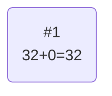
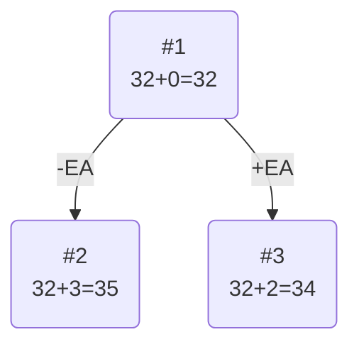
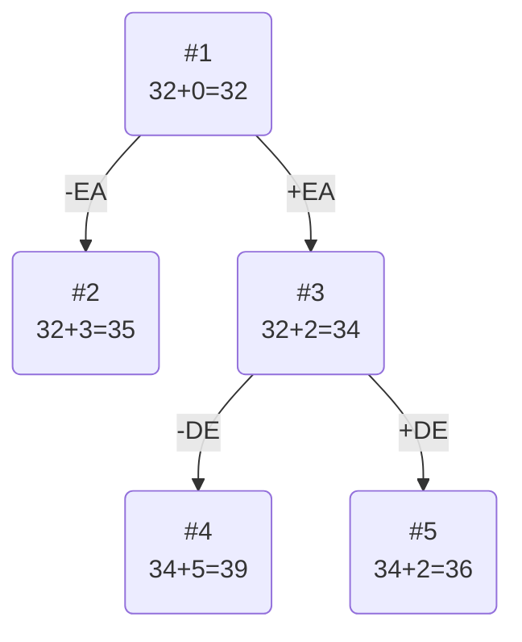
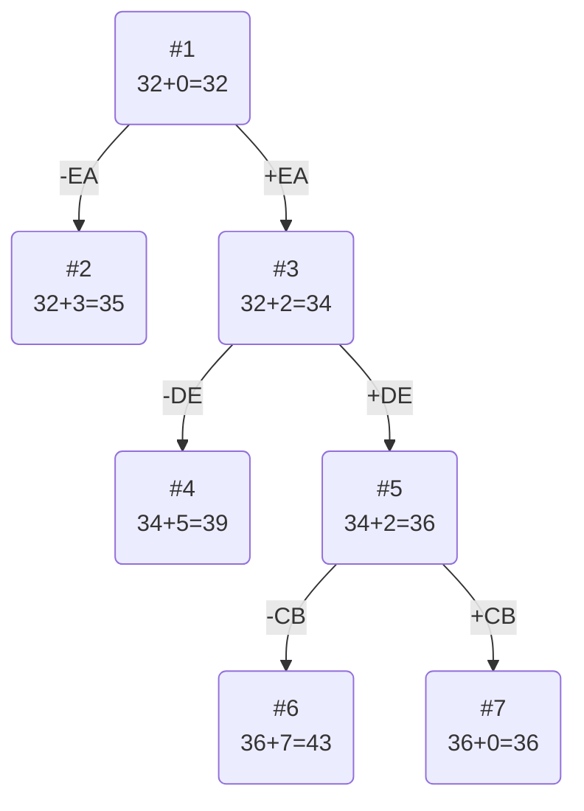
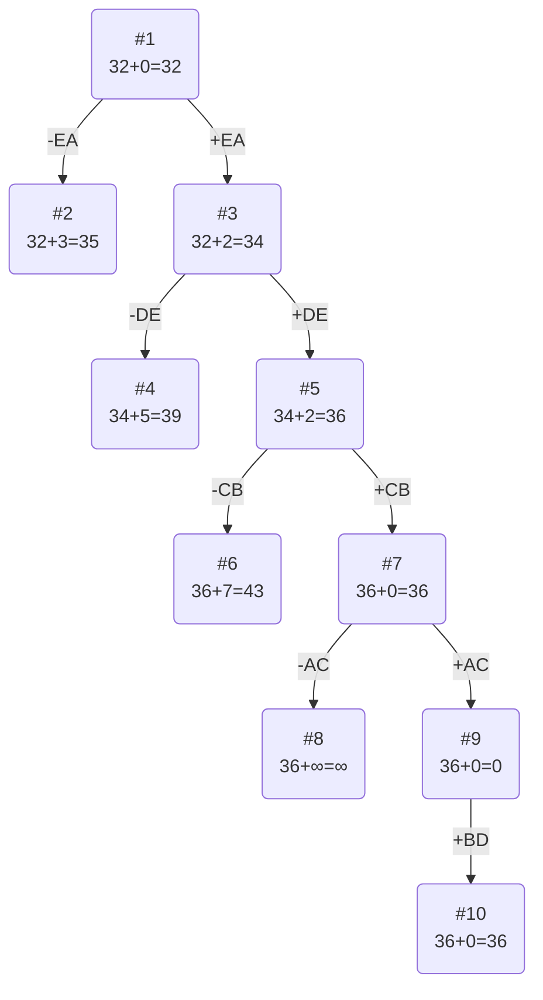

# Задание №19

# Задача коммивояжера. Метод ветвей и границ.

Для каждого варианта представлены условия задачи, в соответствии с которыми необходимо:

1. Решить задачу коммивояжера с применением метода ветвей и границ.
2. Оформить решение задачи по шагам с подробными комментариями, таблицами и диаграммами.
3. **В узлах построенного дерева привести расчет оценки и указать порядковый номер, по которым можно проверить порядок исследования узлов дерева**, либо оформить решение с пошаговым построением дерева.
4. В ответе указать:
   - найденный маршрут,
   - длину найденного маршрута.

### Вариант 8:

Матрица расстояний:

|       | **A** | **B** | **C** | **D** | **E** |
|-------|:-----:|:-----:|:-----:|:-----:|:-----:|
| **A** | **∞** |   8   |   8   |   8   |  14   |
| **B** |   6   | **∞** |   8   |   8   |  12   |
| **C** |  11   |   7   | **∞** |  14   |   5   |
| **D** |  10   |  14   |  13   | **∞** |   8   |
| **E** |   5   |   8   |  10   |  15   | **∞** |

# Решение

## 1. Проведем редукцию строк матрицы

|       | **A** | **B** | **C** | **D** | **E** | **Min** |
| ----- | :---: | :---: | :---: | :---: | :---: | :-----: |
| **A** | **∞** |   8   |   8   |   8   |  14   |    8    |
| **B** |   6   | **∞** |   8   |   8   |  12   |    6    |
| **C** |  11   |   7   | **∞** |  14   |   5   |    5    |
| **D** |  10   |  14   |  13   | **∞** |   8   |    8    |
| **E** |   5   |   8   |  10   |  15   | **∞** |    5    |
| Sum   |       |       |       |       |       |   32    |

Сумма констант редукции по строкам 32

Марица после редукции строк:

|       | **A** | **B** | **C** | **D** | **E** |
| ----- | :---: | :---: | :---: | :---: | :---: |
| **A** | **∞** |   0   |   0   |   0   |   6   |
| **B** |   0   | **∞** |   2   |   2   |   6   |
| **C** |   6   |   2   | **∞** |   9   |   0   |
| **D** |   2   |   6   |   5   | **∞** |   0   |
| **E** |   0   |   3   |   5   |  10   | **∞** |

## 2. Проведем редукцию столбцов матрицы

|       | **A** | **B** | **C** | **D** | **E** | **SUM** |
| ----- | :---: | :---: | :---: | :---: | :---: | :-----: |
| **A** | **∞** |   0   |   0   |   0   |   6   |         |
| **B** |   0   | **∞** |   2   |   2   |   6   |         |
| **C** |   6   |   2   | **∞** |   9   |   0   |         |
| **D** |   2   |   6   |   5   | **∞** |   0   |         |
| **E** |   0   |   3   |   5   |  10   | **∞** |         |
| Min   |   0   |   0   |   0   |   0   |   0   |    0    |

Сумма констант редукции по столбцам 0

Марица после редукции столбцов:

|       | **A** | **B** | **C** | **D** | **E** |
| ----- | :---: | :---: | :---: | :---: | :---: |
| **A** | **∞** |   0   |   0   |   0   |   6   |
| **B** |   0   | **∞** |   2   |   2   |   6   |
| **C** |   6   |   2   | **∞** |   9   |   0   |
| **D** |   2   |   6   |   5   | **∞** |   0   |
| **E** |   0   |   3   |   5   |  10   | **∞** |

## Оценка длины маршрута

Оценка длины маршрута снизу соответствует сумме констант редукции по строкам и по столбцам

32 + 0 = 32

## Найдем решение задачи с использованием метода ветвей и границ

Чтобы определить ребро, по которому будет произведено ветвление из корневого узла рассчитаем штрафы для ребер с нулевой оценкой:

|        | **Штраф** |
| :----- | :-------: |
| **AB** |     2     |
| **AC** |     2     |
| **AD** |     2     |
| **BA** |     2     |
| **CE** |     2     |
| **DE** |     2     |
| **EA** |     3     |

Максимальный штраф 3, выберем ребро EA, как одно из ребер с максимальным штрафом.

### Узел №2

Узел №2 с исключением ребра EA имеет оценку 32 + 3 (штраф) = 35

### Узел №3

Для получения оценки узла 3 необходимо рассчитать сумму констант редукции для матрицы с учетом включения ребра EA, для этого в матрице:

- удалим строку E,
- удалим столбец A,
- Заменим на бесконечность значение AE.

|       | **B** | **C** | **D** | **E** | **Min** |
| ----- | :---: | :---: | :---: | :---: |  :---:  |
| **A** |   0   |   0   |   0   | **∞** |         |
| **B** | **∞** |   2   |   2   |   6   |    2    |
| **C** |   2   | **∞** |   9   |   0   |         |
| **D** |   6   |   5   | **∞** |   0   |         |
| Sum   |       |       |       |       |    2    |

Матрица после редукции по строкам:

|       | **B** | **C** | **D** | **E** |
| ----- | :---: | :---: | :---: | :---: |
| **A** |   0   |   0   |   0   | **∞** |
| **B** | **∞** |   0   |   0   |   4   |
| **C** |   2   | **∞** |   9   |   0   |
| **D** |   6   |   5   | **∞** |   0   |

Сумма констант редукции 2

Оценка узла 3 = 32 + 2 (редукция) = 34

Продолжим поиск из узла 3

### Выбор ребра

Чтобы определить ребро, по которому будет произведено ветвление из узла 3 рассчитаем штрафы для ребер с нулевой оценкой:

|        | **Штраф** |
| :----- | :-------: |
| **AB** |      2    |
| **AC** |      0    |
| **AD** |      0    |
| **BC** |      0    |
| **BD** |      0    |
| **CE** |      2    |
| **DE** |      5    |

Максимальный штраф 5, выберем ребро DE, как ребро с максимальным штрафом.

### Узел №4

Узел №4 с исключением ребра DE имеет оценку 34 + 5 (штраф) = 39

### Узел №5

Для получения оценки узла 5 необходимо рассчитать сумму констант редукции для матрицы с учетом включения ребра DE, для этого в матрице:

- удалим строку D,
- удалим столбец E,
- Заменим на бесконечность значение AD, чтобы избежать образования преждевременного цикла.

|       | **B** | **C** | **D** |**Min**|
| ----- | :---: | :---: | :---: | :---: |
| **A** |   0   |   0   | **∞** |       |
| **B** | **∞** |   0   |   0   |       |
| **C** |   2   | **∞** |   9   |   2   |
| Sum   |       |       |       |   2   |

Матрица после редукции по строкам:

|       | **B** | **C** | **D** |
| ----- | :---: | :---: | :---: |
| **A** |   0   |   0   | **∞** |
| **B** | **∞** |   0   |   0   |
| **C** |   0   | **∞** |   7   |

Сумма констант редукции 2

Оценка узла 5 = 34 + 2 (редукция) = 36

Продолжим поиск из узла 5

### Выбор ребра

Чтобы определить ребро, по которому будет произведено ветвление из узла 5 рассчитаем штрафы для ребер с нулевой оценкой:

|        | **Штраф** |
| :----- | :-------: |
| **AB** |      0    |
| **AC** |      0    |
| **BC** |      0    |
| **CB** |      7    |
| **BD** |      7    |

Максимальный штраф 7, выберем ребро CB, как одно из ребер с максимальным штрафом.

### Узел №6

Узел №6 с исключением ребра BD имеет оценку 36 + 7 (штраф) = 43

### Узел №7

Для получения оценки узла 7 необходимо рассчитать сумму констант редукции для матрицы с учетом включения ребра CB, для этого в матрице:

- удалим строку C
- удалим столбец B,
- Заменим на бесконечность значение BC, чтобы избежать образования преждевременного цикла.

|       | **C** | **D** |
| ----- | :---: | :---: |
| **A** |   0   | **∞** |
| **B** | **∞** |   0   |

Сумма констант редукции 0

Оценка узла 7 = 36 + 0 (редукция) = 36

Продолжим поиск из узла 7

### Выбор ребра

Чтобы определить ребро, по которому будет произведено ветвление из узла 7 рассчитаем штрафы для ребер с нулевой оценкой:

|        | Штраф |
| -----_ | :---: |
| **AC** | **∞** |
| **BD** | **∞** |
Максимальный штраф ∞, выберем ребро AC, как ребро с максимальным штрафом.

### Узел №8
Узел №8 с исключением ребра AC имеет оценку 36 + ∞ (штраф) = ∞

### Узел №9
Для получения оценки узла 9 необходимо рассчитать сумму констант редукции для матрицы с учетом включения ребра AC, для этого в матрице:

- удалим строку A,
- удалим столбец C,

|       | **D** |
| ----- | :---: |
| **B** |   0   |

Сумма констант редукции 0

Оценка узла 9 = 36 + 0 (редукция) = 36

Продолжим поиск из узла 9

Выбор ребра
Альтернатив у ребра BD нет

### Узел №10
Ребро BD включается в маршрут, длина которого составляет 36

# Ответ

Оценка в последнем узле дерева (36) совпала с длиной полученного маршрута, следовательно, найдено оптимальное решение.

Найденный маршрут: D - E - A - C - B - D

Длина найденного маршрута: 36