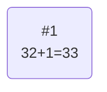
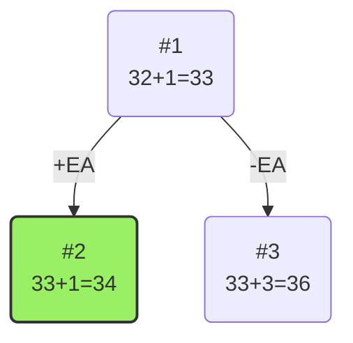

# Задание №19

# Задача коммивояжера. Метод ветвей и границ.

Для каждого варианта представлены условия задачи, в соответствии с которыми необходимо:

1. Решить задачу коммивояжера с применением метода ветвей и границ.
2. Оформить решение задачи по шагам с подробными комментариями, таблицами и диаграммами.
3. **В узлах построенного дерева привести расчет оценки и указать порядковый номер, по которым можно проверить порядок исследования узлов дерева**, либо оформить решение с пошаговым построением дерева.
4. В ответе указать:
   - найденный маршрут,
   - длину найденного маршрута.

### Вариант 7:

Матрица расстояний:

|       | **A** | **B** | **C** | **D** | **E** |
| ----- | :---: | :---: | :---: | :---: | :---: |
| **A** | **∞** |   8   |   8   |   9   |  16   |
| **B** |   6   | **∞** |   8   |   8   |  13   |
| **C** |  12   |   7   | **∞** |  15   |   5   |
| **D** |  11   |  14   |  13   | **∞** |   8   |
| **E** |   5   |   8   |  11   |  16   | **∞** |

# Решение

## 1. Проведем редукцию строк матрицы

|       | **A** | **B** | **C** | **D** | **E** | **Min** |
| ----- | :---: | :---: | :---: | :---: | :---: | :-----: |
| **A** | **∞** |   8   |   8   |   9   |  16   |    8    |
| **B** |   6   | **∞** |   8   |   8   |  13   |    6    |
| **C** |  12   |   7   | **∞** |  15   |   5   |    5    |
| **D** |  11   |  14   |  13   | **∞** |   8   |    8    |
| **E** |   5   |   8   |  11   |  16   | **∞** |    5    |
| Sum   |       |       |       |       |       |   32    |

Сумма констант редукции по строкам 32

Марица после редукции строк:

|       | **A** | **B** | **C** | **D** | **E** |
| ----- | :---: | :---: | :---: | :---: | :---: |
| **A** | **∞** |   0   |   0   |   1   |   8   |
| **B** |   0   | **∞** |   2   |   2   |   7   |
| **C** |   7   |   2   | **∞** |  10   |   0   |
| **D** |   3   |   6   |   5   | **∞** |   0   |
| **E** |   0   |   3   |   6   |  11   | **∞** |

## 2. Проведем редукцию столбцов матрицы

|       | **A** | **B** | **C** | **D** | **E** | **SUM** |
| ----- | :---: | :---: | :---: | :---: | :---: | :-----: |
| **A** | **∞** |   0   |   0   |   1   |   8   |         |
| **B** |   0   | **∞** |   2   |   2   |   7   |         |
| **C** |   7   |   2   | **∞** |  10   |   0   |         |
| **D** |   3   |   6   |   5   | **∞** |   0   |         |
| **E** |   0   |   3   |   6   |  11   | **∞** |         |
| Min   |   0   |   0   |   0   |   1   |   0   |    1    |

Сумма констант редукции по столбцам 1

Марица после редукции столбцов:

|       | **A** | **B** | **C** | **D** | **E** |
| ----- | :---: | :---: | :---: | :---: | :---: |
| **A** | **∞** |   0   |   0   |   0   |   8   |
| **B** |   0   | **∞** |   2   |   1   |   7   |
| **C** |   7   |   2   | **∞** |   9   |   0   |
| **D** |   3   |   6   |   5   | **∞** |   0   |
| **E** |   0   |   3   |   6   |  10   | **∞** |

## Оценка длины маршрута

Оценка длины маршрута снизу соответствует сумме констант редукции по строкам и по столбцам

32 + 1 = 33

## Найдем решение задачи с использованием метода ветвей и границ

Чтобы определить ребро, по которому будет произведено ветвление из корневого узла рассчитаем штрафы для ребер с нулевой оценкой:

|        | **Штраф** |
| :----- | :-------: |
| **AB** |     2     |
| **AC** |     2     |
| **AD** |     1     |
| **BA** |     1     |
| **CE** |     2     |
| **DE** |     2     |
| **EA** |     3     |

Максимальный штраф 3, выберем ребро EA как ребро с максимальный штрафом.

### Узел №2

Узел №2 с исключением ребра EA имеет оценку 33 + 3 (штраф) = 36

### Узел №3

Для получения оценки узла 3 необходимо рассчитать сумму констант редукции для матрицы с учетом включения ребра EA, для этого в матрице:

- удалим строку E,
- удалим столбец A,
- Заменим на бесконечность значение AE.

|       | **B** | **C** | **D** | **E** | **Min** |
| ----- | :---: | :---: | :---: | :---: | :-----: |
| **A** |   0   |   0   |   0   | **∞** |         |
| **B** | **∞** |   2   |   1   |   7   |    1    |
| **C** |   2   | **∞** |   9   |   0   |         |
| **D** |   6   |   5   | **∞** |   0   |         |
| Sum   |       |       |       |       |    1    |

Матрица после редукции по строкам:

|       | **B** | **C** | **D** | **E** |
| ----- | :---: | :---: | :---: | :---: |
| **A** |   0   |   0   |   0   | **∞** |
| **B** | **∞** |   1   |   0   |   6   |
| **C** |   2   | **∞** |   9   |   0   |
| **D** |   6   |   5   | **∞** |   0   |

Сумма констант редукции 1

Оценка узла 3: 33 + 1 = 34

Продолжим поиск из узла 2

### Выбор ребра

Чтобы определить ребро, по которому будет произведено ветвление из узла 2 рассчитаем штрафы для ребер с нулевой оценкой

|        | **Штраф** |
| :----- | :-------: |
| **AB** |     2     |
| **AC** |     1     |
| **AD** |     0     |
| **BD** |     1     |
| **CE** |     2     |
| **DE** |     5     |

Максимальный штраф
