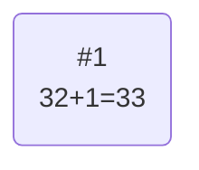
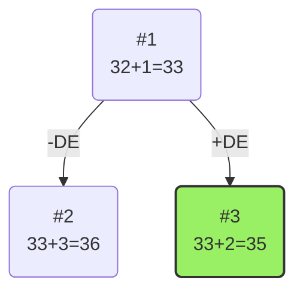
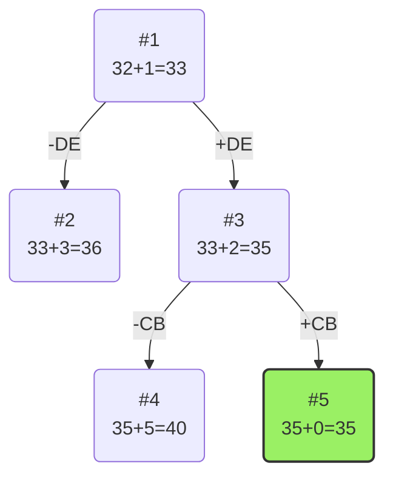
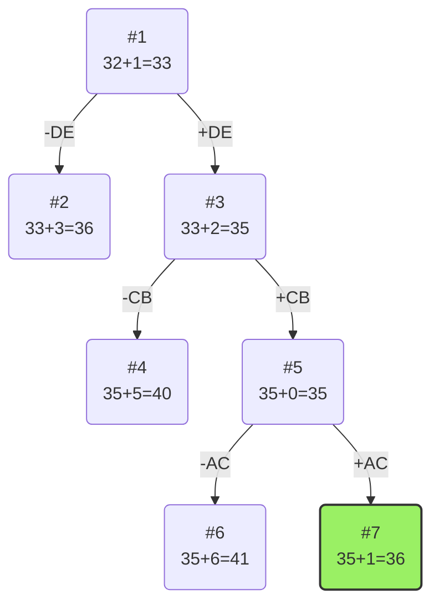

# Задание №19

# Задача коммивояжера. Метод ветвей и границ.

Для каждого варианта представлены условия задачи, в соответствии с которыми необходимо:

1. Решить задачу коммивояжера с применением метода ветвей и границ.
2. Оформить решение задачи по шагам с подробными комментариями, таблицами и диаграммами.
3. **В узлах построенного дерева привести расчет оценки и указать порядковый номер, по которым можно проверить порядок исследования узлов дерева**, либо оформить решение с пошаговым построением дерева.
4. В ответе указать:
   - найденный маршрут,
   - длину найденного маршрута.

### Вариант 7:

Матрица расстояний:

|       | **A** | **B** | **C** | **D** | **E** |
| ----- | :---: | :---: | :---: | :---: | :---: |
| **A** | **∞** |   8   |   8   |   9   |  16   |
| **B** |   6   | **∞** |   8   |   8   |  13   |
| **C** |  12   |   7   | **∞** |  15   |   5   |
| **D** |  11   |  14   |  13   | **∞** |   8   |
| **E** |   5   |   8   |  11   |  16   | **∞** |

# Решение

## 1. Проведем редукцию строк матрицы

|       | **A** | **B** | **C** | **D** | **E** | **Min** |
| ----- | :---: | :---: | :---: | :---: | :---: | :-----: |
| **A** | **∞** |   8   |   8   |   9   |  16   |    8    |
| **B** |   6   | **∞** |   8   |   8   |  13   |    6    |
| **C** |  12   |   7   | **∞** |  15   |   5   |    5    |
| **D** |  11   |  14   |  13   | **∞** |   8   |    8    |
| **E** |   5   |   8   |  11   |  16   | **∞** |    5    |
| Sum   |       |       |       |       |       |   32    |

Сумма констант редукции по строкам 32

Марица после редукции строк:

|       | **A** | **B** | **C** | **D** | **E** |
| ----- | :---: | :---: | :---: | :---: | :---: |
| **A** | **∞** |   0   |   0   |   1   |   8   |
| **B** |   0   | **∞** |   2   |   2   |   7   |
| **C** |   7   |   2   | **∞** |  10   |   0   |
| **D** |   3   |   6   |   5   | **∞** |   0   |
| **E** |   0   |   3   |   6   |  11   | **∞** |

## 2. Проведем редукцию столбцов матрицы

|       | **A** | **B** | **C** | **D** | **E** | **SUM** |
| ----- | :---: | :---: | :---: | :---: | :---: | :-----: |
| **A** | **∞** |   0   |   0   |   1   |   8   |         |
| **B** |   0   | **∞** |   2   |   2   |   7   |         |
| **C** |   7   |   2   | **∞** |  10   |   0   |         |
| **D** |   3   |   6   |   5   | **∞** |   0   |         |
| **E** |   0   |   3   |   6   |  11   | **∞** |         |
| Min   |   0   |   0   |   0   |   1   |   0   |    1    |

Сумма констант редукции по столбцам 1

Марица после редукции столбцов:

|       | **A** | **B** | **C** | **D** | **E** |
| ----- | :---: | :---: | :---: | :---: | :---: |
| **A** | **∞** |   0   |   0   |   0   |   8   |
| **B** |   0   | **∞** |   2   |   1   |   7   |
| **C** |   7   |   2   | **∞** |   9   |   0   |
| **D** |   3   |   6   |   5   | **∞** |   0   |
| **E** |   0   |   3   |   6   |  10   | **∞** |

## Оценка длины маршрута

Оценка длины маршрута снизу соответствует сумме констант редукции по строкам и по столбцам

32 + 1 = 33

## Найдем решение задачи с использованием метода ветвей и границ

Чтобы определить ребро, по которому будет произведено ветвление из корневого узла рассчитаем штрафы для ребер с нулевой оценкой:

|        | **Штраф** |
| :----- | :-------: |
| **AB** |     2     |
| **AC** |     2     |
| **AD** |     1     |
| **BA** |     1     |
| **CE** |     2     |
| **DE** |     3     |
| **EA** |     3     |

Максимальный штраф 3, выберем ребро DE, как одно из ребер с максимальным штрафом.

### Узел №2

Узел №2 с исключением ребра DE имеет оценку 33 + 3 (штраф) = 36

### Узел №3

Для получения оценки узла 3 необходимо рассчитать сумму констант редукции для матрицы с учетом включения ребра DE, для этого в матрице:

- удалим строку D,
- удалим столбец E,
- Заменим на бесконечность значение ED.

|       | **A** | **B** | **C** | **D** |  Min |
| ----- | :---: | :---: | :---: | :---: |:---: | 
| **A** | **∞** |   0   |   0   |   0   |      |
| **B** |   0   | **∞** |   2   |   1   |      |
| **C** |   7   |   2   | **∞** |   9   |  2   |
| **E** |   0   |   3   |   6   | **∞** |      |
| *Sum* |       |       |       |       |  2   |

Матрица после редукции по строкам:

|       | **A** | **B** | **C** | **D** | 
| ----- | :---: | :---: | :---: | :---: |
| **A** | **∞** |   0   |   0   |   0   |   
| **B** |   0   | **∞** |   2   |   1   |  
| **C** |   5   |   0   | **∞** |   7   | 
| **E** |   0   |   3   |   6   | **∞** | 

Сумма констант редукции 2

Оценка узла 3 = 33 + 2 (редукция) = 35

Продолжим поиск из узла 3

### Выбор ребра

Чтобы определить ребро, по которому будет произведено ветвление из узла 3 рассчитаем штрафы для ребер с нулевой оценкой:

|        | **Штраф** |
| :----- | :-------: |
| **AB** |      0    |
| **AC** |      2    |
| **AD** |      1    |
| **BA** |      1    |
| **CB** |      5    |
| **EA** |      3    |

Максимальный штраф 5, выберем ребро CB, как ребро с максимальным штрафом.

### Узел №4

Узел №4 с исключением ребра CB имеет оценку 35 + 5 (штраф) = 40

### Узел №5

Для получения оценки узла 5 необходимо рассчитать сумму констант редукции для матрицы с учетом включения ребра CB, для этого в матрице:

- удалим строку C,
- удалим столбец B,
- Заменим на бесконечность значение BC, чтобы избежать образования преждевременного цикла.

|       | **A** | **C** | **D** |
| ----- | :---: | :---: | :---: | 
| **A** | **∞** |   0   |   0   |  
| **B** |   0   | **∞** |   1   |  
| **E** |   0   |   6   | **∞** | 

Сумма констант редукции 0

Оценка узла 5 = 35 + 0 (редукция) = 35

Продолжим поиск из узла 5

### Выбор ребра

Чтобы определить ребро, по которому будет произведено ветвление из узла 3 рассчитаем штрафы для ребер с нулевой оценкой:

|        | **Штраф** |
| :----- | :-------: |
| **AC** |      6    |
| **AD** |      1    |
| **BA** |      1    |
| **EA** |      6    |

Максимальный штраф 6, выберем ребро AC, как одно из ребер с максимальным штрафом.

### Узел №6

Узел №6 с исключением ребра AC имеет оценку 35 + 6 (штраф) = 41

### Узел №7

Для получения оценки узла 7 необходимо рассчитать сумму констант редукции для матрицы с учетом включения ребра AC, для этого в матрице:

- удалим строку A
- удалим столбец C,
- к данному моменту мы уже включили ребра CB и AC. Они образуют путь A -> C -> B. Чтобы этот путь не замкнулся раньше времени, нам нужно запретить возврат из B в A. Следовательно, на бесконечность нужно заменить элемент BA.

|       | **A** | **D**  |
| ----- | :---: | :---:  | 
| **B** | **∞** |   1    |  
| **E** |   0   |  **∞** | 

Матрица после редукции по строкам:

|       | **A** | **D**  |
| ----- | :---: | :---:  | 
| **B** | **∞** |   0    |  
| **E** |   0   |  **∞** | 

Сумма констант редукции 1

Оценка узла 7 = 35 + 1 (редукция) = 36

Продолжим поиск из узла 7

### Завершение алгоритма

Поскольку матрица сократилась до размера 2x2 и по главной диагонали расположены бесконечности, оставшиеся нули однозначно определяют последние два ребра маршрута без дальнейшего вычисления штрафов и построения новых узлов.

Нули расположены на пересечениях:

Строки B и столбца D (ребро BD)

Строки E и столбца A (ребро EA)

Добавляем эти ребра к множеству уже выбранных: { DE, CB, AC, BD, EA }

Составим итоговый маршрут из найденного множества ребер { DE, CB, AC, BD, EA }, начиная с вершины A:  
$$A -> C -> B -> D -> E -> A $$
Проверим длину найденного маршрута по исходной матрице расстояний:AC + CB + BD + DE + EA = 8 + 7 + 8 + 8 + 5 = 36. Оценка в последнем узле дерева (36) совпала с длиной полученного маршрута, следовательно, найдено оптимальное решение.Найденный маршрут: A - C - B - D - E - AДлина найденного маршрута: 36

# Ответ

Оценка в последнем узле дерева (36) совпала с длиной полученного маршрута, следовательно, найдено оптимальное решение.

Найденный маршрут: A - C - B - D - E - A

Длина найденного маршрута: 36