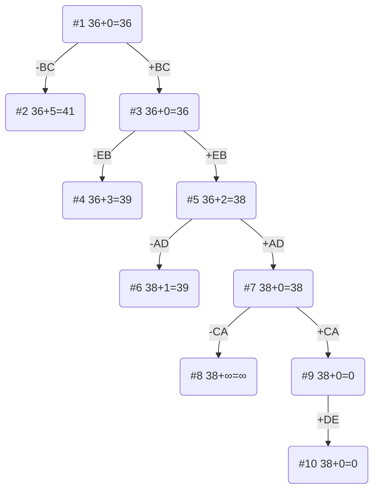

## Вариант 6:

Матрица расстояний:

|       | **A** | **B** | **C** | **D** | **E** |
|-------|:-----:|:-----:|:-----:|:-----:|:-----:|
| **A** | **∞** |   9   |  15   |   8   |   6   |
| **B** |  10   | **∞** |   9   |  16   |  10   |
| **C** |   7   |  12   | **∞** |  10   |   9   |
| **D** |   9   |  16   |  13   | **∞** |   9   |
| **E** |   6   |   5   |  11   |   5   | **∞** |

## Решение

### 1. Проведем редукцию строк матрицы

|       | **A** | **B** | **C** | **D** | **E** |  Min  |
|-------|:-----:|:-----:|:-----:|:-----:|:-----:|:-----:|
| **A** | **∞** |   9   |  15   |   8   |   6   |   6   |
| **B** |  10   | **∞** |   9   |  16   |  10   |   9   |
| **C** |   7   |  12   | **∞** |  10   |   9   |   7   |
| **D** |   9   |  16   |  13   | **∞** |   9   |   9   |
| **E** |   6   |   5   |  11   |   5   | **∞** |   5   |
|  Sum  |       |       |       |       |       |  36   |

Сумма констант редукции по строкам - 36

Матрица после редукции строк:

|       | **A** | **B** | **C** | **D** | **E** |
|-------|:-----:|:-----:|:-----:|:-----:|:-----:|
| **A** | **∞** |   3   |   9   |   2   |   0   |
| **B** |   1   | **∞** |   0   |   7   |   1   |
| **C** |   0   |   5   | **∞** |   3   |   2   |
| **D** |   0   |   7   |   4   | **∞** |   0   |
| **E** |   1   |   0   |   6   |   0   | **∞** |

### 2. Проведем редукцию столбцов матрицы

|       | **A** | **B** | **C** | **D** | **E** |**Sum**|
|-------|:-----:|:-----:|:-----:|:-----:|:-----:|:-----:|
| **A** | **∞** |   3   |   9   |   2   |   0   |       |
| **B** |   1   | **∞** |   0   |   7   |   1   |       |
| **C** |   0   |   5   | **∞** |   3   |   2   |       |
| **D** |   0   |   7   |   4   | **∞** |   0   |       |
| **E** |   1   |   0   |   6   |   0   | **∞** |       |
|  Min  |   0   |   0   |   0   |   0   |   0   |   0   |

Сумма констант редукции по стоблцам - 0

Матрица после редукции столбцов:

|       | **A** | **B** | **C** | **D** | **E** |
|-------|:-----:|:-----:|:-----:|:-----:|:-----:|
| **A** | **∞** |   3   |   9   |   2   |   0   |
| **B** |   1   | **∞** |   0   |   7   |   1   |
| **C** |   0   |   5   | **∞** |   3   |   2   |
| **D** |   0   |   7   |   4   | **∞** |   0   |
| **E** |   1   |   0   |   6   |   0   | **∞** |

### 3. Оценка длины маршрута
Оценка длины маршрута снизу соответствует сумме констант редукции по строкам и по столбцам

36 + 0 = 36

### 4. Найдем решение задачи с использованием метода ветвей и границ

Чтобы определить ребро, по которому будет произведено ветвление из корневого узла рассчитаем штрафы для ребер с нулевой оценкой:

|       | Штраф |
|-------|:-----:|
| **AE**|   2   |
| **BC**|   5   |
| **CA**|   2   |
| **DA**|   0   |
| **DE**|   0   |
| **EB**|   3   |
| **ED**|   2   |

Максимальный штраф 5, выберем ребро BC, как ребро с максимальным штрафом

#### Узел №2

Узел №2 с исключением ребра BC имеет оценку 36 + 5 = 41

#### Узел №3

Для получения оценки узла 3 необходимо рассчитать сумму констант редукции для матрицы с учетом включения ребра BC, для этого в матрице:

- Удалим строку B
- Удалим столбец C
- Заменим на бесконечность значение CB

|       | **A** | **B** | **D** | **E** |  Min  |
|-------|:-----:|:-----:|:-----:|:-----:|:-----:|
| **A** | **∞** |   3   |   2   |   0   |   0   |
| **C** |   0   | **∞** |   3   |   2   |   0   |
| **D** |   0   |   7   | **∞** |   0   |   0   |
| **E** |   1   |   0   |   0   | **∞** |   0   |
|  Sum  |       |       |       |       |   0   |

Матрица после редукции по строкам:

|       | **A** | **B** | **D** | **E** |  SUM  |
|-------|:-----:|:-----:|:-----:|:-----:|:-----:|
| **A** | **∞** |   3   |   2   |   0   |       |
| **C** |   0   | **∞** |   3   |   2   |       |
| **D** |   0   |   7   | **∞** |   0   |       |
| **E** |   1   |   0   |   0   | **∞** |       |
|  Min  |   0   |   0   |   0   |   0   |   0   |

Матрица после редукции по столбцам:

|       | **A** | **B** | **D** | **E** |
|-------|:-----:|:-----:|:-----:|:-----:|
| **A** | **∞** |   3   |   2   |   0   |
| **C** |   0   | **∞** |   3   |   2   |
| **D** |   0   |   7   | **∞** |   0   |
| **E** |   1   |   0   |   0   | **∞** |

Сумма констант редукции 0

Оценка узла №3 36 + 0 = 36

Продолжим поиск из узла 3

**Выбор ребра**

Чтобы определить ребро, по которому будет произведено ветвление из узла 3 рассчитаем штрафы для ребер с нулевой оценкой:

|       | Штраф |
|-------|:-----:|
| **AE**|   2   |
| **CA**|   2   |
| **DA**|   0   |
| **DE**|   0   |
| **EB**|   3   |
| **ED**|   2   |

Максимальный штраф 3, выберем ребро EB, как ребро с максимальным штрафом.

#### Узел №4

Узел №4 с исключением ребра EB имеет оценку 36 + 3 (штраф) = 39

#### Узел №5

Для получения оценки узла 5 необходимо рассчитать сумму констант редукции для матрицы с учетом включения ребра EB, для этого в матрице:

- удалим строку E,
- удалим столбец B,
- Заменим на бесконечность значение CE, чтобы избежать образования преждевременного цикла.
- 
|       | **A** | **D** | **E** |
|-------|:-----:|:-----:|:-----:|
| **A** | **∞** |   2   |   0   |
| **C** |   0   |   3   | **∞** |
| **D** |   0   | **∞** |   0   |

Матрица после редукции

|       | **A** | **D** | **E** |
|-------|:-----:|:-----:|:-----:|
| **A** | **∞** |   0   |   0   |
| **C** |   0   |   1   | **∞** |
| **D** |   0   | **∞** |   0   |

Сумма констант редукции 2

Оценка узла №5 36 + 2 (штраф) = 38

Продолжим поиск из узла 5

**Выбор ребра**

Чтобы определить ребро, по которому будет произведено ветвление из узла 5 рассчитаем штрафы для ребер с нулевой оценкой:

|       | Штраф |
|-------|:-----:|
| **AE**|   0   |
| **AD**|   1   |
| **CA**|   1   |
| **DA**|   0   |
| **DE**|   0   |

Максимальный штраф 1, выберем ребро AD, как ребро с максимальным штрафом.

#### Узел №6

Узел №6 с исключением ребра AD имеет оценку 38 + 1 (штраф) = 39

#### Узел №7

Для получения оценки узла 7 необходимо рассчитать сумму констант редукции для матрицы с учетом включения ребра AD, для этого в матрице:

удалим строку A,
удалим столбец D,
Заменим на бесконечность значение DA, чтобы избежать образования преждевременного цикла.

|       | **A** | **E** |
|-------|:-----:|:-----:|
| **C** |   0   | **∞** |
| **D** | **∞** |   0   |

Сумма констант редукции 0

Оценка узла №7 38 + 0 = 38

Продолжим поиск из узла 7

**Выбор ребра**

Чтобы определить ребро, по которому будет произведено ветвление из узла 7 рассчитаем штрафы для ребер с нулевой оценкой:

|       | Штраф |
|-------|:-----:|
| **CA**| **∞** |
| **DE**| **∞** |

Максимальный штраф **∞**, выберем ребро CA, как ребро с максимальным штрафом.

#### Узел №8

Узел №8 с исключением ребра CA имеет оценку 38 + ∞ (штраф) = ∞

#### Узел №9

Для получения оценки узла 9 необходимо рассчитать сумму констант редукции для матрицы с учетом включения ребра CA, для этого в матрице:

удалим строку C,
удалим столбец A,

|       | **E** |
|-------|:-----:|
| **D** |   0   |

Оценка узла №9 38 + 0 (редукция) = 38

Продолжим поиск из узла 9

Выбор ребра
Альтернатив у ребра DE нет

Узел №10
Ребро DE включается в маршрут, длина которого составляет 38

Кратчайший маршрут BCADEB
Длина маршрута 38.

