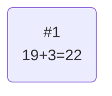
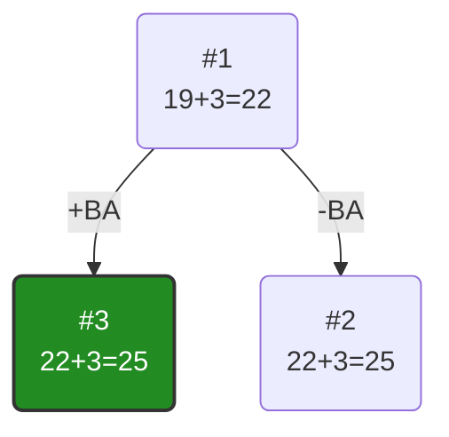
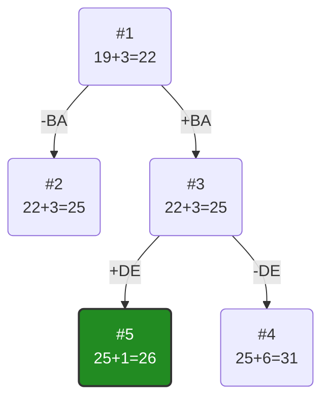
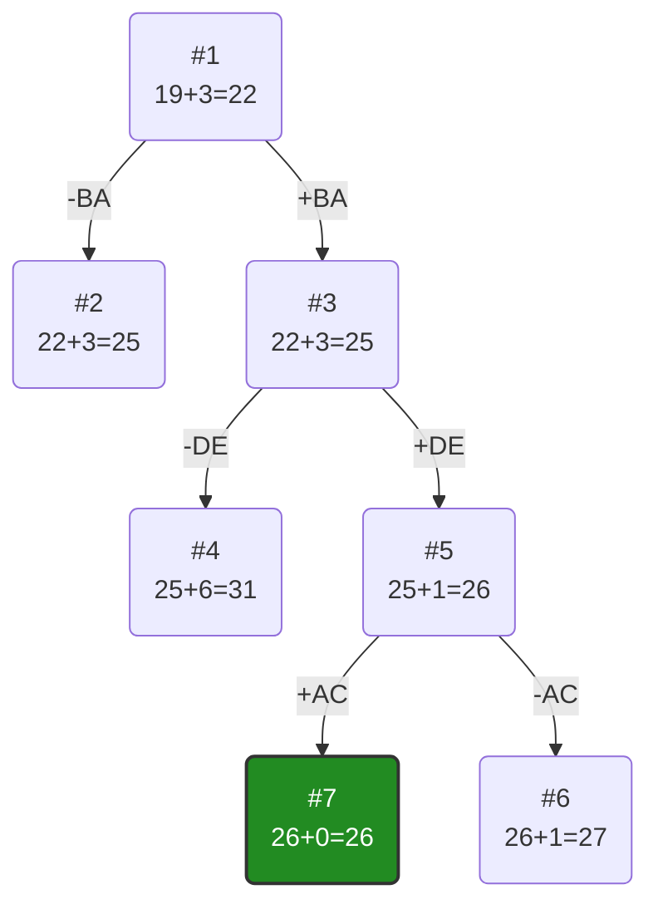
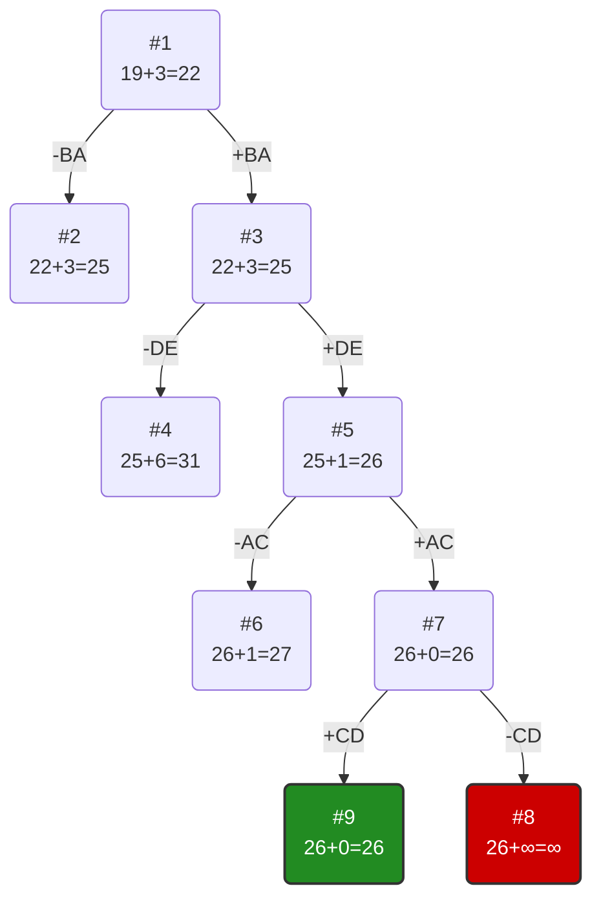
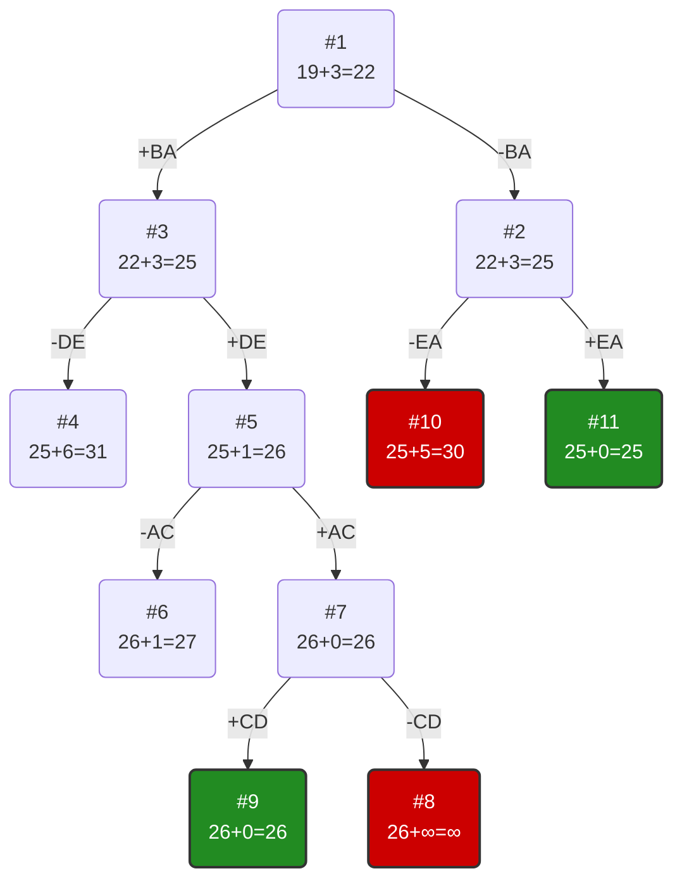
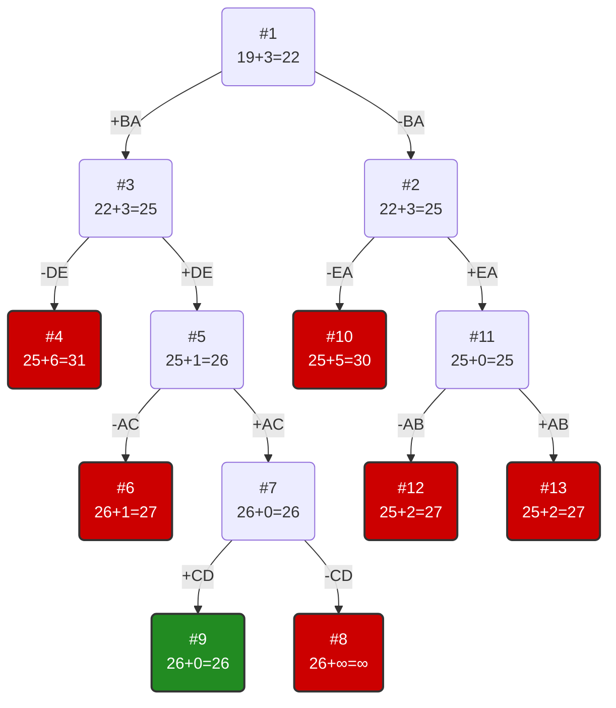

# Задание №19
# Задача коммивояжера. Метод ветвей и границ.

Необходимо:
1. Решить задачу коммивояжера с применением метода ветвей и границ.
2. Оформить решение задачи по шагам с подробными комментариями, таблицами и диаграммами.
3. **В узлах построенного дерева привести расчет оценки и указать порядковый номер, по которым можно проверить порядок исследования узлов дерева**, либо оформить решение с пошаговым построением дерева.
4. В ответе указать:
   - найденный маршрут,
   - длину найденного маршрута.

### Вариант 4:

Матрица расстояний:

|       | **A** | **B** | **C** | **D** | **E** |
|-------|:-----:|:-----:|:-----:|:-----:|:-----:|
| **A** | **∞** |   5   |   8   |  10   |  13   |
| **B** |   3   | **∞** |   8   |  16   |   6   |
| **C** |   9   |   4   | **∞** |   7   |  10   |
| **D** |   8   |   5   |   4   | **∞** |   4   |
| **E** |   3   |   4   |   6   |  12   | **∞** |

## Решение

### 1. Проведем редукцию строк матрицы

|       | **A** | **B** | **C** | **D** | **E** | **Min** |
|-------|:-----:|:-----:|:-----:|:-----:|:-----:|:-------:|
| **A** | **∞** |   5   |   8   |  10   |  13   |    5    |
| **B** |   3   | **∞** |   8   |  16   |   6   |    3    |
| **C** |   9   |   4   | **∞** |   7   |  10   |    4    |
| **D** |   8   |   5   |   4   | **∞** |   4   |    4    |
| **E** |   3   |   4   |   6   |  12   | **∞** |    3    |
| Sum   |       |       |       |       |       |   19    |

Сумма констант редукции по строкам 19

Матрица после редукции строк:

|       | **A** | **B** | **C** | **D** | **E** |
|-------|:-----:|:-----:|:-----:|:-----:|:-----:|
| **A** | **∞** |   0   |   3   |   5   |   8   |
| **B** |   0   | **∞** |   5   |  13   |   3   |
| **C** |   5   |   0   | **∞** |   3   |   6   |
| **D** |   4   |   1   |   0   | **∞** |   0   |
| **E** |   0   |   1   |   3   |   9   | **∞** |

### 2. Проведем редукцию столбцов матрицы

|       | **A** | **B** | **C** | **D** | **E** | **SUM** |
|-------|:-----:|:-----:|:-----:|:-----:|:-----:|:-------:|
| **A** | **∞** |   0   |   3   |   5   |   8   |         |
| **B** |   0   | **∞** |   5   |  13   |   3   |         |
| **C** |   5   |   0   | **∞** |   3   |   6   |         |
| **D** |   4   |   1   |   0   | **∞** |   0   |         |
| **E** |   0   |   1   |   3   |   9   | **∞** |         |
| Min   |   0   |   0   |   0   |   3   |   0   |    3    |

Сумма констант редукции по столбцам 3

Матрица после редукции столбцов:

|       | **A** | **B** | **C** | **D** | **E** |
|-------|:-----:|:-----:|:-----:|:-----:|:-----:|
| **A** | **∞** |   0   |   3   |   2   |   8   |
| **B** |   0   | **∞** |   5   |  10   |   3   |
| **C** |   5   |   0   | **∞** |   0   |   6   |
| **D** |   4   |   1   |   0   | **∞** |   0   |
| **E** |   0   |   1   |   3   |   6   | **∞** |

## Оценка длины маршрута

Оценка длины маршрута снизу соответствует сумме констант редукции по строкам и по столбцам

19 + 3 = 22

## Найдем решение задачи с использованием метода ветвей и границ

Чтобы определить ребро по которому будет произведено ветвление из корневого узла рассчитаем штрафы для ребер с нулевой оценкой:

|        | **Штраф** |
|:-------|:---------:|
| **AB** |     2     |
| **BA** |     3     |
| **CB** |     0     |
| **CD** |     2     |
| **DC** |     3     |
| **DE** |     3     |
| **EA** |     1     |

Максимальный штраф 3, выберем ребро BA, как одно из ребер с максимальным штрафом.

### Узел №2

Узел №2 с исключением ребра BA имеет оценку 22 + 3 (штраф) = 25

### Узел №3

Для получения оценки узла 3 необходимо рассчитать сумму констант редукции для матрицы с учетом включения ребра BA, для этого в матрице:

удалим строку B,
удалим столбец A,
Заменим на бесконечность значение AB, чтобы избежать образования преждевременного цикла B→A→B.

|       | **B** | **C** | **D** | **E** |  Min  |
|-------|:-----:|:-----:|:-----:|:-----:|:-----:|
| **A** | **∞** |   3   |   2   |   8   |   2   |
| **C** |   0   | **∞** |   0   |   6   |       |
| **D** |   1   |   0   | **∞** |   0   |       |
| **E** |   1   |   3   |   6   | **∞** |   1   |
| *Sum* |       |       |       |       |   3   |

Матрица после редукции по строкам:

|       | **B** | **C** | **D** | **E** |
|-------|:-----:|:-----:|:-----:|:-----:|
| **A** | **∞** |   1   |   0   |   6   |
| **C** |   0   | **∞** |   0   |   6   |
| **D** |   1   |   0   | **∞** |   0   |
| **E** |   0   |   2   |   5   | **∞** |

Проверим столбцы:  
Столбец B: min(∞, 0, 1, 0) = 0
Столбец C: min(1, ∞, 0, 2) = 0
Столбец D: min(0, 0, ∞, 5) = 0
Столбец E: min(6, 6, 0, ∞) = 0

Редукция столбцов не требуется.

Сумма констант редукции 3

Оценка узла 3 = 22 + 3 (редукция) = 25

Продолжим поиск из узла 3

### Выбор ребра

Чтобы определить ребро по которому будет произведено ветвление из узла 3 рассчитаем штрафы для ребер с нулевой оценкой:

|        | **Штраф** |
|:-------|:---------:|
| **AD** |     1     |
| **CB** |     0     |
| **CD** |     0     |
| **DC** |     1     |
| **DE** |     6     |
| **EB** |     2     |

Максимальный штраф 6, выберем ребро DE, как ребро с максимальным штрафом

### Узел №4

Узел №4 с исключением ребра DE имеет оценку 25 + 6 (штраф) = 31

### Узел №5

Для получения оценки узла 5 необходимо рассчитать сумму констант редукции для матрицы с учетом включения ребра DE, для этого в матрице:

удалим строку D,
удалим столбец E,
заменим на бесконечность значение ED, чтобы избежать образования преждевременного цикла D→E→D

|       | **B** | **C** | **D** |  Min  |
|-------|:-----:|:-----:|:-----:|:-----:|
| **A** | **∞** |   1   |   0   |       |
| **C** |   0   | **∞** |   0   |       |
| **E** |   0   |   2   | **∞** |       |
| *Sum* |       |       |       |   0   |

Строки уже содержат нули, редукция строк не требуется. Проверим столбцы:  
Столбец B: min(∞, 0, 0) = 0
Столбец C: min(1, ∞, 2) = 1 - необходима редукция
Столбец D: min(0, 0, ∞) = 0

Вычтем 1 из столбца C:

|       | **B** | **C** | **D** |
|-------|:-----:|:-----:|:-----:|
| **A** | **∞** |   0   |   0   |
| **C** |   0   | **∞** |   0   |
| **E** |   0   |   1   | **∞** |

Сумма констант редукции: строки (0) + столбцы (1) = 1

Оценка узла 5 = 25 + 1 (редукция) = 26

Продолжим поиск из узла 5

### Выбор ребра

Чтобы определить ребро, по которому будет произведено ветвление из узла 5 рассчитаем штрафы для ребер с нулевой оценкой:

|        | **Штраф** |
|:-------|:---------:|
| **AC** |     1     |
| **AD** |     0     |
| **CB** |     0     |
| **CD** |     0     |
| **EB** |     1     |

Максимальный штраф 1, выберем ребро AC, как одно из ребер с максимальным штрафом.

### Узел №6

Узел №6 с исключением ребра AC имеет оценку 26 + 1 (штраф) = 27

### Узел №7

Для получения оценки узла 7 необходимо рассчитать сумму констант редукции для матрицы с учетом включения ребра AC, для этого в матрице:

удалим строку A,
удалим столбец C,
К данному моменту мы уже включили ребра BA, DE и AC. Они образуют цепи: D→E и B→A→C. Чтобы цикл не замкнулся преждевременно, убираем возможность хода из C в B: ставим в CB значение ∞

|       | **B** | **D** |  Min  |
|-------|:-----:|:-----:|:-----:|
| **C** | **∞** |   0   |       |
| **E** |   0   | **∞** |       |
| *Sum* |       |       |   0   |

Все строки и столбцы уже содержат нули, редукция не требуется

Сумма констант редукции 0

Оценка узла 7 = 26 + 0 (редукция) = 26

Продолжим поиск из узла 7

### Выбор ребра

Чтобы определить ребро, по которому будет произведено ветвление из узла 7 рассчитаем штрафы для ребер с нулевой оценкой:

|        | **Штраф** |
|:-------|:---------:|
| **CD** |   **∞**   |
| **EB** |   **∞**   |

Максимальный штраф ∞, выберем ребро CD, как одно из ребер с максимальным штрафом

### Узел №8

Узел №8 с исключением ребра CD имеет оценку 26 + ∞ (штраф) = ∞

### Узел №9

Для получения оценки узла 9 необходимо рассчитать сумму констант редукции для матрицы с учетом включения ребра CD, для этого в матрице:

удалим строку C,
удалим столбец D,

|       | **B** |
|:------|:-----:|
| **E** |   0   |

Сумма констант редукции 0

Оценка узла 9 = 26 + 0 (редукция) = 26

Ребро EB включается в маршрут, длина которого составляет 26

Составим маршрут из найденного множества ребер { BA, DE, AC, CD, EB }, начиная с вершины A:

$$A \rightarrow C \rightarrow D \rightarrow E \rightarrow B \rightarrow A$$

Проверим длину по исходной матрице расстояний:

AC + CD + DE + EB + BA = 8 + 7 + 4 + 4 + 3 = 26

Оценка в узле 9 (26) совпала с длиной полученного маршрута

### Проверка узла №2 (оценка 25 < 26)

Оценка узла №2 (25) меньше длины найденного маршрута (26), поэтому нужно исследовать эту ветвь, чтобы убедиться, что в ней нет более короткого маршрута

В узле 2 ребро BA исключено (заменено на ∞). Исходная приведенная матрица с BA = ∞:

|       | **A** | **B** | **C** | **D** | **E** |
|-------|:-----:|:-----:|:-----:|:-----:|:-----:|
| **A** | **∞** |   0   |   3   |   2   |   8   |
| **B** | **∞** | **∞** |   5   |  10   |   3   |
| **C** |   5   |   0   | **∞** |   0   |   6   |
| **D** |   4   |   1   |   0   | **∞** |   0   |
| **E** |   0   |   1   |   3   |   6   | **∞** |

Необходима редукция строки B: min(∞, ∞, 5, 10, 3) = 3

|       | **A** | **B** | **C** | **D** | **E** |  Min  |
|-------|:-----:|:-----:|:-----:|:-----:|:-----:|:-----:|
| **A** | **∞** |   0   |   3   |   2   |   8   |       |
| **B** | **∞** | **∞** |   5   |  10   |   3   |   3   |
| **C** |   5   |   0   | **∞** |   0   |   6   |       |
| **D** |   4   |   1   |   0   | **∞** |   0   |       |
| **E** |   0   |   1   |   3   |   6   | **∞** |       |
| *Sum* |       |       |       |       |       |   3   |

Матрица после редукции:

|       | **A** | **B** | **C** | **D** | **E** |
|-------|:-----:|:-----:|:-----:|:-----:|:-----:|
| **A** | **∞** |   0   |   3   |   2   |   8   |
| **B** | **∞** | **∞** |   2   |   7   |   0   |
| **C** |   5   |   0   | **∞** |   0   |   6   |
| **D** |   4   |   1   |   0   | **∞** |   0   |
| **E** |   0   |   1   |   3   |   6   | **∞** |

Все столбцы содержат нули, редукция столбцов не требуется

Сумма констант редукции 3

Оценка узла 2 = 22 + 3 = 25

#### Выбор ребра

Рассчитаем штрафы для ребер с нулевой оценкой:

|        | **Штраф** |
|:-------|:---------:|
| **AB** |     2     |
| **BE** |     2     |
| **CB** |     0     |
| **CD** |     2     |
| **DC** |     2     |
| **DE** |     0     |
| **EA** |     5     |

Максимальный штраф 5, выберем ребро EA, как ребро с максимальным штрафом

### Узел №10

Узел №10 с исключением ребра EA имеет оценку 25 + 5 (штраф) = 30 ⩾ 26 - ветвь отсекается.

### Узел №11

Для получения оценки узла 11 необходимо рассчитать сумму констант редукции для матрицы с учетом включения ребра EA, для этого в матрице:

удалим строку E,
удалим столбец A,
заменим на бесконечность значение AE, чтобы избежать образования преждевременного цикла E→A→E

|       | **B** | **C** | **D** | **E** |  Min  |
|-------|:-----:|:-----:|:-----:|:-----:|:-----:|
| **A** |   0   |   3   |   2   | **∞** |       |
| **B** | **∞** |   2   |   7   |   0   |       |
| **C** |   0   | **∞** |   0   |   6   |       |
| **D** |   1   |   0   | **∞** |   0   |       |
| *Sum* |       |       |       |       |   0   |

Все строки и столбцы уже содержат нули, редукция не требуется.

Сумма констант редукции 0

Оценка узла 11 = 25 + 0 (редукция) = 25

Продолжим поиск из узла 11.

#### Выбор ребра

Рассчитаем штрафы для ребер с нулевой оценкой:

|        | **Штраф** |
|:-------|:---------:|
| **AB** |     2     |
| **BE** |     2     |
| **CB** |     0     |
| **CD** |     2     |
| **DC** |     2     |
| **DE** |     0     |

Максимальный штраф 2, выберем ребро AB, как одно из ребер с максимальным штрафом.

### Узел №12

Узел №12 с исключением ребра AB имеет оценку 25 + 2 (штраф) = 27 ⩾ 26 - ветвь отсекается.

### Узел №13

Для получения оценки узла 13 необходимо рассчитать сумму констант редукции для матрицы с учетом включения ребра AB, для этого в матрице:

удалим строку A,
удалим столбец B,
к данному моменту мы уже включили ребро EA. С добавлением AB получаем цепь E→A→B. Чтобы избежать образования преждевременного цикла, необходимо запретить возврат из B в E. Заменим на бесконечность значение BE

|       | **C** | **D** | **E** |  Min  |
|-------|:-----:|:-----:|:-----:|:-----:|
| **B** |   2   |   7   | **∞** |   2   |
| **C** | **∞** |   0   |   6   |       |
| **D** |   0   | **∞** |   0   |       |
| *Sum* |       |       |       |   2   |

Матрица после редукции по строкам:

|       | **C** | **D** | **E** |
|-------|:-----:|:-----:|:-----:|
| **B** |   0   |   5   | **∞** |
| **C** | **∞** |   0   |   6   |
| **D** |   0   | **∞** |   0   |

Проверим столбцы:  
Столбец C: min(0, ∞, 0) = 0
Столбец D: min(5, 0, ∞) = 0
Столбец E: min(∞, 6, 0) = 0

Редукция столбцов не требуется

Сумма констант редукции 2

Оценка узла 13 = 25 + 2 (редукция) = 27 ⩾ 26 - ветвь отсекается

### Итог проверки

Все неисследованные узлы дерева имеют оценки ⩾ 26:

| **Узел** | **Оценка** | **Решение**     |
|:--------:|:----------:|:---------------|
| №4       |     31     | ⩾ 26, отсекли |
| №6       |     27     | ⩾ 26, отсекли |
| №8       |     ∞      | ⩾ 26, отсекли |
| №10      |     30     | ⩾ 26, отсекли |
| №12      |     27     | ⩾ 26, отсекли |
| №13      |     27     | ⩾ 26, отсекли |

Значит, это решение оптимальное!

## Итоговое дерево ветвлений

## Проверка маршрута

Множество выбранных ребер: { BA, DE, AC, CD, EB }

Составим маршрут, начиная с вершины A:

$$A \rightarrow C \rightarrow D \rightarrow E \rightarrow B \rightarrow A$$

Проверим длину по исходной матрице расстояний:

- A → C: C(A,C) = 8
- C → D: C(C,D) = 7
- D → E: C(D,E) = 4
- E → B: C(E,B) = 4
- B → A: C(B,A) = 3

Сумма: 8 + 7 + 4 + 4 + 3 = 26

# Ответ

Оценка в последнем узле дерева (26) совпала с длиной полученного маршрута и все неисследованные узлы дерева имеют оценки ⩾ 26. Найдено оптимальное решение.

Найденный маршрут: **A → C → D → E → B → A**

Длина найденного маршрута: **26**
