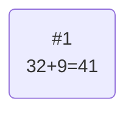
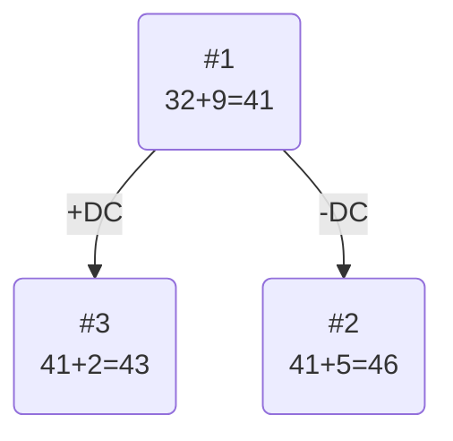
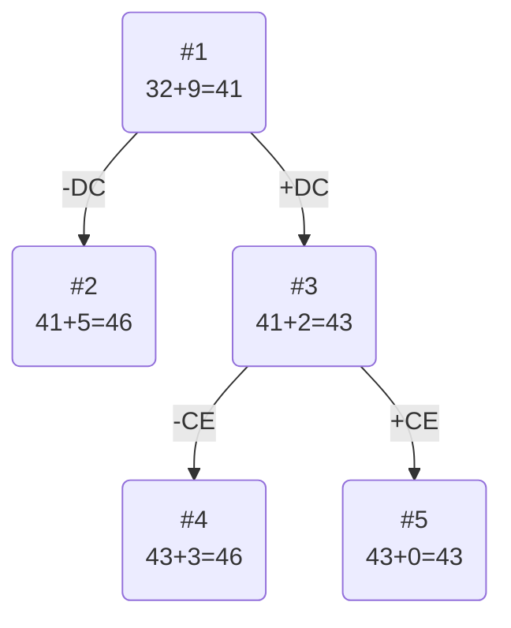
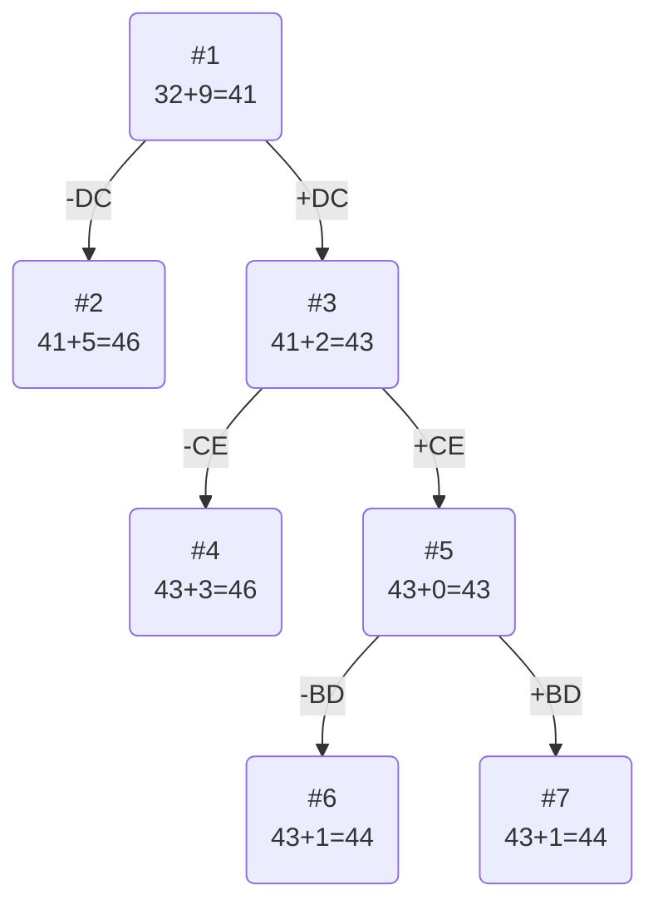
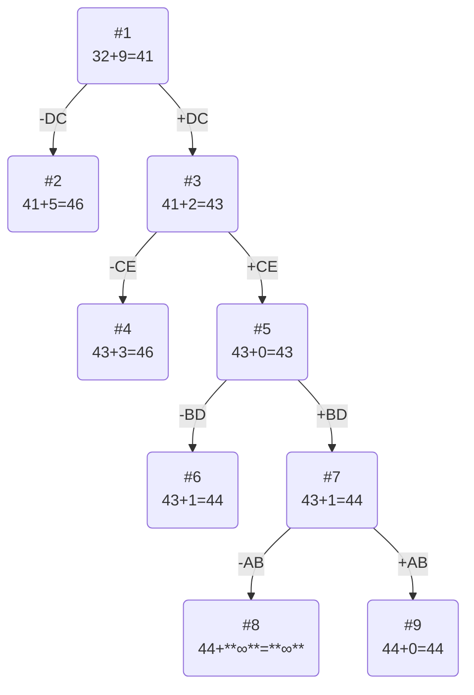
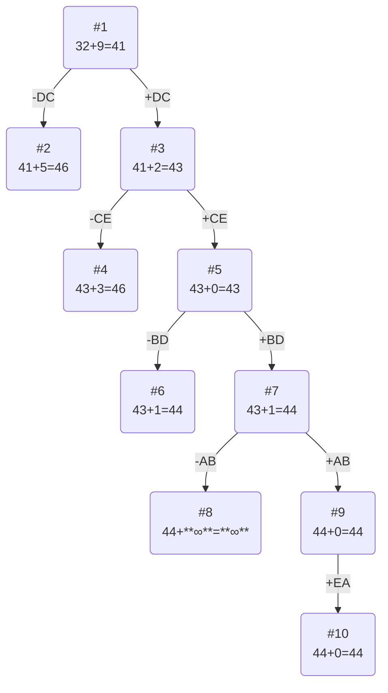

# Задание №19 (Вариант 5)
# Задача коммивояжера. Метод ветвей и границ.

Необходимо: 
1. Решить задачу коммивояжера с применением метода ветвей и границ.
2. Оформить решение задачи по шагам с подробными комментариями, таблицами и диаграммами.
3. **В узлах построенного дерева привести расчет оценки и указать порядковый номер, по которым можно проверить порядок исследования узлов дерева**, либо оформить решение с пошаговым построением дерева.
4. В ответе указать:
   - найденный маршрут,
   - длину найденного маршрута.

Матрица расстояний:

|       | **A** | **B** | **C** | **D** | **E** |
|-------|:-----:|:-----:|:-----:|:-----:|:-----:|
| **A** | **∞** |   9   |  14   |   6   |  14   |
| **B** |   8   | **∞** |  12   |   5   |  13   |
| **C** |  10   |  13   | **∞** |   8   |  13   |
| **D** |   6   |   8   |   8   | **∞** |  11   |
| **E** |   9   |   9   |  14   |   7   | **∞** |

## Решение
### 1. Проведем редукцию строк матрицы

|       | **A** | **B** | **C** | **D** | **E** |  Min  |
|-------|:-----:|:-----:|:-----:|:-----:|:-----:|:-----:|
| **A** | **∞** |   3   |   8   |   0   |   8   |   6   |
| **B** |   3   | **∞** |   7   |   0   |   8   |   5   |
| **C** |   2   |   5   | **∞** |   0   |   5   |   8   |
| **D** |   0   |   2   |   2   | **∞** |   5   |   6   |
| **E** |   2   |   2   |   7   |   0   | **∞** |   7   |
| Sum   |       |       |       |       |       |  32   |

Сумма констант редукции по строкам 32

Матрица после редукции строк:

|       | **A** | **B** | **C** | **D** | **E** |
|-------|:-----:|:-----:|:-----:|:-----:|:-----:|
| **A** | **∞** |   3   |   8   |   0   |   8   |
| **B** |   3   | **∞** |   7   |   0   |   8   |
| **C** |   2   |   5   | **∞** |   0   |   5   |
| **D** |   0   |   2   |   2   | **∞** |   5   |
| **E** |   2   |   2   |   7   |   0   | **∞** |

### 2. Проведем редукцию столбцов матрицы

|       | **A** | **B** | **C** | **D** | **E** |  Sum  |
|-------|:-----:|:-----:|:-----:|:-----:|:-----:|:-----:|
| **A** | **∞** |   1   |   6   |   0   |   3   |       |
| **B** |   3   | **∞** |   5   |   0   |   3   |       |
| **C** |   2   |   3   | **∞** |   0   |   0   |       |
| **D** |   0   |   0   |   0   | **∞** |   0   |       |
| **E** |   2   |   0   |   5   |   0   | **∞** |       |
| Min   |   0   |   2   |   2   |   0   |   5   |   9   |

Сумма констант редукции по столбцам 9

Матрица после редукции столбцов:

|       | **A** | **B** | **C** | **D** | **E** |
|-------|:-----:|:-----:|:-----:|:-----:|:-----:|
| **A** | **∞** |   1   |   6   |   0   |   3   |
| **B** |   3   | **∞** |   5   |   0   |   3   |
| **C** |   2   |   3   | **∞** |   0   |   0   |
| **D** |   0   |   0   |   0   | **∞** |   0   |
| **E** |   2   |   0   |   5   |   0   | **∞** |

### 3. Оценка длины маршрута

Оценка длины маршрута снизу соответствует сумме констант редукции по строкам и по столбцам

32 + 9 = 41

### 4. Найдем решение задачи с использованием метода ветвей и границ

Чтобы определить ребро, по которому будет произведено ветвление из корневого узла рассчитаем штрафы для ребер с нулевой оценкой:

|        | **Штраф** |
|:-------|:---------:|
| **AD** |     1     |
| **BD** |     3     |
| **CD** |     0     |
| **CE** |     0     |
| **DA** |     2     |
| **DB** |     0     |
| **DC** |     5     |
| **DE** |     0     |
| **EB** |     0     |
| **ED** |     0     |

Максимальный штраф 5, выберем ребро DC, как ребро с максимальным штрафом.

#### Узел №2
Узел №2 с исключением ребра DС имеет оценку 41 + 5 (штраф) = 46

#### Узел №3
Для получения оценки узла 3 необходимо рассчитать сумму констант редукции для матрицы с учетом включения ребра DB, для этого в матрице:
- удалим строку D,
- удалим столбец C,
- Заменим на бесконечность значение CD.

|       | **A** | **B** | **D** | **E** |
|-------|:-----:|:-----:|:-----:|:-----:|
| **A** | **∞** |   1   |   0   |   3   |
| **B** |   3   | **∞** |   0   |   3   |
| **C** |   2   |   3   |   0   |   0   |
| **E** |   2   |   0   |   0   | **∞** |

Матрица после редукции по столбцам:

|       | **A** | **B** | **D** | **E** |  Sum  |
|-------|:-----:|:-----:|:-----:|:-----:|:-----:|
| **A** | **∞** |   1   |   0   |   3   |   0   |
| **B** |   1   | **∞** |   0   |   3   |   0   |
| **C** |   0   |   3   | **∞** |   0   |   0   |
| **E** |   0   |   0   |   0   | **∞** |   0   |
|  MIN  |   2   |   0   |   0   |   0   |   2   |

Сумма констант редукции 2

Оценка узла 3 = 41 + 2 (редукция) = 43

Продолжим поиск из узла 3

#### Выбор ребра
Чтобы определить ребро, по которому будет произведено ветвление из узла 3 рассчитаем штрафы для ребер с нулевой оценкой:

|        | **Штраф** |
|:-------|:---------:|
| **AD** |     1     |
| **BD** |     1     |
| **CA** |     0     |
| **CE** |     3     |
| **EA** |     0     |
| **EB** |     1     |
| **ED** |     0     |

Максимальный штраф 3, выберем ребро CE, как ребро с максимальным штрафом.

#### Узел №4
Узел №4 с исключением ребра CE имеет оценку 43 + 3 (штраф) = 46

#### Узел №5
Для получения оценки узла 5 необходимо рассчитать сумму констант редукции для матрицы с учетом включения ребра CE, для этого в матрице:
- удалим строку C,
- удалим столбец E,
- Заменим на бесконечность значение DE.

|       | **A** | **B** | **D** |
|-------|:-----:|:-----:|:-----:|
| **A** | **∞** |   1   |   0   |
| **B** |   1   | **∞** |   0   |
| **E** |   0   |   0   | **∞** |

Сумма констант редукции 0

Оценка узла 5 = 43 + 0 (редукция) = 43

Продолжим поиск из узла 5

#### Выбор ребра
Чтобы определить ребро, по которому будет произведено ветвление из узла 5 рассчитаем штрафы для ребер с нулевой оценкой:

|        | **Штраф** |
|:-------|:---------:|
| **AD** |     1     |
| **BD** |     1     |
| **EA** |     1     |
| **EB** |     1     |

Максимальный штраф 1, выберем ребро BD, как одно из ребер с максимальным штрафом.

#### Узел №6
Узел №6 с исключением ребра BD имеет оценку 43 + 1 (штраф) = 44

#### Узел №7
Для получения оценки узла 7 необходимо рассчитать сумму констант редукции для матрицы с учетом включения ребра BD, для этого в матрице:
- удалим строку B,
- удалим столбец D,
- Заменим на бесконечность значение EB, чтобы избежать образования преждевременного цикла.

|       | **A** | **B** |
|-------|:-----:|:-----:|
| **A** | **∞** |   1   |
| **E** |   0   | **∞** |

Матрица после редукции по столбцам:

|       | **A** | **B** |
|-------|:-----:|:-----:|
| **A** | **∞** |   0   |
| **E** |   0   | **∞** |

Сумма констант редукции 1

Оценка узла 7 = 43 + 1 (редукция) = 44

Продолжим поиск из узла 7

#### Выбор ребра
Чтобы определить ребро, по которому будет произведено ветвление из узла 7 рассчитаем штрафы для ребер с нулевой оценкой:

|        | **Штраф** |
|:-------|:---------:|
| **AB** |   **∞**   |
| **EA** |   **∞**   |

Максимальный штраф **∞**, выберем ребро AB, как одно из ребер с максимальным штрафом.

#### Узел №8
Узел №8 с исключением ребра AB имеет оценку 44 + **∞** (штраф) = **∞**

#### Узел №9
Для получения оценки узла 9 необходимо рассчитать сумму констант редукции для матрицы с учетом включения ребра AB, для этого в матрице:
- удалим строку A,
- удалим столбец B,

|       | **A** | 
|:------|:-----:|
| **E** |   0   |

Сумма констант редукции 0

Оценка узла 9 = 44 + 0 (редукция) = 44

Продолжим поиск из узла 9. Поиск из узла 6 с тем же значением проводить не будем, так он находится выше узла 9

#### Выбор ребра
Альтернатив у ребра EA нет

#### Узел №14
Ребро EA включается в маршрут, длина которого составляет 44

### Ответ
- Кратчайший маршрут DCEABD.
- Длина маршрута 44.
