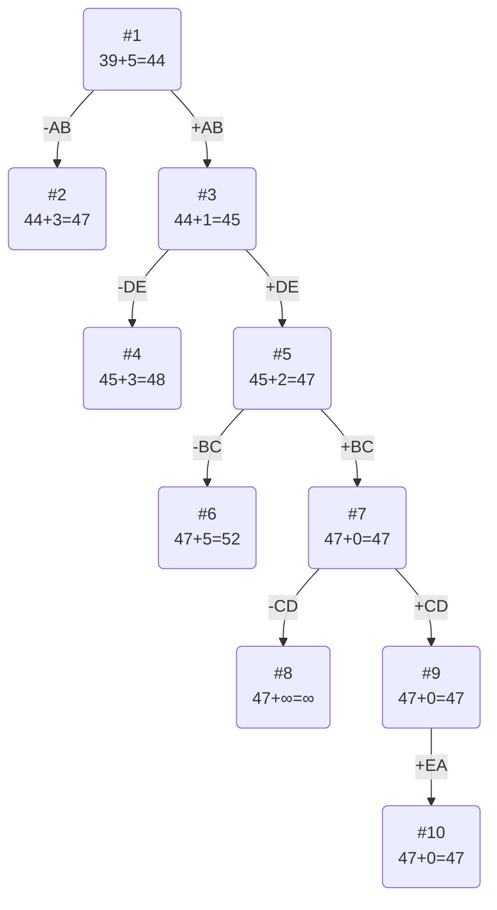

# Решение задачи коммивояжера

## Условия задачи

Матрица расстояний:

|       | **A** | **B** | **C** | **D** | **E** |
|-------|:-----:|:-----:|:-----:|:-----:|:-----:|
| **A** | **∞** |   13  |   9   |   12  |   13  |
| **B** |   11  | **∞** |   10  |   15  |   7   |
| **C** |   7   |   14  | **∞** |   8   |   15  |
| **D** |   14  |   15  |   12  | **∞** |   8   |
| **E** |   8   |   15  |   9   |   10  | **∞** |

## Решение

### 1. Проведем редукцию строк матрицы

|       | **A** | **B** | **C** | **D** | **E** |  Min  |
|-------|:-----:|:-----:|:-----:|:-----:|:-----:|:-----:|
| **A** | **∞** |   13  |   9   |   12  |   13  |   9   |
| **B** |   11  | **∞** |   10  |   15  |   7   |   7   |
| **C** |   7   |   14  | **∞** |   8   |   15  |   7   |
| **D** |   14  |   15  |   12  | **∞** |   8   |   8   |
| **E** |   8   |   15  |   9   |   10  | **∞** |   8   |
| Sum   |       |       |       |       |       |  39   |

Сумма констант редукции по строкам 39

Матрица после редукции строк:

|       | **A** | **B** | **C** | **D** | **E** |
|-------|:-----:|:-----:|:-----:|:-----:|:-----:|
| **A** | **∞** |   4   |   0   |   3   |   4   |
| **B** |   4   | **∞** |   3   |   8   |   0   |
| **C** |   0   |   7   | **∞** |   1   |   8   |
| **D** |   6   |   7   |   4   | **∞** |   0   |
| **E** |   0   |   7   |   1   |   2   | **∞** |

### 2. Проведем редукцию столбцов матрицы

|       | **A** | **B** | **C** | **D** | **E** |  SUM  |
|-------|:-----:|:-----:|:-----:|:-----:|:-----:|:-----:|
| **A** | **∞** |   4   |   0   |   3   |   4   |       |
| **B** |   4   | **∞** |   3   |   8   |   0   |       |
| **C** |   0   |   7   | **∞** |   1   |   8   |       |
| **D** |   6   |   7   |   4   | **∞** |   0   |       |
| **E** |   0   |   7   |   1   |   2   | **∞** |       |
| Min   |   0   |   4   |   0   |   1   |   0   |   5   |

Сумма констант редукции по столбцам 5

Матрица после редукции столбцов:

|       | **A** | **B** | **C** | **D** | **E** |
|-------|:-----:|:-----:|:-----:|:-----:|:-----:|
| **A** | **∞** |   0   |   0   |   2   |   4   |
| **B** |   4   | **∞** |   3   |   7   |   0   |
| **C** |   0   |   3   | **∞** |   0   |   8   |
| **D** |   6   |   3   |   4   | **∞** |   0   |
| **E** |   0   |   3   |   1   |   1   | **∞** |

### 3. Оценка длины маршрута

Оценка длины маршрута снизу соответствует сумме констант редукции по строкам и по столбцам

39 + 5 = 44

### 4. Найдем решение задачи с использованием метода ветвей и границ

Чтобы определить ребро, по которому будет произведено ветвление из корневого узла, рассчитаем штрафы для ребер с нулевой оценкой:

|        | **Штраф** |
|:-------|:---------:|
| **AB** |     3     |
| **AC** |     1     |
| **BE** |     3     |
| **CA** |     0     |
| **CD** |     1     |
| **DE** |     3     |
| **EA** |     1     |

Максимальный штраф 3, выберем ребро AB (первое из найденных с максимальным штрафом).

#### Узел №2
Узел №2 с исключением ребра AB имеет оценку 44 + 3 (штраф) = 47

#### Узел №3
Для получения оценки узла 3 необходимо рассчитать сумму констант редукции для матрицы с учетом включения ребра AB, для этого в матрице:
- удалим строку A,
- удалим столбец B,
- Заменим на бесконечность значение BA (чтобы избежать преждевременного цикла).

|       | **A** | **C** | **D** | **E** |  Min  |
|-------|:-----:|:-----:|:-----:|:-----:|:-----:|
| **B** | **∞** |   3   |   7   |   0   |       |
| **C** |   0   | **∞** |   0   |   8   |       |
| **D** |   6   |   4   | **∞** |   0   |       |
| **E** |   0   |   1   |   1   | **∞** |       |
| Sum   |       |       |       |       |   0   |

Минимальные элементы в строках равны 0. Редукция столбцов:
В столбце C минимальный элемент 1 (в строке E).
В столбце A минимальный элемент 0.
В столбце D минимальный элемент 0.
В столбце E минимальный элемент 0.

Сумма констант редукции по столбцам (только столбец C): 1.

Матрица после редукции:

|       | **A** | **C** | **D** | **E** |
|-------|:-----:|:-----:|:-----:|:-----:|
| **B** | **∞** |   2   |   7   |   0   |
| **C** |   0   | **∞** |   0   |   8   |
| **D** |   6   |   3   | **∞** |   0   |
| **E** |   0   |   0   |   1   | **∞** |

Сумма констант редукции 1

Оценка узла 3 = 44 + 1 (редукция) = 45

Продолжим поиск из узла 3

#### Выбор ребра
Чтобы определить ребро, по которому будет произведено ветвление из узла 3, рассчитаем штрафы для ребер с нулевой оценкой:

|        | **Штраф** |
|:-------|:---------:|
| **BE** |     2     |
| **CA** |     0     |
| **CD** |     1     |
| **DE** |     3     |
| **EA** |     0     |
| **EC** |     2     |

Максимальный штраф 3, выберем ребро DE.

#### Узел №4
Узел №4 с исключением ребра DE имеет оценку 45 + 3 (штраф) = 48

#### Узел №5
Для получения оценки узла 5 необходимо рассчитать сумму констант редукции для матрицы с учетом включения ребра DE, для этого в матрице:
- удалим строку D,
- удалим столбец E,
- Заменим на бесконечность значение ED.

|       | **A** | **C** | **D** |  Min  |
|-------|:-----:|:-----:|:-----:|:-----:|
| **B** | **∞** |   2   |   7   |   2   |
| **C** |   0   | **∞** |   0   |       |
| **E** |   0   |   0   | **∞** |       |
| Sum   |       |       |       |   2   |

Редукция по строкам (строка B: min=2):

|       | **A** | **C** | **D** |
|-------|:-----:|:-----:|:-----:|
| **B** | **∞** |   0   |   5   |
| **C** |   0   | **∞** |   0   |
| **E** |   0   |   0   | **∞** |

Сумма констант редукции 2

Оценка узла 5 = 45 + 2 (редукция) = 47

Продолжим поиск из узла 5

#### Выбор ребра
Чтобы определить ребро, по которому будет произведено ветвление из узла 5, рассчитаем штрафы для ребер с нулевой оценкой:

|        | **Штраф** |
|:-------|:---------:|
| **BC** |     5     |
| **CA** |     0     |
| **CD** |     5     |
| **EA** |     0     |
| **EC** |     0     |

Максимальный штраф 5, выберем ребро BC (первое из максимальных).

#### Узел №6
Узел №6 с исключением ребра BC имеет оценку 47 + 5 (штраф) = 52

#### Узел №7
Для получения оценки узла 7 необходимо рассчитать сумму констант редукции для матрицы с учетом включения ребра BC, для этого в матрице:
- удалим строку B,
- удалим столбец C,
- Заменим на бесконечность значение CA (так как есть путь A->B->C, нельзя C->A).

|       | **A** | **D** |
|-------|:-----:|:-----:|
| **C** | **∞** |   0   |
| **E** |   0   | **∞** |

Сумма констант редукции 0

Оценка узла 7 = 47 + 0 (редукция) = 47

Продолжим поиск из узла 7

#### Выбор ребра
Чтобы определить ребро, по которому будет произведено ветвление из узла 7, рассчитаем штрафы для ребер с нулевой оценкой:

|        | **Штраф** |
|:-------|:---------:|
| **CD** |   **∞**   |
| **EA** |   **∞**   |

Максимальный штраф **∞**, выберем ребро CD.

#### Узел №8
Узел №8 с исключением ребра CD имеет оценку 47 + **∞** (штраф) = **∞**

#### Узел №9
Для получения оценки узла 9 необходимо рассчитать сумму констант редукции для матрицы с учетом включения ребра CD, для этого в матрице:
- удалим строку C,
- удалим столбец D,

|       | **A** |
|:------|:-----:|
| **E** |   0   |

Сумма констант редукции 0

Оценка узла 9 = 47 + 0 (редукция) = 47

Продолжим поиск из узла 9

#### Выбор ребра
Альтернатив у ребра EA нет

#### Узел №10
Ребро EA включается в маршрут, длина которого составляет 47

### Ответ
- Кратчайший маршрут ABCDEA.
- Длина маршрута 47.
