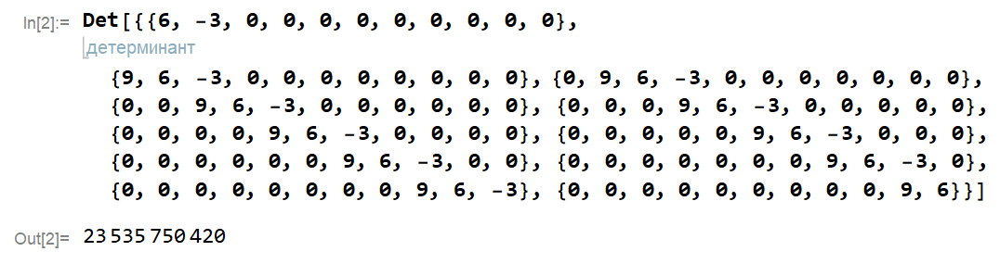

### Вариант 5:

$$    
A =     
 \begin{pmatrix}    
  6 & -3 & 0 & \cdots & 0 & 0 \\    
  9 & 6 & -3 & \cdots & 0 & 0 \\    
  0 & 9 & 6 & \cdots & 0 & 0 \\    
  \vdots  & \vdots & \vdots & \ddots & \vdots & \vdots  \\    
  0 & 0 & 0 & \cdots & 6 & -3 \\    
  0 & 0 & 0 & \cdots & 9 & 6     
 \end{pmatrix}    
$$

Порядок матрицы *n* = 11

---
### Решение

Вычислим определитель матрицы 11-го порядка с помощью составления рекуррентного соотношения. Обозначим определитель исходной матрицы как $\Delta_n$ и разложим его по первой строке:

$$    
\Delta_n=    
 \begin{vmatrix}  
  6 & -3 & 0 & \cdots & 0 & 0 \\    
  9 & 6 & -3 & \cdots & 0 & 0 \\    
  0 & 9 & 6 & \cdots & 0 & 0 \\    
  \vdots  & \vdots & \vdots & \ddots & \vdots & \vdots  \\    
  0 & 0 & 0 & \cdots & 6 & -3 \\    
  0 & 0 & 0 & \cdots & 9 & 6     
 \end{vmatrix}    = 6 \cdot (-1)^{1 + 1}\cdot \Delta_{n-1} + (-3) \cdot (-1)^{1 + 2} \cdot \begin{vmatrix}     
  9 & -3 & \cdots & 0 & 0 \\    
  0 & 6 & \cdots & 0 & 0 \\    
  \vdots  & \vdots & \vdots & \ddots & \vdots  \\    
  0 & 0 & \cdots & 6 & -3 \\    
  0 & 0 & \cdots & 9 & 6     
 \end{vmatrix}
$$

В первом слагаемом находится определитель матрицы порядка $n-1$, идентичной исходной, полученной путём вычёркивания первой строки и первого столбца. Во втором слагаемом требуется вычислить определитель другой матрицы, для этого также выполним разложение по первой строке:

$$
\begin{vmatrix}     
  9 & -3 &  \cdots & 0 & 0 \\    
  0 & 6 & \cdots & 0 & 0 \\    
  \vdots  & \vdots & \vdots & \ddots & \vdots  \\    
  0 & 0 & \cdots & 6 & -3 \\    
  0 & 0 & \cdots & 9 & 6     
 \end{vmatrix} = 9 \cdot (-1)^{1+1} \cdot \Delta_{n-2}
$$

Получен определитель матрицы, идентичной исходной, порядка $n-2$. Подставим в выражение для определителя исходной матрицы:

$$
\Delta_n = 6 \cdot \Delta_{n-1} + 3 \cdot 9 \cdot \Delta_{n-2} = 6 \cdot \Delta_{n-1} + 27 \cdot \Delta_{n-2}
$$

Таким образом, имеем **однородное линейное рекуррентное соотношение второго порядка с постоянными коэффициентами**. С помощью метода неопределённых коэффициентов найдём его общее решение.

#### 1. Составление характеристического уравнения

$$
\lambda^n = 6 \cdot \lambda ^{n-1} + 27 \cdot \lambda^{n-2}
$$

Сократим обе части уравнения на $\lambda^{n-2}$ и перенесём слагаемые в левую часть:

$$
\lambda^2 - 6\cdot\lambda - 27 = 0,
$$

откуда теореме Виета:

$$
\begin{cases}
\lambda_1 + \lambda_2 &=& -6,\\
\lambda_1 \cdot \lambda_2 &=& 27
\end{cases}
\quad \Rightarrow \qquad
\begin{cases}
\lambda_1 &=& -3,\\
\lambda_2 &=& 9
\end{cases}
$$

#### 2. Общее решение
$\lambda_1 \ne \lambda_2$, следовательно, общее решение имеет вид

$$
\Delta_n = C_1 \cdot (-3)^n + C_2 \cdot 9^n, \quad C_1, C_2 \in ℂ
$$

#### 3. Определение коэффициентов $C_1$ и $C_2$
Для этого вычислим определители матриц порядка $n=1$ и $n=2$:

$$
\begin{aligned}
& \Delta_1 = 6,\\
& \Delta_2 = \begin{vmatrix}
6 & -3 \\
9 & 6 \\
\end{vmatrix} = 6 \cdot 6 - (-3) \cdot 9 = 63
\end{aligned}
$$

Запишем рекуррентные выражения для этих определителей:

$$
\begin{aligned}
& \Delta_1 = C_1 \cdot (-3) + C_2 \cdot 9, \\
& \Delta_2 = C_1 \cdot 9 + C_2 \cdot 81
\end{aligned}
$$

Подставим найденные значения определителей и получим систему линейных алгебраических уравнений с неизвестными $C_1$ и $C_2$:

$$
\begin{cases}
-3C_1 + 9C_2 &=& 6,\\
9C_1 + 81C_2 &=& 63\\
\end{cases}
$$

Решим её методом Крамера. Выпишем матрицу коэффициентов и вычислим её определитель:

$$ 
\Delta = 
\begin{vmatrix}
-3 & 9 \\
9 & 81 \\
\end{vmatrix} = -3 \cdot 81 - 9 \cdot 9 = -324 \ne 0
$$

Она не вырождена, следовательно, система имеет единственное решение.

По формулам Крамера для $C_1$:

$$
\begin{aligned}
& \Delta_{C_1} = \begin{vmatrix}
6 & 9 \\
63 & 81 \\
\end{vmatrix} = -81, \\
& C_1 = \frac{\Delta_{C_1}}{\Delta} = \frac{-81}{-324} = \frac{1}{4}
\end{aligned}
$$

Найдём $C_2$:

$$
\begin{aligned}
& \Delta_{C_2} = \begin{vmatrix}
-3 & 6 \\
9 & 63 \\
\end{vmatrix} = -243, \\
& C_2 = \frac{\Delta_{C_2}}{\Delta} = \frac{-243}{-324} = \frac{3}{4}
\end{aligned}
$$

#### 4. Частное решение

Подставив найденные коэффициенты, получим формулу частного решения: 

$$
\Delta_n = \frac{1}{4} \cdot (-3)^n + \frac{3}{4} \cdot 9^n \qquad (1)
$$

#### 5. Проверка
Выполним проверку формулы для матрицы порядка $n = 3$, так как её определитель можно посчитать вручную. 

$$    
A =     
 \begin{pmatrix}    
  6 & -3 & 0 \\    
  9 & 6 & -3  \\    
  0 & 9 & 6  \\    
 \end{pmatrix}    
$$

Вычислим определитель разложением по первой строке:

$$    
\Delta_A =     
 \begin{vmatrix}    
  6 & -3 & 0 \\    
  9 & 6 & -3  \\    
  0 & 9 & 6  \\    
 \end{vmatrix} = 6 \cdot (-1)^{1+1} \cdot 
 \begin{vmatrix}     
 6 & -3  \\    
 9 & 6  \\    
 \end{vmatrix} + (-3) \cdot (-1)^{1+2} \cdot 
 \begin{vmatrix}     
 9 & -3  \\    
 0 & 6  \\    
 \end{vmatrix} = 6 \cdot 63 + 3 \cdot 54 = 540
$$

Также по полученной формуле (1):

$$
\Delta_3 = \frac{1}{4} \cdot (-3)^3 + \frac{3}{4} \cdot 9^3 = \frac{1}{4} \cdot (-27) + \frac{3}{4} \cdot 729 = 540
$$

Результаты совпали, что подтверждает корректность вычислений.

#### 6. Вычисление определителя матрицы 11-го порядка

$$
\Delta_{11} = \frac{1}{4} \cdot (-3)^{11} + \frac{3}{4} \cdot 9^{11} = \text{23 535 750 420}
$$

Также проверим результат в системе компьютерной алгебры *Wolfram Mathematica*, вычислив определитель матрицы с помощью встроенной функции.

