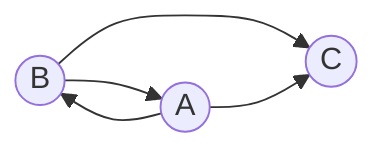

# Задача 7 на взаимную рекурсию (маршруты в треугольнике)

В условиях задачи указан граф с тремя вершинами. Для решения задачи требуется: 
1. Составить систему из 3 рекуррентных соотношений для предложенного графа.
2. Методом исключения свести систему к одному рекуррентному соотношению.
3. Составить и решить характеристическое уравнение.
4. Вывести формулу общего решения.

## Вариант 1:

Допустимые маршруты:
- B --> A
- B --> C
- A --> B
- A --> C

Найти формулу расчета количества маршрутов, начинающихся в вершине A и заканчивающихся в вершине C. 

Пусть *n* - количество дорог, которое мы прошли для достижения финальной точки. Пример расчета количества маршрутов.

| *n* | Маршруты                   | Количество |
|-----|----------------------------|------------|
| 0   | нет                        | 0          |
| 1   | (A->C)                     | 1          |
| 2   | (A->B->C)                  | 1          |
| 3   | (A->B->A->C)               | 1          |
| 4   | (A->B->A->B->C)            | 1          |

Можно обозначить
* an - количество маршрутов длины *n* начинающихся и заканчивающихся 
в A,
* bn - количество маршрутов длины *n* начинающихся в A и 
заканчивающихся в B,
* cn - количество маршрутов длины *n* начинающихся в A и 
заканчивающихся в C.

Тогда справедливы равенства:

$$
\begin{cases}
a_n = b_{n-1}
\\
b_n = a_{n-1}
\\
c_n = a_{n-1} + b_{n-1}
\end{cases}
$$

Указанную систему уравнений можно методом исключения свести к одному рекуррентному соотношению:

$$
c_n = a_{n-1} + b_{n-1} = b_{n-2} + a_{n-2} = c_{n-1}
\\
c_n = c_{n-1}
$$

Вывести и решить характеристическое уравнение:

$t^n = t^{n-1} |:(t^{n-1})$

$t = 1 $

Вывести формулу общего решения:

$$
\begin{cases}
c_n = C*t^n 
\\
c_{1} = 1
\end{cases}
$$

Получаем: $$c_n = 1^{n}$$
