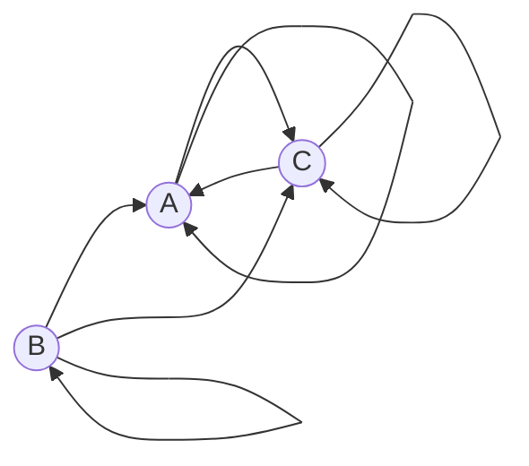

## Задача 7 на взаимную рекурсию (маршруты в треугольнике) Вариант 2

Допустимые маршруты:

- A --> C
    
- A --> A
    
- B --> A
    
- B --> C
    
- B --> B
    
- C --> C
    
- C --> A
    

Найти формулу расчета количества маршрутов, начинающихся в вершине A и заканчивающихся в вершине A.

Пусть:

an — количество маршрутов длины n, начинающихся в A и заканчивающихся в A;

bn — количество маршрутов длины n, начинающихся в A и заканчивающихся в B;

cn — количество маршрутов длины n, начинающихся в A и заканчивающихся в C.

Из графа видно, что стрелки в вершину A идут из A и C;  
в вершину B — только из B;  
в вершину C — из A, B и C.

Следовательно, система рекуррентных соотношений имеет вид:

$$  
\begin{cases}  
a_n = a_{n-1} + c_{n-1} \  
b_n = b_{n-1} \  
c_n = a_{n-1} + b_{n-1} + c_{n-1}  
\end{cases}  
\quad \text{при } n \ge 1  
$$

Начальные условия: 

$$  
a_0 = 1, \quad b_0 = 0, \quad c_0 = 0  
$$

Из второго уравнения следует:  

$$  
b_n = b_{n-1} = 0 \text{ для всех } n \ge 0  
$$

Подставим это в первые два уравнения:  

$$  
a_n = a_{n-1} + c_{n-1} \\  
c_n = a_{n-1} + c_{n-1}  
$$

Так как правые части одинаковы, получаем:

$$  
a_n = c_n \quad \text{для всех } n \ge 1  
$$

Тогда подставляем это в первое уравнение:

$$  
a_n = a_{n-1} + a_{n-1} = 2a_{n-1}, \quad n \ge 2  
$$

Проверим базовые значения:  

$$
a_0 = 1, \quad a_1 = a_0 + c_0 = 1 + 0 = 1
$$

Дальше уже действует рекуррентное соотношение ( an = 2an - 1 ).

Характеристическое уравнение для этой зависимости:

$$  
t^n = 2t^{n-1} \Rightarrow t = 2  
$$

Тогда общее решение:

$$  
a_n = C \cdot 2^n  
$$

Из условия ( a1 = 1 ) получаем:

$$  
1 = C \cdot 2 \Rightarrow C = \frac{1}{2}  
$$

Подставляем:

$$  
a_n = \frac{1}{2} \cdot 2^n = 2^{n-1}  
$$

Ответ:

$$  
a_n =  
\begin{cases}  
1, & n = 0, 
\\  
2^{n-1}, & n \ge 1  
\end{cases}  
$$