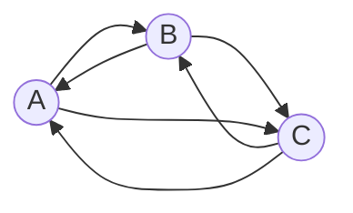

# Задание №7
## Задача на взаимную рекурсию (маршруты в треугольнике)
В условиях задачи для каждого варианта указан граф с тремя вершинами. Для решения задачи требуется: 
1. Составить систему из 3 рекуррентных соотношений для предложенного графа.
2. Методом исключения свести систему к одному рекуррентному соотношению.
3. Составить и решить характеристическое уравнение.
4. Вывести формулу общего решения.

**Решение должно содержать номер варианта и подробное пошаговое описание.**

Условия задачи расположены в файле `Задание 7/Варианты условий.md` в ветке main репозитория для ручных задач.
Решение задачи нужно оформить в формате Markdown в отдельном файле с названием <название_команды>.md, который добавить в каталог `Задание 7` данного репозитория.

## Информация по Markdown разметке:

Полезная информация для оформления решений:
- [Руководство по оформлению Markdown файлов](https://gist.github.com/Jekins/2bf2d0638163f1294637)
- [Система верстки LaTeX, которую можно использовать для математических формул](https://grammarware.net/text/syutkin/MathInLaTeX.pdf)
- [Рисуем диаграммы Mermaid.js в README-файлах GitHub](https://habr.com/ru/articles/652867/)

## Для выполнения задания необходимо:

1. Обновить ветку main в локальном репозитории (git pull).
2. От ветки main создать ветвь с названием `<название_команды>-task-7`, заменив `<название_команды>` на название команды, решившей задание.
3. В созданной ветке в каталог `Задание 7` добавить файл с решением задачи с названием `<название_команды>.md`.
4. Зафиксировать изменения на ветке (git commit).
5. Отравить ветку с изменениями в репозиторий на Github (git push).
6. Создать на Github запрос на слияние (pull request), указав в качестве base ветки `main`, в качестве compare ветки `<название_команды>-task-7`.

## Маршруты в треугольнике

Путешественник перемещается между тремя городами A, B и C по трем дорогам и каждый день переходит из одного города в другой. Сколько различных замкнутых маршрутов, начинающихся и заканчивающихся в городе A может проделать путешественник за *n* дней.

Пример расчета количества маршрутов.

| *n* | Маршруты                   | Количество |
|-----|----------------------------|------------|
| 1   | нет                        | 0          |
| 2   | (A->B->A), (A->C->A)       | 2          |
| 3   | (A->B->C->A), (A->C->B->A) | 2          |

Можно обозначить
* an - количество маршрутов длины *n* начинающихся и заканчивающихся 
в A,
* bn - количество маршрутов длины *n* начинающихся в A и 
заканчивающихся в B,
* cn - количество маршрутов длины *n* начинающихся в A и 
заканчивающихся в C.

Тогда справедливы равенства:

$$
\begin{cases}
a_n = b_{n-1} + c_{n-1}
\\
b_n = a_{n-1} + c_{n-1}
\\
c_n = a_{n-1} + b_{n-1}
\end{cases}
$$

Указанную систему уравнений можно методом исключения свести к одному рекуррентному соотношению:

$$
b_n = 2b_{n-2} + b_{n-1}
$$

Вывести и решить характеристическое уравнение:

$t^2 - t - 2 = 0 $

$t_{1} = 2  \ t_{2} = -1 $

$t_{1} \neq t_{2} $

Вывести формулу общего решения:

$b_n = С_{1}t_{1}^n + С_{2}t_{2}^n $

$b_n = С_{1} * 2^n + С_{2} * (-1)^n $

$b_{1} = 1 $

$b_{2} = 1 $

$$\begin{cases}
1 = 2С_{1} - С_{2} \\ 
1 = 4С_{1} + С_{2} 
\end{cases} $$

$C_{1} = \frac{1}{3} $

$C_{2} = - \frac{1}{3} $

$b_n = \frac{1}{3} * 2^{n} - \frac{1}{3} * (-1)^{n} $

$a_n = 2b_{n - 1} $

$a_n = \frac{2}{3} * 2^{n - 1} - \frac{2}{3} * (-1)^{n - 1} $

$a_n = \frac{1}{3} * 2^{n} 2 \frac{2}{3} * (-1)^{n} $
