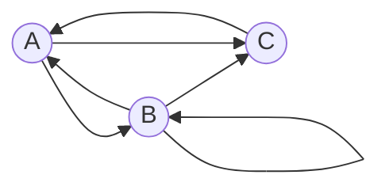

# Задание №7
## Задача на взаимную рекурсию (маршруты в треугольнике)
В условиях задачи для каждого варианта указан граф с тремя вершинами. Для решения задачи требуется: 
1. Составить систему из 3 рекуррентных соотношений для предложенного графа.
2. Методом исключения свести систему к одному рекуррентному соотношению.
3. Составить и решить характеристическое уравнение.
4. Вывести формулу общего решения.

## Вариант 9:

Допустимые маршруты:
- A --> B
- B --> A
- B --> B
- B --> C
- C --> A
- A --> C

Найти формулу расчета количества маршрутов, начинающихся в вершине C и заканчивающихся в вершине C.

| *n* | Маршруты                                                                                          | Количество |
|-----|---------------------------------------------------------------------------------------------------|------------|
| 1   | нет                                                                                               | 0          |
| 2   | (С->A->C)                                                                                         | 1          |
| 3   | (C->A->B->C)                                                                                      | 1          |
| 4   | (C->A->B->B->C), (C->A->B->A->C), (C->A->C->A->C)                                                 | 3          |
| 5   | (C->A->B->B->A->C), (C->A->B->B->B->C), (C->A->B->A->B->C), (C->A->C->A->B->C), (C->A->B->C->A->C)| 5          |

Можно обозначить
* an - количество маршрутов длины *n* начинающихся в C и заканчивающихся 
в A,
* bn - количество маршрутов длины *n* начинающихся в C и 
заканчивающихся в B,
* cn - количество маршрутов длины *n* начинающихся и 
заканчивающихся в C.

В вершину $c$ можно попасть из вершин $a$ и $b$, то есть на шаге $n-1$ нужно находиться либо на вершине $a$, либо на вершине $b$ (аналогично и для вершин $a, b$), поэтому справедливы равенства:

$$
\begin{cases}
a_n = b_{n-1} + c_{n-1}
\\
b_n = a_{n-1} + b_{n-1}
\\
c_n = a_{n-1} + b_{n-1}
\end{cases}
$$

Так как $c_n = b_n$, то указанную систему уравнений можно свести к одному рекуррентному соотношению:

$$
a_{n-1} = b_{n-2} + c_{n-2}
\\
c_n = b_{n-2} + c_{n-2} + b_{n-1}
\\
c_n = c_{n-2} + c_{n-2} + c_{n-1}
\\
c_n = 2c_{n-2} + c_{n-1}
$$

Выводим и решаем характеристическое уравнение:

$\lambda^n - \lambda^{n-1} - 2\lambda^{n-2} = 0 | : \lambda^{n-2}$

$\lambda^2 - \lambda - 2 = 0$

$\lambda_{1} = 2  \ \lambda_{2} = -1$

$\lambda_{1} \neq \lambda_{2}$

Формула общего решения:

$c_n = С_{1}\lambda_{1}^n + С_{2}\lambda_{2}^n$

$c_n = С_{1} * 2^n + С_{2} * (-1)^n$

$c_{1} = 0$

$c_{2} = 1$

$$\begin{cases}
0 = 2С_{1} - С_{2} \\ 
1 = 4С_{1} + С_{2} 
\end{cases} $$

$C_{1} = \frac{1}{6}$

$C_{2} = \frac{1}{3}$

Формула расчета количества маршрутов, начинающихся в вершине C и заканчивающихся в вершине C:
$\\c_n = \frac{1}{6} * 2^{n} + \frac{1}{3} * (-1)^{n} = \frac{2^{n} + 2*(-1)^{n}}{6} = \frac{2^{n-1} + (-1)^{n}}{3}$

Проверим:
$\\c_3 = \frac{4 - 1}{3} = 1$
$\\c_4 = \frac{8 + 1}{3} = 3$
$\\c_5 = \frac{16 - 1}{3} = 5$