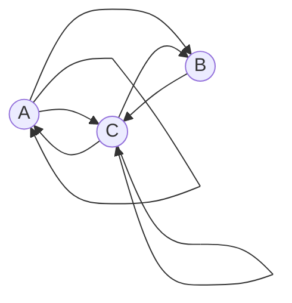

# Задание 7. Вариант 6
## Дано

Допустимые маршруты:
- A --> C
- A --> B
- A --> A
- B --> C
- C --> C
- C --> A
- C --> B

Найти формулу расчета количества маршрутов, начинающихся в вершине A и заканчивающихся в вершине A.

## Решение
* an - количество маршрутов длины *n*, начинающихся и заканчивающихся 
в A.
* bn - количество маршрутов длины *n*, начинающихся в A и 
заканчивающихся в B.
* cn - количество маршрутов длины *n*, начинающихся в A и 
заканчивающихся в C.

Тогда справедливы равенства:

$$
\begin{cases}
a_n = a_{n-1} + c_{n-1}
\\
b_n = a_{n-1} + c_{n-1}
\\
c_n = a_{n-1} + b_{n-1} + c_{n-1}
\end{cases}
$$

Можно заметить, что $a_n = b_n$. Методом исключения выводим одно рекуррентное соотношение:

$a_n = 2a_{n-1} + a_{n-2}$

### Характеристическое уравнение

$t^2 - 2t - 1 = 0 $

$t_1 = 1 + \sqrt{2}, t_2 = 1 - \sqrt{2}$

$t_{1} \neq t_{2} $

### Общее решение 

an = С1 * (1 + $\sqrt{2}$)n + C2 * (1 - $\sqrt{2}$)n 

### Поиск констант

Так как рекуррентное соотношение глубины 2, нам необходимо найти 2 начальных элемента.

Найдем вручную  $a_1$ и  $a_2$

$a_1 = 1$ , $a_2 = 2$

Решим систему:

$$
\begin{cases}
С_1 * (1 + \sqrt{2}) + C_2 * (1 - \sqrt{2}) = 1
\\
С_1 * (1 + \sqrt{2})^2 + C_2 * (1 - \sqrt{2})^2 = 2
\end{cases}
$$

$$
\begin{cases}
C_1 + C_2 + \sqrt{2} * (C_1 - C_2) = 1
\\
3 * (C_1 + C_2) + 2\sqrt{2} * (C_1 - C_2) = 2
\end{cases}
$$

Пусть $х = C_1 + C_2$ , а $y = C_1 - C_2$ , тогда:

$$
\begin{cases}
x + \sqrt{2} * y = 1
\\
3x + 2\sqrt{2} * y = 2
\end{cases}
$$

Откуда:

$C_1 = 1/2\sqrt{2}$

$C_2 = -(1/2\sqrt{2}$)

### Ответ

$a_n = \frac{(1 + \sqrt{2})^n - (1 - \sqrt{2})^n }{2\sqrt{2}}$
