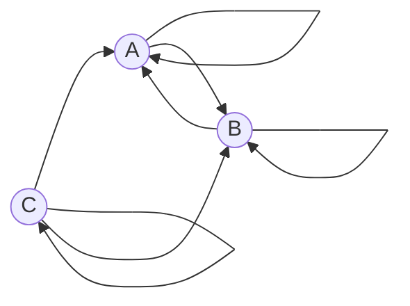

# Задача на взаимную рекурсию (маршруты в треугольнике)
В условиях задачи для каждого варианта указан граф с тремя вершинами. Для решения задачи требуется: 
1. Составить систему из 3 рекуррентных соотношений для предложенного графа.
2. Методом исключения свести систему к одному рекуррентному соотношению.
3. Составить и решить характеристическое уравнение.
4. Вывести формулу общего решения.

## Вариант 3

Найти формулу расчета количества маршрутов, начинающихся в вершине C и заканчивающихся в вершине B.

## Условие задачи
Допустимые маршруты:
- A --> A
- A --> B
- B --> A
- B --> B
- C --> A
- C --> C
- C --> B

Найти формулу расчета количества маршрутов, начинающихся в вершине C и заканчивающихся в вершине B.

---

| n | Маршруты | Количество |
|---:|---|---:|
| 0 | нет | 0 |
| 1 | (C->B) | 1 |
| 2 | (C ->A ->B), (C ->C ->B), (C ->B ->B) | 3 | (C->A), (C->B), (C->C->B), (C->B), (C->B->B) | 3 |
| 3 | (C->A->A->B), (C->A->B->B), (C->C->A->B), (C->C->C->B), (C->B->A->B), (C->B->B->B), (C->C->B->B) | 7 |

---

## Введение обозначений
Обозначим:

* an — количество маршрутов длины \(n\), начинающихся в C и заканчивающихся в A,
* bn — количество маршрутов длины \(n\), начинающихся в C и заканчивающихся в B,
* cn  — количество маршрутов длины \(n\), начинающихся и заканчивающихся в C.

Начальные условия:

$$  
a_0 = 0, \quad b_0 = 0, \quad c_0 = 1  
$$ 

---

## Система рекуррентных соотношений
Пусть мы делаем последний шаг в маршрут длины \(n\). Тогда:

$$
\begin{cases}
a_n = a_{n-1} + b_{n-1} + c_{n-1},\\
b_n = a_{n-1} + b_{n-1} + c_{n-1},\\
c_n = c_{n-1}.
\end{cases}
$$

Так как $a_n = b_n$ для всех $n \ge 1$, а $c_n = 1$,, то система упрощается

---

## Сведение системы к одному уравнению
Подставляем $a_{n-1} = b_{n-1}$ и $c_{n-1} = 1$:

$$
b_n = 2b_{n-1} + 1,\quad n \ge 1
$$

Чтобы убрать свободный член, мы вычитываем два уравнения:

$$
b_n - b_{n-1} = 2(b_{n-1} - b_{n-2})
$$

Отсюда получаем однородную рекурсию:

$$
b_n = 3b_{n-1} - 2b_{n-2},\quad n \ge 2
$$

Начальные условия:

$$
b_0 = 0,\quad b_1 = 1
$$

---

## Характеристическое уравнение

Запишем характеристическое уравнение для рекуррентного соотношения:

$$
\lambda^2 - 3\lambda + 2 = 0
$$

Вычислим дискриминант:

$$
D = 9 - 4 \cdot 1 \cdot 2 = 9 - 8 = 1
$$

Найдём корни:

$$
\lambda_{1,2} = \frac{3 \pm {1}}{2}
$$

$$
\lambda_1 = 1, \quad \lambda_2 = 2
$$

Так как $\lambda_1 \neq \lambda_2$, решаем уравнение для случая **различных корней**.

---
Общая формула:

$$
b_n = C_1 \cdot 1^n + C_2 \cdot 2^n = C_1 + C_2 2^n
$$

Подставляем начальные условия:

$$
\begin{cases}
C_1 + C_2 = 0,\\
C_1 + 2C_2 = 1,
\end{cases}
\quad \ => \quad C_2 = 1,\ C_1 = -1
$$

Подставим найденные значения констант в общее решение:

$$
b_n = C_1 \cdot 1^n + C_2 \cdot 2^n
$$

Тогда:

$$
b_n = (-1) \cdot 1^n + 1 \cdot 2^n = -1^n + 2^n
$$

Так как $1^n = 1$, получаем формулу общего решения:

$$
b_n = 2^n - 1
$$

Проверим для $n = 3$:

$$
b_3 = 2^3 - 1 = 8 - 1 = 7
$$

---

$$
b_0 = 0,\quad b_1 = 1,\quad b_2 = 3,\quad b_3 = 7
$$
