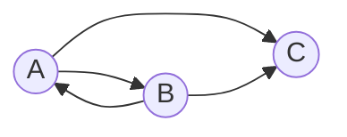

# Задача на взаимную рекурсию (маршруты в треугольнике)

В условиях задачи для каждого варианта указан граф с тремя вершинами. Для решения задачи требуется: 
1. Составить систему из 3 рекуррентных соотношений для предложенного графа.
2. Методом исключения свести систему к одному рекуррентному соотношению.
3. Составить и решить характеристическое уравнение.
4. Вывести формулу общего решения.

## Вариант 8:

Допустимые маршруты:
- A --> B
- A --> C
- B --> A
- B --> C

Найти формулу расчета количества маршрутов, начинающихся в вершине A и заканчивающихся в вершине C. 

1) Система из рекурретных соотношений
* an - число путей длины *n* из A в А
* bn - число путей длины *n* из A в B
* cn - число путей длины *n* из A в C

Длина 0:

a0 = 1,  b0 = 0, c0 = 0

Длина 1: 

a1 = 0,  b1 = 1, c1 = 1

Формула рекурсии:

* В А прийти можно только из B => an = bn-1
* В B прийти можно только из A => bn = an-1
* В C прийти можно только из A и B => cn = an-1 + bn-1

2) Метод исключени:

cn+1 = an + bn => Подставляем выражения an и bn

cn+1 = bn-1 + an-1 => Точно также, как у нас было в cn 

cn = an-1 + bn-1 

Значит => cn+1 = cn 

3) Характерное уравнение

cn+1 - cn = 0 

Подставновка: сn = rn 

rn+1 - rn = 0

rn (r - 1) = 0

r - 1 = 0 => r = 1

4) Формула общего решения

Так как Cn+1 = Cn, значит, что все члены последовательности одинаковы

С n = 0: => c1 не = c0 

С n = 1: => c2 = C1

Cn = 

$$
\begin{cases}
0, n = 0
\\
1, n >= 1
\end{cases}
$$
