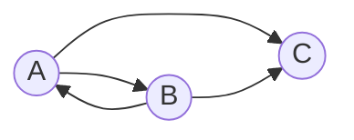

# Задача на взаимную рекурсию (маршруты в треугольнике)

В условиях задачи для каждого варианта указан граф с тремя вершинами. Для решения задачи требуется: 
1. Составить систему из 3 рекуррентных соотношений для предложенного графа.
2. Методом исключения свести систему к одному рекуррентному соотношению.
3. Составить и решить характеристическое уравнение.
4. Вывести формулу общего решения.

## Вариант 8:

Допустимые маршруты:
- A --> B
- A --> C
- B --> A
- B --> C

Найти формулу расчета количества маршрутов, начинающихся в вершине A и заканчивающихся в вершине C. 

---

1) Система рекуррентных соотношений

* an - число путей длины *n* из A в А
* bn - число путей длины *n* из A в B
* cn - число путей длины *n* из A в C

Начальные условия (длина 0):

>a0 = 1,  b0 = 0, c0 = 0

Длина 1: 

>a1 = 0,  b1 = 1, c1 = 1

Формула рекурсии:

* В А прийти можно только из B => an = bn-1
* В B прийти можно только из A => bn = an-1
* В C прийти можно только из A и B => cn = an-1 + bn-1

---

2) Метод исключения:

Из первых двух равенств:

>an + bn = an−1 + bn−1

Тогда:

>cn+1 = an + bn = an−1 + bn−1 = cn

Получили рекурсию глубины 1:

>cn+1 − cn = 0 

---

3) Составляем и решаем характеристическое уравнение

Подстановка cn = rn даёт:

>rn+1 − rn = 0
>
>rn(r − 1) = 0
>
>p(r) = r − 1, корень r = 1

---

4) Выводим формулу общего решения

Из cn+1 = cn следует, что для всех n >= 1 имеем cn = c1

Общее решение тогда: cn = A · 1n = A

Так как c1 = 1, то A = 1. Значение c0 = 0 задано отдельно (рекурсия на него не распространяется)

Итоговая формула:

Cn = 

$$
\begin{cases}
0, n = 0
\\
1, n >= 1
\end{cases}
$$
