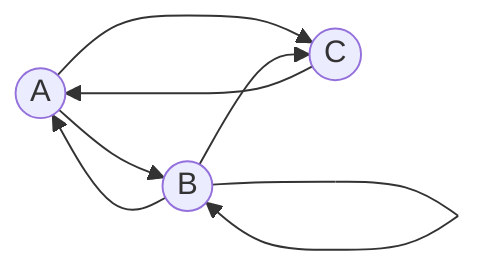

# Задача 7 на взаимную рекурсию (маршруты в треугольнике)  
**Вариант 4 - формула для числа маршрутов из A в B за $n$ шагов**

Допустимые рёбра: A→B, A→C, B→A, B→B, B→C, C→A

Обозначения и базовые значения
- $a_n$ - число путей длины n из A в A
- $b_n$ - число путей длины n из A в B
- $c_n$ - число путей длины n из A в C

### Две базы

Для длины 0: $a_0=1, b_0=0, c_0=0$

Для длины 1: $a_1=0, b_1=1, c_1=1$

### Система рекуррентных соотношений

По входящим рёбрам в вершины: 

$  
\begin{cases} 
a_n=b_{n-1}+c_{n-1}\\ 
b_n=a_{n-1}+b_{n-1}\\
c_n=a_{n-1}+b_{n-1} 
\end{cases}
$

### Сведение к одному уравнению для $b_n$
Из второй и третьей строк видно, что $c_n=b_n$ для всех n

Тогда $a_n=b_{n-1}+c_{n-1}=2b_{n-1}$ 

Подставляем в формулу для $b_n$ 

$b_n=b_{n-1}+2b_{n-2}$

### Характеристическое уравнение

Подставляем $b_n=t^n$ 

$t^2-t-2=0 \ \Rightarrow\ t_1=2,\ t_2=-1$

### Общее решение и определение констант

$b_n=С_12^{,n}+С_2(-1)^n$

$
\begin{cases} 
b_0=0 =\ С_1+С_2=0\\ 
b_1=1 = \ 2С_1-С_2=1 
\end{cases}
\Rightarrow\ С_1=\tfrac13,\ С_2=-\tfrac13 
$

Итоговая формула: 
$$ 
b_n=\dfrac{2^{n}-(-1)^{n}}{3}
$$
