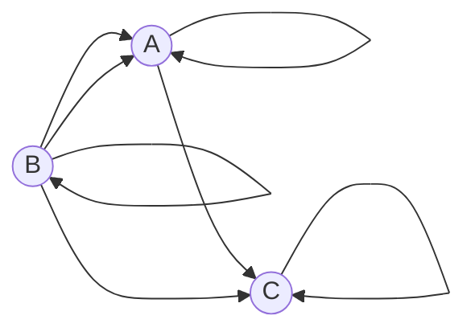
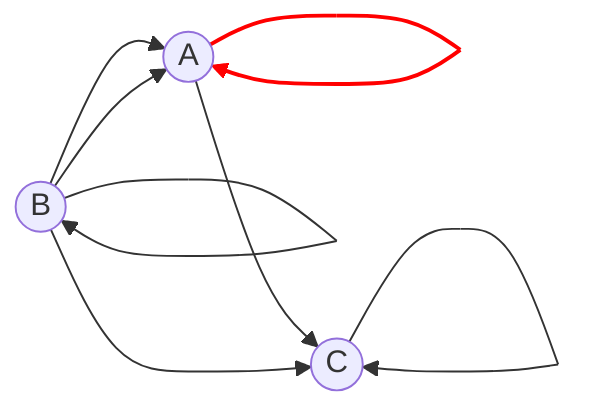

## Вариант 5:

Допустимые маршруты:
- A --> C
- A --> A
- B --> A
- B --> C
- B --> B
- C --> C
- B --> A

Найти формулу расчета количества маршрутов, начинающихся в вершине A и заканчивающихся в вершине A.
----
из вершины А в вершину А маршрута длины $n$ можно попасть :
  - Из точки А маршрута длины $n-1$ одним способом 
  - Из точки B маршрута длины $n-1$ двумя способами
  - Из точки С маршрута длины $n-1$ никаким способом

из вершины А в вершину B маршрута длины $n$ можно попасть :
  - Из точки А маршрута длины $n-1$ никаким способом
  - Из точки B маршрута длины $n-1$ одним способом
  - Из точки С маршрута длины $n-1$ никаким способом

из вершины А в вершину С маршрута длины $n$ можно попасть :
  - Из точки А маршрута длины $n-1$ одним способом
  - Из точки B маршрута длины $n-1$ одним способом
  - Из точки С маршрута длины $n-1$ одним способом

С учётом допустимых маршрутов, можем записать систему уравнений для вычисления количества маршрутов, которые начинаются и заканчиваются в каждой вершине:
В более общем виде:

$$
\begin{cases}
a_n = a_{n-1} + 2 \cdot b_{n-1},\\
b_n = b_{n-1},\\
c_n = a_{n-1} + b_{n-1} + c_{n-1}
\end{cases}
$$

где $a_n$ - количество путей из А в А длины $n$, $b_n$ - из A в B длины $n$, $c_n$ - из A в С длины $n$.
Заметим,что значение b_n будет константой.
Запишем начальные условия - определим количество маршрутов из А длины 0  для каждой вершины: $a_0 = 1$ (прошлись по петле), $b_0 = 0 = b_n$ для любого $n$, $c_0 = 0$.

Для $n = 1$:

$$
\begin{cases}
a_1 = a_{0} + 2 \cdot b_{0},\\
b_1 = b_{0} = 0,\\
c_1 = a_{0} + b_{0} + c_{0} = a_{0}  + c_{0} 
\end{cases}
$$

Значение $b_1$ нам известно, оно всегда будет 0.
Тогда систему можно упростить:

$$
\begin{cases}
a_n = a_{n-1},\\
b_n \equiv 0, \\
c_n = a_{n-1} + c_{n-1}
\end{cases}
$$

Заметим, что в вершину А невозможно попасть из вершины С, то есть третье уравнение можно не рассматривать.
Тогда получаем линейное однородное рекуррентное соотношение 1-го порядка

$$
a_n = a_{n-1}
$$

Составим характеристическое уравнение:

$$
\lambda^n = \lambda^{n-1}
$$

Поделим обе части на $\lambda^{n-1}$:

$$
\lambda = 1
$$

Тогда общее решение рекуррентного соотношения имеет вид

$$
a_n = C \cdot 1^n = C
$$

Определим значение константы из начального условия $a_0 = 1$:

$$
a_0 = C = 1
$$

Таким образом, $a_n \equiv 1$, то есть в указанном графе существует только один маршрут, который начинается и заканчивается в вершине А - это проход по петле.

