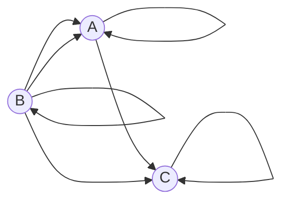
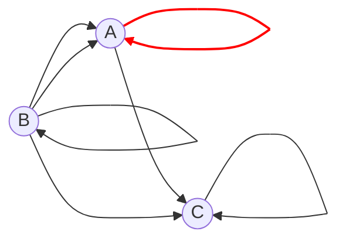

## Вариант 5:

Допустимые маршруты:
- A --> C
- A --> A
- B --> A
- B --> C
- B --> B
- C --> C
- B --> A

Найти формулу расчета количества маршрутов, начинающихся в вершине A и заканчивающихся в вершине A.
----
С учётом допустимых маршрутов, можем записать систему уравнений для вычисления количества маршрутов, которые начинаются и заканчиваются в каждой вершине:

$$
\begin{cases}
a_n = a_{n-1} + 2 \cdot b_{n-1},\\
b_n = b_{n-1},\\
c_n = a_{n-1} + b_{n-1} + c_{n-1}
\end{cases}
$$

где $a_n$ - количество путей из А в А, $b_n$ - из A в B, $c_n$ - из A в С.
Запишем начальные условия - определим количество маршрутов длины 0: $a_0 = 1$ (просто остались в исходной точке А), $b_0 = 0$, $c_0 = 0$.
Подставим во второе уравнение $n = 1$: $b_1 = b_0$, значение $b_0$ нам известно, тогда $b_1 = 0$. Для остальных значений $n$ это тождество также будет выполняться, т.е. $b_n \equiv 0$ при $n \ge 0$.
Тогда систему можно упростить:

$$
\begin{cases}
a_n = a_{n-1},\\
b_n \equiv 0, \\
c_n = a_{n-1} + c_{n-1}
\end{cases}
$$

Заметим, что в вершину А невозможно попасть из вершины С, то есть третье уравнение можно не рассматривать.
Тогда получаем линейное однородное рекуррентное соотношение 1-го порядка

$$
a_n = a_{n-1}
$$

Составим характеристическое уравнение:

$$
\lambda^n = \lambda^{n-1}
$$

Поделим обе части на $\lambda^{n-1}$:

$$
\lambda = 1
$$

Тогда общее решение рекуррентного соотношения имеет вид

$$
a_n = C \cdot 1^n = C
$$

Определим значение константы из начального условия $a_0 = 1$:

$$
a_0 = C = 1
$$

Таким образом, $a_n \equiv 1$, то есть в указанном графе существует только один маршрут, который начинается и заканчивается в вершине А - это проход по петле.

