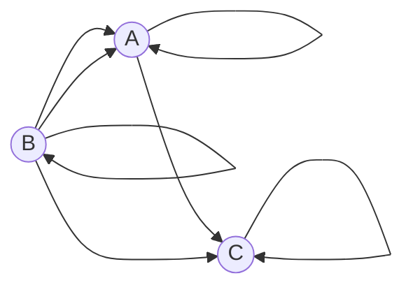

## Вариант 5:

Допустимые маршруты:
- A --> C
- A --> A
- B --> A
- B --> C
- B --> B
- C --> C
- B --> A

Найти формулу расчета количества маршрутов, начинающихся в вершине A и заканчивающихся в вершине A.
----
С учётом допустимых маршрутов, можем записать систему уравнений для вычисления количества маршрутов, которые начинаются и заканчиваются в каждой вершине:
$$
\begin{cases}
a_n = a_{n-1} + 2 \cdot b_{n-1},\\
b_n = b_{n-1},
c_n = a_{n-1} + b_{n-1} + c_{n-1}
\end{cases}
$$
где $a_n$ -- количество путей из А в А, $b_n$ -- из A в B, $c_n$ -- из A в С.
Запишем начальные условия --- определим количество маршрутов длины 0: $a_0 = 1$ (просто остались в исходной точке А), $b_0 = 0$, $c_0 = 0$.
Подставим во второе уравнение $n = 1$: $b_1 = b_0$, значение $b_0$ нам известно, тогда $b_1 = 0$. Для остальных значений $n$ это тождество также будет выполняться, т.е. $b_n \equiv 0 \forall n$.
Тогда систему можно упростить:
$$
\begin{cases}
a_n = a_{n-1},\\
b_n \equiv 0,
c_n = a_{n-1} + c_{n-1}
\end{cases}
$$

