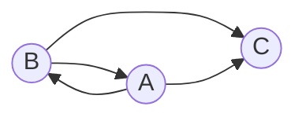
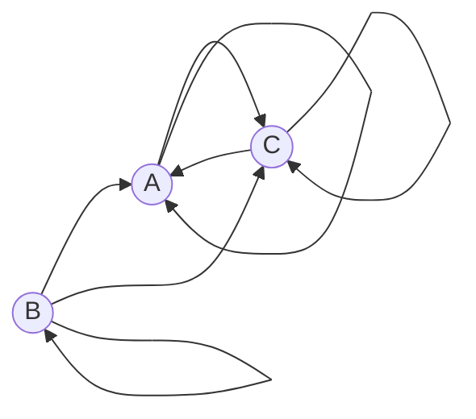
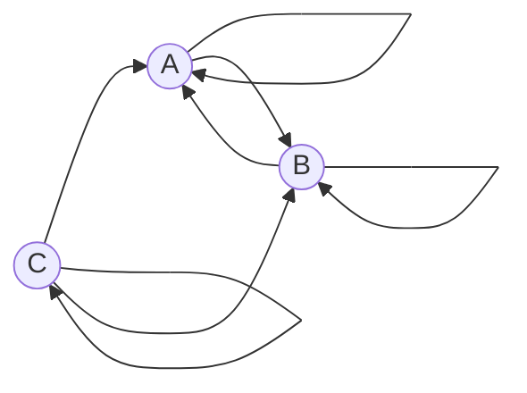
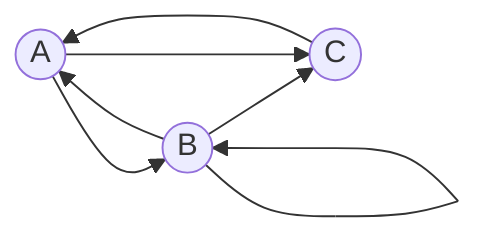
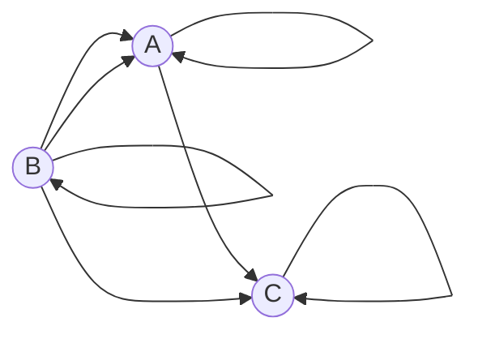
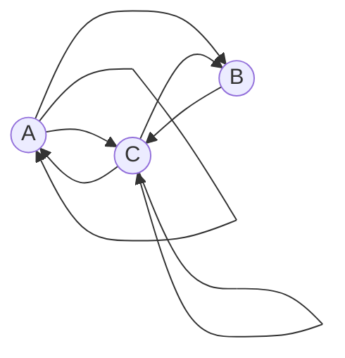
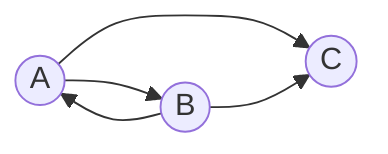

# Задача на взаимную рекурсию (маршруты в треугольнике)

В условиях задачи для каждого варианта указан граф с тремя вершинами. Для решения задачи требуется: 
1. Составить систему из 3 рекуррентных соотношений для предложенного графа.
2. Методом исключения свести систему к одному рекуррентному соотношению.
3. Составить и решить характеристическое уравнение.
4. Вывести формулу общего решения.

## Вариант 1:

Допустимые маршруты:
- B --> A
- B --> C
- A --> B
- A --> C

Найти формулу расчета количества маршрутов, начинающихся в вершине A и заканчивающихся в вершине C. 

## Вариант 2:

Допустимые маршруты:
- A --> C
- A --> A
- B --> A
- B --> C
- B --> B
- C --> C
- C --> A

Найти формулу расчета количества маршрутов, начинающихся в вершине A и заканчивающихся в вершине A. 

## Вариант 3: 

Допустимые маршруты:
- A --> A
- A --> B
- B --> A
- B --> B
- C --> A
- C --> C
- C --> B

Найти формулу расчета количества маршрутов, начинающихся в вершине C и заканчивающихся в вершине B. 

## Вариант 4:

Допустимые маршруты:
- A --> B
- B --> A
- B --> B
- B --> C
- C --> A
- A --> C

Найти формулу расчета количества маршрутов, начинающихся в вершине A и заканчивающихся в вершине B.

## Вариант 5:

Допустимые маршруты:
- A --> C
- A --> A
- B --> A
- B --> C
- B --> B
- C --> C
- B --> A

Найти формулу расчета количества маршрутов, начинающихся в вершине A и заканчивающихся в вершине A.

## Вариант 6:

Допустимые маршруты:
- A --> C
- A --> B
- A --> A
- B --> C
- C --> C
- C --> A
- C --> B

Найти формулу расчета количества маршрутов, начинающихся в вершине A и заканчивающихся в вершине A. 

## Вариант 7:

Допустимые маршруты:
- A --> A
- A --> B
- B --> A
- B --> B
- C --> A
- C --> C
- C --> B

Найти формулу расчета количества маршрутов, начинающихся в вершине A и заканчивающихся в вершине B. 

## Вариант 8:

Допустимые маршруты:
- A --> B
- A --> C
- B --> A
- B --> C

Найти формулу расчета количества маршрутов, начинающихся в вершине A и заканчивающихся в вершине C. 

## Вариант 9:

Допустимые маршруты:
- A --> B
- B --> A
- B --> B
- B --> C
- C --> A
- A --> C

Найти формулу расчета количества маршрутов, начинающихся в вершине C и заканчивающихся в вершине C.
