# Задание №8

# Оптимальное расписание. Ленточная стратегия/Конвейерная задача

Для каждого варианта представлены условия для двух задач. Для каждой задачи необходимо построить расписание, выполняемое в кратчайшие сроки: 
1. Выбрать алгоритм решения задачи и обосновать свой выбор.
2. Применить выбранный алгоритм, в решении отобразить ход выполнения алгоритма с **подробными комментариями**.
3. В ответе указать длительность полученного расписания.
4. В ответе вывести полученное расписание в виде диаграммы Ганта.

## Вариант №1: 
1. Имеется 9 независимых заданий, каждое из которых состоит из двух последовательных этапов, и 2 исполнителя, исполнитель 1 выполняет только первый этап задания, исполнитель 2 - только второй. Длительность заданий (по этапам): (4, 6), (3, 2), (2, 1), (8, 9), (9, 9), (2, 4), (3, 6), (12, 5), (5, 4).
2. Имеется 6 независимых заданий и 4 универсальных исполнителя. Прерывания задач допускаются. Длительность заданий: 3, 7, 7, 4, 6, 9.

## 1. Конвейерная задача (Алгоритм Джонсона)
Данная задача является конвейерной по постановке:
1. Количество заданий произвольно;
2. Каждое задание состоит из двух последовательных этапов, длительность которых произвольна;
3. Задания независимы;
4. Запрещены прерывания при выполнении заданий;
5. Количество работников строго 2;
6. Первый работник выполняет только первый этап каждого задания, второй работник — только второй этап каждого задания;
7. Производительность работников, размеры оплаты из труда и т.д. не учитываются;
8. Требуется построить расписание выполнения всех заданий в кратчайшие сроки.

Данную задачу решим, используя алгоритм Джонсона

### Алгоритм Джонсона
Пусть аi и bi, — это длительности первого и второго 
этапов 1-го задания.

| Этап/Задание | 1 | 2 | 3 | 4 | 5 | 6 | 7 | 8 | 9 |
|--------------|---|---|---|---|---|---|---|---|---|
| a (Этап 1)   | 4 | 3 | 2 | 8 | 9 | 2 | 3 | 12| 5 |
| b (Этап 2)   | 6 | 2 | 1 | 9 | 9 | 4 | 6 | 5 | 4 |

---
### 1 Шаг
Разобьём список всех заданий на две группы. В первую группу попадают задания, у которых аi <= bi. Во вторую группу - все остальные задания.

Группа 1 (a ≤ b):
- 1(4, 6): 4 ≤ 6
- 4(8, 9): 8 ≤ 9
- 5(9, 9): 9 ≤ 9
- 6(2, 4): 2 ≤ 4
- 7(3, 6): 3 ≤ 6

Группа 2 (a > b):
- 2(3, 2): 3 > 2
- 3(2, 1): 2 > 1
- 8(12, 5): 12 > 5
- 9(5, 4): 5 > 4

**Итог**
- 1 группа(Задания): 1, 4, 5, 6, 7
- 2 группа(Задания): 2, 3, 8, 9
---
### 2 Шаг
Задания из первой группы отсортируем в порядке возрастания величин аi.

$$6(2,4) → 7(3, 6) → 1(4, 6) → 4(8, 9) → 5(9, 9)$$

Задания из второй группы отсортируем в порядке убывания величин bi.

$$8(12, 5) → 9(5, 4) → 2(3, 2) → 3 (2, 1)$$

Согласно алгоритму Джонсона, расписание получается кратчайшим, если сначала выполнить все задания из первой группы в отсортированном порядке, а затем — все задания из второй группы также в отсортированном порядке.

#### Полученная последовательность
$$6(2,4) → 7(3, 6) → 1(4, 6) → 4(8, 9) → 5(9, 9) → 8(12, 5) → 9(5, 4) → 2(3, 2) → 3 (2, 1)$$

### Диаграмма Ганта

```mermaid
gantt
    title Диаграмма Ганта - Конвейерная задача
    dateFormat  s
    axisFormat  %S

    Начало выполнения работ : milestone, m1, 01 00:00:00, 0h

    section Конвейер 1 (Исполнитель 1)
    6 :a1, 01 00:00, 2s
    7 :a2, after a1, 3s
    1 :a3, after a2, 4s
    4 :a4, after a3, 8s
    5 :a5, after a4, 9s
    8 :a6, after a5, 12s
    9 :a7, after a6, 5s
    2 :a8, after a7, 3s
    3 :a9, after a8, 2s

    section Конвейер 2 (Исполнитель 2)
    6 :b1, after a1, 4s
    7 :b2, after a2 b1, 6s
    1 :b3, after a3 b2, 6s
    4 :b4, after a4 b3, 9s
    5 :b5, after a5 b4, 9s
    8 :b6, after a6 b5, 5s
    9 :b7, after a7 b6, 4s
    2 :b8, after a8 b7, 2s
    3 :b9, after a9 b8, 1s

    Окончание выполнения работ : milestone, m2, 01 00:00:50, 0h
```

#### Итоговая длительность задачи: 50 ед.
