# Задание №8

Для каждого варианта представлены условия для двух задач. Для каждой задачи необходимо: 
1. Выбрать алгоритм решения задачи и обосновать свой выбор.
2. Применить выбранный алгоритм, в решении отобразить ход выполнения алгоритма с подробными комментариями.
3. В ответе указать длительность полученного расписания.
4. В ответе вывести полученное расписание **в виде диаграммы Ганта**.

### Вариант 5:
1. Имеется 9 независимых заданий и 4 универсальных исполнителя. Прерывания задач допускаются. Длительность заданий: 5, 7, 10, 5, 6, 8, 6, 12, 17.
2. Имеется 8 независимых заданий, каждое из которых состоит из двух последовательных этапов, и 2 исполнителя, исполнитель 1 выполняет только первый этап задания, исполнитель 2 - только второй. Длительность заданий (по этапам): (5, 4), (5, 3), (3, 5), (8, 8), (4, 1), (5, 6), (2, 2), (8, 7).
# Часть A. Ленточная стратегия 
### 1) Выбор алгоритма

Когда задачи независимы, исполнители универсальны, а прерывания разрешены, оптимальный по времени план даёт ленточная стратегия: мы режем общий поток работ на «ленты» одинаковой длины и раздаём их исполнителям

### 2) Применение алгоритма

Пусть длительности задач: A = 5, B = 7, C = 10, D = 5, E = 6, F = 8, G = 6, H = 12, I = 17

1.Наибольшая длительность среди задач: 

$$  
T_{max} = max \\{ A,\ldots,I \\} = 17
$$  

2.Вычисляем среднюю продолжительность заданий для одного исполнителя Tavg по формуле

$$  
T_{avg} = \frac {\sum_{i=1}^n  t_i}{k}  
$$  

где k - количество исполнителей.

Выходит:

$$
T_{avg} = \frac{5+7+10+5+6+8+6+12+17} {4} = 19.
$$

3.Длительность оптимального расписания Topt определяется как максимум из рассчитанных ранее средней продолжительности для исполнителя и наибольшей длительности заданий.  

$$  
T_{opt} = max \\{T_{max} , T_{avg} \\} = T_{avg} = 19
$$  

4.Диаграмма Ганта

```mermaid
gantt
    title Диаграмма Ганта - Ленточная стратегия для 4 исполнителей
    dateFormat  HH:mm    
    axisFormat %H:%M
    todayMarker off
    Начало выполнения работ : milestone, m1, 00:00, 0h

    section Исполнитель 1 
    Задача A          :a1, 00:00, 5h
    Задача B          :a2, after a1, 7h
    Задача C          :a3, after a2, 7h

    section Исполнитель 2 
    Задача C          :b1, 00:00, 3h
    Задача D          :b2, after b1, 5h
    Задача E          :b3, after b2, 6h
    Задача F          :b4, after b3, 5h

    section Исполнитель 3 
    Задача F          :c1, 00:00, 3h
    Задача G          :c2, after c1, 6h
    Задача H          :c3, after c2, 10h

    section Исполнитель 4 
    Задача H          :d1, 00:00, 2h
    Задача I          :d2, after d1, 17h

    Конец : milestone, m2, 19:00, 0h
```

При параллельной работе всех исполнителей все задачи будут выполнены за 19 единиц времени, и это время минимально

# Часть B. Конвейерная задача (алгоритм Джонсона)

### Задача

Имеется 8 независимых заданий, каждое из которых состоит из двух последовательных этапов, и 2 исполнителя, исполнитель 1 выполняет только первый этап задания, исполнитель 2 - только второй. Длительность заданий (по этапам): (5, 4), (5, 3), (3, 5), (8, 8), (4, 1), (5, 6), (2, 2), (8, 7).

### Выбор алгоритма

Каждое задание выполняется целиком: сначала на первой станции, потом на второй. Прерывать или делить посередине нельзя. Именно для таких ситуаций подходит алгоритм Джонсона - он помогает найти порядок, при котором всё закончится как можно быстрее

### Решение:

Данные (обозначу задачи буквами):
A = (5, 4), B = (5, 3), C = (3, 5), D = (8, 8), E = (4, 1), F = (5, 6), G = (2, 2), H = (8, 7)

### Применение алгоритма:

1.Делим на две группы

Группа 1 ($a_i \le b_i$): C(3, 5), D(8, 8), F(5, 6), G(2, 2)

Группа 2 ($a_i > b_i$): A(5, 4), B(5, 3), E(4, 1), H(8, 7)

2.Сортируем группы

Группа 1 - по возрастанию $a_i$: G(2,2), C(3,5), F(5,6), D(8,8)

Группа 2 - по убыванию $b_i$: H(8,7), A(5,4), B(5,3), E(4,1)

3.Оптимальный порядок по Джонсону: 

Сначала Группа 1 в отсортированном порядке, затем Группа 2 в своём порядке: 

G, C, F, D, H, A, B, E

| Порядок| Задание|
|:-----:|:-------:|
| 1 | $G (2, 2)$ |
| 2 | $C (3, 5)$ |
| 3 | $F (5, 6)$ |
| 4 | $D (8, 8)$ |
| 5 | $H (8, 7)$ |
| 6 | $A (5, 4)$ |
| 7 | $B (5, 3)$ |
| 8 | $E (4, 1)$ |

4.Ответ

```mermaid
gantt
    title Конвейерная задача — алгоритм Джонсона
    dateFormat  HH:mm
    axisFormat %H:%M
    todayMarker off
    Начало : milestone, m0, 00:00, 0h

    section Конвейер 1
    G      :a1, 00:00, 2h
    C      :a2, after a1, 3h
    F      :a3, after a2, 5h
    D      :a4, after a3, 8h
    H      :a5, after a4, 8h
    A      :a6, after a5, 5h
    B      :a7, after a6, 5h
    E      :a8, after a7, 4h

    section Конвейер 2 
    G      :b1, after a1, 2h
    C      :b2, after a2 b1, 5h
    F      :b3, after a3 b2, 6h
    D      :b4, after a4 b3, 8h
    H      :b5, after a5 b4, 7h
    A     :b6, after a6 b5, 4h
    B     :b7, after a7 b6, 3h
    E     :b8, after a8 b7, 1h

    Конец : milestone, m1, 00:41, 0h
```

Общая продолжительность - 41. Это минимально. На первой машине есть 1 единица простоя в финале, на второй - 2 единицы в самом начале
