# Условие
## Вариант 7:
Имеется 9 независимых заданий и 4 универсальных исполнителя. Прерывания задач допускаются. Длительность заданий: 5, 5, 17, 6, 7, 6, 11, 6, 9.
Имеется 9 независимых заданий, каждое из которых состоит из двух последовательных этапов, и 2 исполнителя, исполнитель 1 выполняет только первый этап задания, исполнитель 2 - только второй. Длительность заданий (по этапам): (6, 2), (6, 5), (4, 4), (6, 9), (2, 1), (2, 3), (9, 11), (2, 5), (12, 7).

# Решение
## Задание 1
Для решения этой задачи подойдет ленточная стратегия, так как в условие разрешены прерываня при выполнении заданий и количество работников фиксировано.

Для применения этой стратегии необходимо вычилисть значение переменной $T_{opt}$:
$$
T_{avg} = \frac{5+5+17+6+7+6+11+6+9}{4} = 18
\\\\
T_{opt} = 18
$$

Далее составим диаграмму Ганта

```mermaid
gantt
    title Диаграмма Ганта - Ленточная стратегия для 4 исполнителей
    dateFormat  HH:mm    
    axisFormat %H:%M
    Начало выполнения работ : milestone, m1, 00:00, 0h
section Исполнитель 1
    Задача C (17) :a1, 00:00, 17h 
    Задача A (5) :a2, after a1, 1h
section Исполнитель 2
    Задача G (11) :b1, 00:00, 11h
    Задача E (7) :b2, after b1, 7h
section Исполнитель 3
    Задача A (5) :c1, 00:00, 4h
    Задача D (6) :c2, after c1, 6h
    Задача J (9) :c3, after c2, 8h
section Исполнитель 4
    Задача J (9) :d1, 00:00, 1h
    Задача B (5) :d2, after d1, 5h
    Задача F (6) :d3, after d2, 6h
    Задача H (6) :d4, after d3, 6h
    Окончание выполнения работ : milestone, m2, 18:00, 0h
```

## Задание 2
Для того, чтобы решить данную задачу необходимо воспользоваться алгоритмом Джонсона, так как нет прерываний работы, всего 2 последовательных этапа и количество работников 9 (фиксированное).

Для начала применения алгоритма нужно разделить на две группы - первая группа содержит в себе задачи $a_i \le b_i$, а во второй группе задачи $a_i > b_i$.

Группа 1: (4, 4), (6, 9), (2, 3), (9, 11), (2, 5)

Группа 2: (6, 5), (2, 1), (12, 7)

**Сортировка:**
   - Группа 1 отсортирована по возрастанию $a_i$.
   - Группа 2 отсортирована по убыванию $b_i$.

Группа 1: (2, 3), (2, 5), (4, 4), (6, 9), (9, 11)

Группа 2: (12, 7), (6, 5), (2, 1)

Теперь необходимо объеденить две группы для получения итогового ответа:

(2, 3), (2, 5), (4, 4), (6, 9), (9, 11), (12, 7), (6, 5), (2, 1)

### Диграмма Ганта:

```mermaid
gantt
    dateFormat s
    axisFormat %s
    section Исполнитель 1
        (2, 3): a1, 0, 2s
        (2, 5): a2, 2, 2s
        (4, 4): a3, 4, 4s
        (6, 9): a4, 8, 6s
        (9, 11): a5, 14, 9s
        (12, 7): a6, 23, 12s
        (6, 5): a7, 35, 6s
        (2, 1): a8, 41, 2s
    section Исполнитель 2
        (2, 3): a1, 2, 3s
        (2, 5): a2, 5, 5s
        (4, 4): a3, 10, 4s
        (6, 9): a4, 14, 9s
        (9, 11): a5, 23, 11s
        (12, 7): a6, 35, 7s
        (6, 5): a7, 42, 5s
        (2, 1): a8, 47, 1s
```

**Ответ** 
**всего затрачено времени 48**
