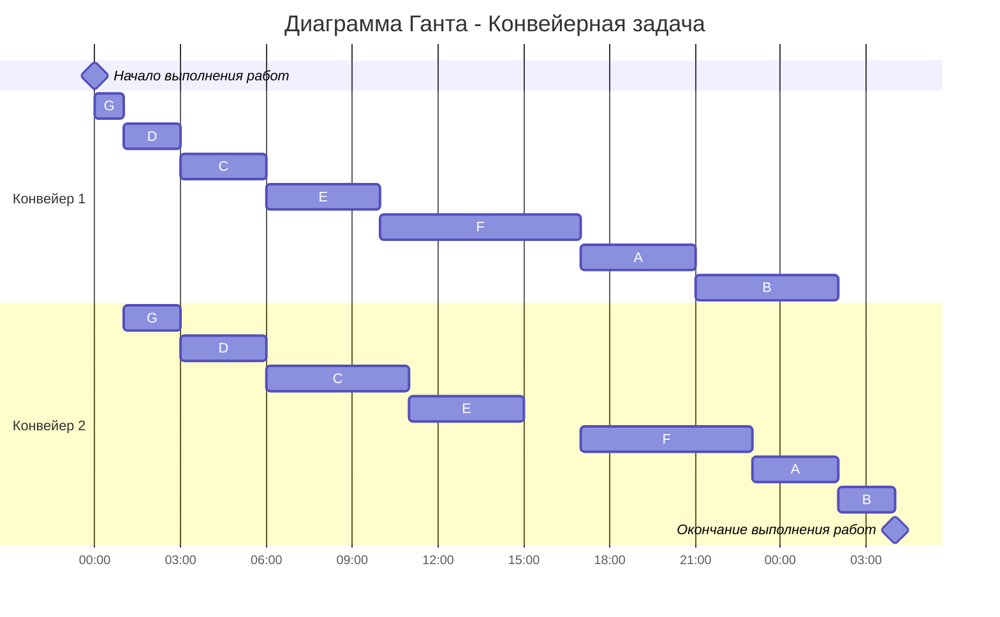

# Задание №8
# Оптимальное расписание. Ленточная стратегия/Конвейерная задача

Для каждого варианта представлены условия для двух задач. Для каждой задачи необходимо: 
1. Выбрать алгоритм решения задачи и обосновать свой выбор.
2. Применить выбранный алгоритм, в решении отобразить ход выполнения алгоритма с подробными комментариями.
3. В ответе указать длительность полученного расписания.
4. В ответе вывести полученное расписание **в виде диаграммы Ганта**. Диаграмму Ганта можно оформить с помощью плагина Mermaid, образцы оформления диаграмм представлены в данном файле, в описании алгоритмов.

**Решение должно содержать номер варианта и подробное пошаговое описание.**

Условия задачи расположены в файле `Задание 8/Варианты условий.md` в ветке main репозитория для ручных задач.
Решение задачи нужно оформить в формате Markdown в отдельном файле с названием <название_команды>.md, который добавить в каталог `Задание 8` данного репозитория.

## Информация по Markdown разметке:

Полезная информация для оформления решений:
- [Руководство по оформлению Markdown файлов](https://gist.github.com/Jekins/2bf2d0638163f1294637)
- [Система верстки LaTeX, которую можно использовать для математических формул](https://grammarware.net/text/syutkin/MathInLaTeX.pdf)
- [Рисуем диаграммы Mermaid.js в README-файлах GitHub](https://habr.com/ru/articles/652867/)

## Для выполнения задания необходимо:

1. Обновить ветку main в локальном репозитории (git pull).
2. От ветки main создать ветвь с названием `<название_команды>-task-8`, заменив `<название_команды>` на название команды, решившей задание.
3. В созданной ветке в каталог `Задание 8` добавить файл с решением задачи с названием `<название_команды>.md`.
4. Зафиксировать изменения на ветке (git commit).
5. Отравить ветку с изменениями в репозиторий на Github (git push).
6. Создать на Github запрос на слияние (pull request), указав в качестве base ветки `main`, в качестве compare ветки `<название_команды>-task-8`.

## Ленточная стратегия
### Постановка задачи:  
1. Количество заданий произвольно;  
2. Каждое задание имеет собственную длительность;  
3. Задания независимы - несколько заданий может выполняться разными исполнителями одновременно, но в каждый момент времени одно задание должно выполняться только одним исполнителем;  
4. Разрешены прерывания при выполнении заданий - задание прерванное одним исполнителем может быть продолжено другим;  
5. Количество исполнителей произвольно, но не меняется в ходе выполнения заданий;  
6. Исполнители универсальны, то есть могут выполнять любые задания;
7. Производительность работников, размеры оплаты из труда и т.д. не учитываются;
8. Требуется построить расписание выполнения всех заданий в кратчайшие сроки.

### Алгоритм:
1. Необходимо выбрать наибольшую длительность Tmax среди заданий.    

$$  
T_{max} = max\{t_1, t_2, ..., t_n\}  
$$  

где tn - задание с номером n.  
2. Необходимо рассчитать среднюю продолжительность заданий для одного исполнителя Tavg, то есть разделить сумму продолжительностей заданий на **количество исполнителей**.    

$$  
T_{avg} = \frac {\sum_{i=1}^n  t_i}{k}  
$$  

где k - количество исполнителей.  
3. Длительность оптимального расписания Topt определяется как максимум из рассчитанных ранее средней продолжительности для исполнителя и наибольшей длительности заданий.  

$$  
T_{opt} = max \\{T_{max} , T_{avg} \\}  
$$  

4. Задания в исходном порядке разрезаются на "ленты" длиной Topt, которые распределяются по исполнителям, при этом "разрез ленты" может производиться внутри задания, что означает прерывание данного задания. Ленты могут представляться в виде диаграммы Ганта.

```mermaid
gantt
    title Диаграмма Ганта - Ленточная стратегия для 5 исполнителей
    dateFormat  HH:mm    
    axisFormat %H:%M
    Начало выполнения работ : milestone, m1, 00:00, 0h
    section Исполнитель 1
    Задача A         :a1, 00:00, 3h
    Задача B         :a2, after a1, 4h
    Задача C         :a3, after a2, 6h
    Задача D         :after a3, 4h
    section Исполнитель 2
    Задача D         :b1, 00:00, 3h
    Задача E         :b2, after b1, 7h
    Задача F         :after b2, 7h
    section Исполнитель 3
    Задача F         :c1, 00:00, 2h
    Задача G         :c2, after c1, 10h
    Задача H         :after c2, 5h
    section Исполнитель 4
    Задача H         :d1, 00:00, 7h
    Задача I         :after d1, 10h
    section Исполнитель 5
    Задача I         :00:00, 7h
    Окончание выполнения работ : milestone, m2, 17:00, 0h
```

## Конвейерная задача
### Постановка конвейерной задачи:
1. Количество заданий произвольно;
2. Каждое задание состоит из двух последовательных этапов, длительность которых произвольна;
3. Задания независимы;
4. Запрещены прерывания при выполнении заданий;
5. Количество работников строго 2;
6. Первый работник выполняет только первый этап каждого задания, второй работник — только второй этап каждого задания;
7. Производительность работников, размеры оплаты из труда и т.д. не учитываются;
8. Требуется построить расписание выполнения всех заданий в кратчайшие сроки.

### Алгоритм Джонсона
Пусть аi и bi, — это длительности первого и второго 
этапов i-го задания. 

Разобьём список всех заданий на две группы. В первую группу попадают задания, у которых аi <= bi. Во вторую группу - все остальные задания. 

Задания из первой группы отсортируем в порядке возрастания величин аi. Задания из второй группы отсортируем в порядке убывания величин bi.

Согласно алгоритму Джонсона, расписание получается кратчайшим, если сначала выполнить все задания из первой группы в отсортированном порядке, а затем — все задания из второй группы также в отсортированном порядке.

