# Задание №8
# Оптимальное расписание. Ленточная стратегия/Конвейерная задача

## Задание
Для каждого варианта представлены условия для двух задач. Для каждой задачи необходимо построить расписание, выполняемое в кратчайшие сроки: 
1. Выбрать алгоритм решения задачи и обосновать свой выбор.
2. Применить выбранный алгоритм, в решении отобразить ход выполнения алгоритма с **подробными комментариями**.
3. В ответе указать длительность полученного расписания.
4. В ответе вывести полученное расписание в виде диаграммы Ганта.

### Вариант 3:
1. Имеется 9 независимых заданий, каждое из которых состоит из двух последовательных этапов, и 2 исполнителя, исполнитель 1 выполняет только первый этап задания, исполнитель 2 - только второй. Длительность заданий (по этапам): (4, 3), (5, 5), (4, 6), (7, 8), (3, 4), (6, 3), (2, 3), (6, 7), (5, 6).
2. Имеется 7 независимых заданий и 5 универсальных исполнителей. Прерывания задач допускаются. Длительность заданий: 4, 7, 10, 4, 6, 8, 6.

## 1. Конвейерная задача
Первая задача по постановке является конвейерной задачей:
1. Количество заданий произвольно;
2. Каждое задание состоит из двух последовательных этапов, длительность которых произвольна;
3. Задания независимы;
4. Запрещены прерывания при выполнении заданий;
5. Количество работников строго 2;
6. Первый работник выполняет только первый этап каждого задания, второй работник — только второй этап каждого задания;
7. Производительность работников, размеры оплаты из труда и т.д. не учитываются;
8. Требуется построить расписание выполнения всех заданий в кратчайшие сроки.

Решим её, используя алгоритм Джонсона
### Алгоритм Джонсона
Пусть аi и bi, — это длительности первого и второго 
этапов i-го задания:

---
| Этап/Задание   | A   | B   | C   | D   | E   | F   | G   | H   | I   |
|-----|-----|-----|-----|-----|-----|-----|-----|-----|-----|
| a  | 4  | 5  | 4  | 7  | 3  | 6  | 2  | 6  | 5  |
| b | 3  | 5  | 6  | 8  | 4  | 3  | 3  | 7  | 6  |

Разобьём список всех заданий на две группы. В первую группу попадают задания, у которых аi <= bi. Во вторую группу - все остальные задания: 

Группа 1:
B(5, 5), C(4, 6), D(7, 8), E(3, 4), G(2, 3), H(6, 7), I(5, 6)  
Группа 2:
A(4, 3), F(6, 3) 

Задания из первой группы отсортируем в порядке возрастания величин аi. Задания из второй группы отсортируем в порядке убывания величин bi:

1. G(2, 3), E(3, 4), C(4, 6), B(5, 5), I(5, 6), H(6, 7), D(7, 8)
2. A(4, 3), F(6, 3)

Согласно алгоритму Джонсона, расписание получается кратчайшим, если сначала выполнить все задания из первой группы в отсортированном порядке, а затем — все задания из второй группы также в отсортированном порядке, то есть в последовательности:
G(2, 3), E(3, 4), C(4, 6), B(5, 5), I(5, 6), H(6, 7), D(7, 8), A(4, 3), F(6, 3)

```mermaid
gantt
    title Диаграмма Ганта - Конвейерная задача
    dateFormat s   
    axisFormat %S
    Начало выполнения работ : milestone, m1, 01 00:00, 0h
    section Конвейер 1
    G         :a1, 01 00:00, 2s
    E         :a2, after a1, 3s
    C         :a3, after a2, 4s
    B         :a4, after a3, 5s
    I         :a5, after a4, 5s
    H         :a6, after a5, 6s
    D         :a7, after a6, 7s
    A         :a8, after a7, 4s
    F         :a9, after a8, 5s
    section Конвейер 2
    G         :b1, 01 00:00:02, 3s
    E         :b2, after b1, 4s
    C         :b3, after b2, 6s
    B         :b4, after b3, 5s
    I         :b5, after b4, 6s
    H         :b6, after b5, 7s
    D         :b7, after b6, 8s
    A         :b8, after b7, 3s
    F         :b9, after b8, 3s
    Окончание выполнения работ : milestone, m2, 01 00:00:47, 0h
```

Посчитаем суммарное количество единиц времени, затраченных на выполнение двух заданий:
2 + 3 + 4 + 5 + 5 + 6 + 7 + 4 + 5 + 3 + 3 = 47

## 2. Ленточная стратегия
Вторая задача по постановке является ленточной стратегией:
### Постановка задачи:  
1. Количество заданий произвольно;  
2. Каждое задание имеет собственную длительность;  
3. Задания независимы - несколько заданий может выполняться разными исполнителями одновременно, но в каждый момент времени одно задание должно выполняться только одним исполнителем;  
4. Разрешены прерывания при выполнении заданий - задание прерванное одним исполнителем может быть продолжено другим;  
5. Количество исполнителей произвольно, но не меняется в ходе выполнения заданий;  
6. Исполнители универсальны, то есть могут выполнять любые задания;
7. Производительность работников, размеры оплаты из труда и т.д. не учитываются;
8. Требуется построить расписание выполнения всех заданий в кратчайшие сроки.

### Алгоритм:
1. Необходимо выбрать наибольшую длительность Tmax среди заданий.    

$$  
T_{max} = max \\{t_1, t_2, ..., t_n \\} = max \\{4, 7, 10, 4, 6, 8, 6 \\} = 10
$$  

2. Необходимо рассчитать среднюю продолжительность заданий для одного исполнителя Tavg, то есть разделить сумму продолжительностей заданий на **количество исполнителей** (5).    

$$  
T_{avg} = \frac {\sum_{i=1}^n  t_i}{k} = \frac {4 + 7 + 10 + 4 + 6 + 8 + 6}{5} = \frac {45}{5} = 9
$$

где k - количество исполнителей.

3. Длительность оптимального расписания Topt определяется как максимум из рассчитанных ранее средней продолжительности для исполнителя и наибольшей длительности заданий:

$$  
T_{opt} = max \\{T_{max}, T_{avg} \\} = max \\{10, 9 \\} = 10
$$  

4. Задания в исходном порядке разрезаются на "ленты" длиной 10, которые распределяются по исполнителям, при этом "разрез ленты" может производиться внутри задания, что означает прерывание данного задания. Ленты могут представляться в виде диаграммы Ганта:

```mermaid
gantt
    title Диаграмма Ганта - Ленточная стратегия
    dateFormat s   
    axisFormat %S
    Начало выполнения работ : milestone, m1, 01 00:00, 0h
    section Исполнитель 1
    Задача A         :a1, 01 00:00, 4s
    Задача B         :a2, after a1, 6s
    section Исполнитель 2
    Задача B         :b1, 01 00:00, 1s
    Задача C         :b2, after b1, 9s
    section Исполнитель 3
    Задача C         :c1, 01 00:00, 1s
    Задача D         :c2, after c1, 4s
    Задача E         :after c2, 5s
    section Исполнитель 4
    Задача E         :d1, 01 00:00, 1s
    Задача F         :d2, after d1, 8s
    Задача G         :after d2, 1s
    section Исполнитель 5
    Задача G         :e1, 01 00:00, 5s
    Окончание выполнения работ : milestone, m2, 01 00:00:10, 0h
```

* I исполнитель: от 0 до 4 - задание А, от 4 до 10 - задание В;
* II исполнитель: от 0 до 1 - задание B, от 1 до 10 - задание C;
* III исполнитель: от 0 до 1 - задание C, от 1 до 5 - задание D, от 5 до 10 - задание E;
* IV исполнитель: от 0 до 1 - задание E, от 1 до 9 - задание F, от 9 до 10 - задание G;
* V исполнитель: от 0 до 5 - задание G;