# Условие
## Вариант 6:
1. Имеется 8 независимых заданий и 4 универсальных исполнителя. Прерывания задач допускаются. Длительность заданий: 5, 7, 9, 5, 6, 7, 6, 11.
2. Имеется 8 независимых заданий, каждое из которых состоит из двух последовательных этапов, и 2 исполнителя, исполнитель 1 выполняет только первый этап задания, исполнитель 2 - только второй. Длительность заданий (по этапам): (2, 1), (12, 15), (2, 1), (3, 4), (12, 13), (8, 9), (15, 6), (5, 5).

# Решение
## Задание 1
Для решения этой задачи подойдет ленточная стратегия, так как по условиям разрешены прерываня при выполнении заданий и количество работников фиксировано.

Для применения этой стратегии необходимо вычилисть значение переменной $T_{opt}$:

$$
T_{opt} = max \\{t_1, t_2, ..., t_n, \frac{t_1 + t_2 + ... + t_n}{k} \\}
$$

где $t_1, t_2, ..., t_n$ - длительность каждой работы, $k$ - количество работников. В нашем случае:

$$
T_{avg} = \frac{5+7+9+5+6+7+6+11}{4} = 14
\\\\
T_{opt} = 14
$$

Далее составим диаграмму Ганта, разрезав все задания для каждого исполнителя так, чтобы каждый в итоге потратил $T_{opt}$ времени.

| Задание      | A   | B   | C   | D   | E   | F   | G   | H   |
|:-------------|:---:|:---:|:---:|:---:|:---:|:---:|:---:|:---:|
| Длительность | 5   | 7   | 9   | 5   | 6   | 7   | 6   | 11  |

```mermaid

%%{init: {'theme':'base', 'themeVariables': { 'primaryColor':'#4A90E2', 'primaryTextColor':'#fff', 'primaryBorderColor':'#2E5C8A', 'secondaryColor':'#E74C3C', 'tertiaryColor':'#2ECC71', 'noteBkgColor':'#9B59B6'}}}%%
gantt
    dateFormat s
    axisFormat %s
    section Все задачи
    	A: a1, 0, 5s
        B: a2, 5, 7s
        C1: a3, 12, 2s
        C2: crit, a4, 14, 7s
        D: crit, a5, 21, 5s
        E1: crit, a6, 26, 2s
        E2: active, a7, 28, 4s
        F: active, a8, 32, 7s
        G1: active, a9, 39, 3s
        G2: done, a10, 42, 3s
        H: done, a11, 45, 11s
```

```mermaid

%%{init: {'theme':'base', 'themeVariables': { 'primaryColor':'#4A90E2', 'primaryTextColor':'#fff', 'primaryBorderColor':'#2E5C8A', 'secondaryColor':'#E74C3C', 'tertiaryColor':'#2ECC71', 'noteBkgColor':'#9B59B6'}}}%%
gantt
    dateFormat s
    axisFormat %s
    section Все исполнители
        A: a1, 0, 5s
        B: a2, 5, 7s
        C1: a3, 12, 2s
        C2: crit, a4, 0, 7s
        D: crit, a5, 7, 5s
        E1: crit, a6, 12, 2s
        E2: active, a7, 0, 4s
        F: active, a8, 4, 7s
        G1: active, a9, 11, 3s
        G2: done, a10, 0, 3s
        H: done, a11, 3, 11s
```

## Задание 2

Для решения данной задачи подходит алгоритм Джонсона, так как по условиям у нас нет прерываний работы, этапов работ всего две и количество работников фиксированное.

Для применения алгоритма нужно образовать две группы - первая группа содержит в себе задачи, в которых первый этап короче второго, а во второй группе задачи, в которых первый этап длиннее второго.

Группа А: (12, 15), (3, 4), (12, 13), (8, 9), (5, 5)

Группа Б: (2, 1), (2, 1), (15, 6)

Далее необходимо отсортировать первую группу по возрастанию первого этапа, а вторую в порядке убывания второго этапа.

Группа А: (3, 4), (5, 5), (8, 9), (12, 13), (12, 15)

Группа Б: (15, 6), (2, 1), (2, 1)

Теперь необходимо объеденить две группы для получения итогового ответа:

((3, 4), (5, 5), (8, 9), (12, 13), (12, 15), (15, 6), (2, 1), (2, 1)

### Диграмма Ганта:

```mermaid
gantt
    dateFormat s
    axisFormat %s
    section Исполнитель 1
        (3, 4): a1, 0, 3s
        (5, 5): a2, 3, 5s
        (8, 9): a3, 8, 8s
        (12, 13): a4, 16, 12s
        (12, 15): a5, 28, 12s
        (15, 6): a6, 40, 15s
        (2, 1): a7, 55, 2s
        (2, 1): a8, 57, 2s
    section Исполнитель 2
        (3, 4): a1, 3, 4s
        (5, 5): a2, 8, 5s
        (8, 9): a3, 16, 9s
        (12, 13): a4, 28, 13s
        (12, 15): a5, 41, 15s
        (15, 6): a6, 56, 4s
```

```mermaid
gantt
    dateFormat s
    axisFormat %s
    section Исполнитель 1 (отрезок 2)
    section Исполнитель 2 (отрезок 2 (после 1763067660 секунды))
        (15, 6): a6, 0, 2s
        (2, 1): a6, 2, 1s
        (2, 1): a6, 3, 1s
```

В итоге всего затрачено времени 64 единиц
