# Решение задачи 8

---

## Часть 1: 7 независимых заданий и 5 исполнителей

**Дано:**
- Длительности заданий: $5,\ 5,\ 6,\ 7,\ 6,\ 11,\ 15$
- Количество исполнителей: $5$
- Прерывания задач разрешены.

**Решение:**
1. Найдем максимальную длительность задания:
   $$
   T_{\text{max}} = \max(5,\ 5,\ 6,\ 7,\ 6,\ 11,\ 15) = 15
   $$

2. Вычислим среднюю нагрузку на одного исполнителя:
   $$
   T_{\text{avg}} = \frac{5 + 5 + 6 + 7 + 6 + 11 + 15}{5} = \frac{55}{5} = 11
   $$

3. Оптимальное время выполнения определяется как:
   $$
   T_{\text{opt}} = \max(T_{\text{max}},\ T_{\text{avg}}) = \max(15,\ 11) = 15
   $$

**Ответ:**  
**15**

```mermaid
gantt
    title Диаграмма Ганта - Ленточная стратегия для 5 исполнителей
    dateFormat  HH:mm    
    axisFormat %H:%M
    Начало выполнения работ : milestone, m1, 00:00, 0h
section Исполнитель 1
    Задача G (15) :a1, 00:00, 15h 
section Исполнитель 2
    Задача F (11) :b1, 00:00, 11h
    Простой :b2, after b1, 4h
section Исполнитель 3
    Задача D (7) :c1, 00:00, 7h
    Задача E (6) :c2, after c1, 6h
    Простой :c3, after c2, 2h
section Исполнитель 4
    Задача C (6) :d1, 00:00, 6h
    Задача B (5) :d2, after d1, 5h
    Простой :d3, after d2, 4h
    section Исполнитель 5
    Задача A (5) :e1, 00:00, 5h
    Простой :e2, after e1, 10h
    Окончание выполнения работ : milestone, m2, 15:00, 0h
```

---

## Часть 2: Конвейерная задача с 10 заданиями и 2 исполнителями

**Дано:**
- Длительности этапов заданий:  
  $(4,7),\ (4,5),\ (8,6),\ (6,8),\ (5,5),\ (6,4),\ (2,4),\ (6,3),\ (4,9),\ (5,8)$
- Исполнитель 1 выполняет первый этап ($a_i$), Исполнитель 2 — второй этап ($b_i$).

**Решение (алгоритм Джонсона):**

1. **Разделение на группы:**
   - **Группа 1** ($a_i \leq b_i$):  
     $(2,4),\ (4,5),\ (4,7),\ (4,9),\ (5,5),\ (5,8),\ (6,8)$
   - **Группа 2** ($a_i > b_i$):  
     $(8,6),\ (6,4),\ (6,3)$

2. **Сортировка:**
   - Группа 1 отсортирована по возрастанию $a_i$.
   - Группа 2 отсортирована по убыванию $b_i$.

3. **Общий порядок выполнения:**  
   $(2,4),\ (4,5),\ (4,7),\ (4,9),\ (5,5),\ (5,8),\ (6,8),\ (8,6),\ (6,4),\ (6,3)$

4. **Расчёт времени завершения:**

   | Задание | $a_i$ | $b_i$ | $C_1$ (время окончания этапа 1) | $C_2$ (время окончания этапа 2) |
   |---------|--------|--------|----------------------------------|----------------------------------|
   | 1 | 2 | 4 | 2 | $2 + 4 = 6$ |
   | 2 | 4 | 5 | $2 + 4 = 6$ | $\max(6, 6) + 5 = 11$ |
   | 3 | 4 | 7 | $6 + 4 = 10$ | $\max(10, 11) + 7 = 18$ |
   | 4 | 4 | 9 | $10 + 4 = 14$ | $\max(14, 18) + 9 = 27$ |
   | 5 | 5 | 5 | $14 + 5 = 19$ | $\max(19, 27) + 5 = 32$ |
   | 6 | 5 | 8 | $19 + 5 = 24$ | $\max(24, 32) + 8 = 40$ |
   | 7 | 6 | 8 | $24 + 6 = 30$ | $\max(30, 40) + 8 = 48$ |
   | 8 | 8 | 6 | $30 + 8 = 38$ | $\max(38, 48) + 6 = 54$ |
   | 9 | 6 | 4 | $38 + 6 = 44$ | $\max(44, 54) + 4 = 58$ |
   | 10| 6 | 3 | $44 + 6 = 50$ | $\max(50, 58) + 3 = \textbf{61}$|

**Ответ:**  
**61**

