# Задание №8
# Оптимальное расписание. Ленточная стратегия/Конвейерная задача

## Задание
Для каждого варианта представлены условия для двух задач. Для каждой задачи необходимо построить расписание, выполняемое в кратчайшие сроки: 
1. Выбрать алгоритм решения задачи и обосновать свой выбор.
2. Применить выбранный алгоритм, в решении отобразить ход выполнения алгоритма с **подробными комментариями**.
3. В ответе указать длительность полученного расписания.
4. В ответе вывести полученное расписание в виде диаграммы Ганта.

### Вариант 9:
1. Имеется 8 независимых заданий и 5 универсальных исполнителей. Прерывания задач допускаются. Длительность заданий: 4, 6, 5, 6, 8, 9, 11, 16.
2. Имеется 8 независимых заданий, каждое из которых состоит из двух последовательных этапов, и 2 исполнителя, исполнитель 1 выполняет только первый этап задания, исполнитель 2 - только второй. Длительность заданий (по этапам): (1, 2), (5, 6), (8, 7), (5, 4), (2, 3), (3, 3), (4, 3), (2, 1).

## 1. Конвейерная задача
Первая задача по постановке является конвейерной задачей:
1. Количество заданий произвольно;
2. Каждое задание состоит из двух последовательных этапов, длительность которых произвольна;
3. Задания независимы;
4. Запрещены прерывания при выполнении заданий;
5. Количество работников строго 2;
6. Первый работник выполняет только первый этап каждого задания, второй работник — только второй этап каждого задания;
7. Производительность работников, размеры оплаты из труда и т.д. не учитываются;
8. Требуется построить расписание выполнения всех заданий в кратчайшие сроки.

Решим её, используя алгоритм Джонсона

### Алгоритм Джонсона
Пусть аi и bi — это длительности первого и второго 
этапов i-го задания:

---
| Этап/Задание | A | B | C | D | E | F | G | H |
|--------------|---|---|---|---|---|---|---|---|
| a (этап 1)   | 1 | 5 | 8 | 5 | 2 | 3 | 4 | 2 |
| b (этап 2)   | 2 | 6 | 7 | 4 | 3 | 3 | 3 | 1 |

### Применение алгоритма

**Шаг 1: Разбиение на группы**

Разобьём список всех заданий на две группы:
- **Первая группа:** задания, у которых аi ≤ bi (время на первом этапе меньше или равно времени на втором)
- **Вторая группа:** задания, у которых аi > bi (время на первом этапе больше времени на втором)

**Группа 1 (a ≤ b):**
- A(1, 2): 1 ≤ 2
- B(5, 6): 5 ≤ 6
- E(2, 3): 2 ≤ 3
- F(3, 3): 3 ≤ 3

**Группа 2 (a > b):**
- C(8, 7): 8 > 7
- D(5, 4): 5 > 4
- G(4, 3): 4 > 3
- H(2, 1): 2 > 1

**Итого:**
- **Группа 1:** A(1, 2), B(5, 6), E(2, 3), F(3, 3)
- **Группа 2:** C(8, 7), D(5, 4), G(4, 3), H(2, 1)

**Шаг 2: Сортировка групп**

Задания из первой группы сортируем в порядке возрастания величин аi (времени первого этапа):
- A(1, 2) → E(2, 3) → F(3, 3) → B(5, 6)

Задания из второй группы сортируем в порядке убывания величин bi (времени второго этапа):
- C(8, 7) имеет b=7
- D(5, 4) имеет b=4
- G(4, 3) и F(3, 3) имеют b=3
- H(2, 1) имеет b=1

**Оптимальная последовательность:**

$$
A(1, 2) → E(2, 3) → F(3, 3) → B(5, 6) → C(8, 7) → D(5, 4) → G(4, 3) → H(2, 1)
$$

### Диаграмма Ганта

```mermaid
gantt
    title Диаграмма Ганта - Конвейерная задача (Алгоритм Джонсона)
    dateFormat s   
    axisFormat %S
    Начало выполнения работ : milestone, m1, 01 00:00, 0h
    section Исполнитель 1
    A         :a1, 01 00:00, 1s
    E         :a2, after a1, 2s
    F         :a3, after a2, 3s
    B         :a4, after a3, 5s
    C         :a5, after a4, 8s
    D         :a6, after a5, 5s
    G         :a7, after a6, 4s
    H         :a8, after a7, 2s
    section Исполнитель 2
    A         :b1, 01 00:00:01, 2s
    E         :b2, after b1, 3s
    F         :b3, after b2, 3s
    Простой   :crit, b4idle, after b3, 2s
    B         :b4, after b4idle, 6s
    Простой   :crit, b5idle, after b4, 2s
    C         :b5, after b5idle, 7s
    D         :b6, after b5, 4s
    G         :b7, after b6, 3s
    H         :b8, after b7, 1s
    Окончание выполнения работ : milestone, m2, 01 00:00:34, 0h
```

**Итоговая длительность конвейерной задачи: 34 единицы времени**

---

## Ленточная стратегия

### Постановка задачи:  
1. Количество заданий произвольно;  
2. Каждое задание имеет собственную длительность;  
3. Задания независимы - несколько заданий может выполняться разными исполнителями одновременно, но в каждый момент времени одно задание должно выполняться только одним исполнителем;  
4. Разрешены прерывания при выполнении заданий - задание прерванное одним исполнителем может быть продолжено другим;  
5. Количество исполнителей произвольно, но не меняется в ходе выполнения заданий;  
6. Исполнители универсальны, то есть могут выполнять любые задания;
7. Производительность работников, размеры оплаты из труда и т.д. не учитываются;
8. Требуется построить расписание выполнения всех заданий в кратчайшие сроки.

### Исходные данные

Задания: A=4, B=6, C=5, D=6, E=8, F=9, G=11, H=16  
Количество исполнителей: k = 5

### Алгоритм:

**Шаг 1: Вычисление Tmax**

Необходимо выбрать наибольшую длительность Tmax среди заданий:

$$
T_{max} = max \{t_1, t_2, ..., t_n\} = max \{4, 6, 5, 6, 8, 9, 11, 16\} = 16
$$

**Шаг 2: Вычисление Tavg**

Необходимо рассчитать среднюю продолжительность заданий для одного исполнителя Tavg, то есть разделить сумму продолжительностей заданий на количество исполнителей:

$$
T_{avg} = \frac{\sum_{i=1}^n t_i}{k} = \frac{4 + 6 + 5 + 6 + 8 + 9 + 11 + 16}{5} = \frac{65}{5} = 13
$$

где k = 5 — количество исполнителей.

**Шаг 3: Определение Topt**

Длительность оптимального расписания Topt определяется как максимум из рассчитанных ранее средней продолжительности для исполнителя и наибольшей длительности заданий:

$$
T_{opt} = max \{T_{max}, T_{avg}\} = max \{16, 13\} = 16
$$

**Обоснование:** Расписание не может быть короче Tmax = 16, так как хотя бы одно задание длится 16 единиц. Также расписание не может быть короче Tavg = 13, так как суммарная работа должна быть распределена между исполнителями

### Диаграмма Ганта

```mermaid
gantt
    title Диаграмма Ганта - Ленточная стратегия
    dateFormat s   
    axisFormat %S
    Начало выполнения работ : milestone, m1, 01 00:00, 0h
    section Исполнитель 1
    Задание A         :a1, 01 00:00, 4s
    Задание B         :a2, after a1, 6s
    Задание C         :a3, after a2, 5s
    Задание D         :a4, after a3, 1s
    section Исполнитель 2
    Задание D         :b1, 01 00:00, 5s
    Задание E         :b2, after b1, 8s
    Задание F         :b3, after b2, 3s
    section Исполнитель 3
    Задание F         :c1, 01 00:00, 6s
    Задание G         :c2, after c1, 10s
    section Исполнитель 4
    Задание G         :d1, 01 00:00, 1s
    Задание H         :d2, after d1, 15s
    section Исполнитель 5
    Задание H         :e1, 01 00:00, 1s
    Окончание выполнения работ : milestone, m2, 01 00:00:16, 0h
```

### Детальное распределение:

* **Исполнитель 1:** от 0 до 4 — задание A, от 4 до 10 — задание B, от 10 до 15 — задание C, от 15 до 16 — задание D;
* **Исполнитель 2:** от 0 до 5 — задание D, от 5 до 13 — задание E, от 13 до 16 — задание F;
* **Исполнитель 3:** от 0 до 6 — задание F, от 6 до 16 — задание G;
* **Исполнитель 4:** от 0 до 1 — задание G, от 1 до 16 — задание H;
* **Исполнитель 5:** от 0 до 1 — задание H;

**Итоговая длительность по ленточной стратегии: 16 единиц времени**

---

## Итоговые результаты

| Задача | Алгоритм | Длительность расписания |
|--------|----------|-----------------------------------|
| Задача 1 (Конвейерная) | Алгоритм Джонсона | **34 единицы** |
| Задача 2 (Ленточная стратегия) | Ленточная стратегия | **16 единиц** |
