# Задание №8 - Вариант 4

### 1. суть задания

1) Ленточная стратегия (несколько  исполнителей, прерывания разрешены). Оптимальная длительность расписания задаётся
   $$T_{max} = max t_1, t_2, \dots, t_n \qquad T_{avg} = \frac{\sum_{i=1}^{n} t_i}{k} \qquad T_{opt} = max(T_{max}, \, T_{avg})$$
   ПОтом режем исходный список работ на ленты длиной $T_{opt}$ и исполняем параллельно
2) Конвейерная задача (две последовательные операции у каждой работы, 2 исполнителя, прерываний нет). Решается алгоритмом Джонсона. 

### 2. Исходные данные

Ленточная стратегия: 9 независимых заданий, 5 исполнителей.  
Длительности: 4, 7, 10, 5, 6, 8, 6, 12, 17. Прерывания есть.  
Работы режем именно в исходном порядке.

Конвейерная задача: 8 заданий, пары длительностей $(a_i, b_i)$ -
A(5,4), B(1,4), C(8,11), D(10,10), E(7,6), F(5,6), G(7,8), H(2,1)  
Исполнитель 1 делает только $a_i$, исполнитель 2 - только $b_i$. Прерываний нет.

### 3. Ленточная стратегия

#### Шаг 1
Сумма длительностей: 4+7+10+5+6+8+6+12+17 = 75.  
Число исполнителей $k=5$. Тогда

$T_{avg} = 75/5 = 15$

$T_{max} = 17$

$T_{opt} = max(17,15) = 17$ - минимально возможная длительность

#### Шаг 2

Границы: 0–17, 17–34, 34–51, 51–68, 68–85. Режем в исходном порядке:
- Лента 1 (0–17): T1(4), T2(7), T3(6 из 10)  
- Лента 2 (17–34): T3(ост. 4), T4(5), T5(6), T6(2 из 8)  
- Лента 3 (34–51): T6(ост. 6), T7(6), T8(5 из 12)  
- Лента 4 (51–68): T8(ост. 7), T9(10 из 17)  
- Лента 5 (68–85): T9(ост. 7)

Каждую ленту отдаём отдельному исполнителю, все стартуют в 00:00 и финиш будет в 00:17

```mermaid
gantt
    title Диаграмма Ганта - Ленточная стратегия 5 исполнителей
    dateFormat  HH:mm
    axisFormat  %H:%M
    Начало работ : milestone, m0, 00:00, 0h

    section Исполнитель 1
    T1                : e1a, 00:00, 4h
    T2                : e1b, after e1a, 7h
    T3                : e1c, after e1b, 6h

    section Исполнитель 2
    T3                : e2a, 00:00, 4h
    T4                : e2b, after e2a, 5h
    T5                : e2c, after e2b, 6h
    T6                : e2d, after e2c, 2h

    section Исполнитель 3
    T6                : e3a, 00:00, 6h
    T7                : e3b, after e3a, 6h
    T8                : e3c, after e3b, 5h

    section Исполнитель 4
    T8                : e4a, 00:00, 7h
    T9                : e4b, after e4a, 10h

    section Исполнитель 5
    T9                : e5a, 00:00, 7h

    Окончание работ : milestone, m1, 17:00, 0h
```

### 4. Конвейерная задача - алгоритм Джонсона

#### Шаг 1
- Группа 1 $(a_i \le b_i)$: B(1,4), C(8,11), D(10,10), F(5,6), G(7,8)
- Группа 2 $(a_i > b_i)$: A(5,4), E(7,6), H(2,1)

#### Шаг 2
- Группа 1 - по возрастанию $a_i$: B, F, G, C, D
- Группа 2 - по убыванию $b_i$: E, A, H

#### Шаг 3
Соединяем: B, F, G, C, D, E, A, H

#### Шаг 4

### 5.Итоги

Ленты: $T_{opt}$ = 17

Конвейер: порядок B-F-G-C-D-E-A-H, длительность 53  
