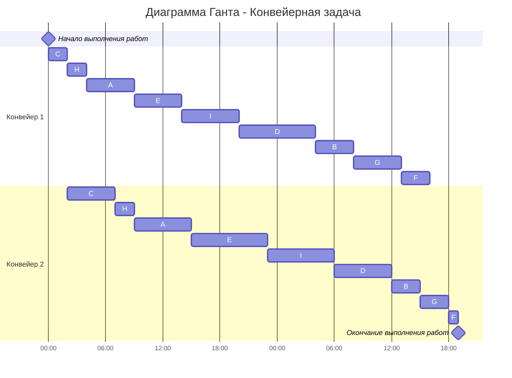

# Вариант 2
## Задание
Для каждой задачи необходимо: 
1. Выбрать алгоритм решения задачи и обосновать свой выбор.
2. Применить выбранный алгоритм, в решении отобразить ход выполнения алгоритма с **подробными комментариями**.
3. В ответе указать длительность полученного расписания.
4. В ответе вывести полученное расписание в виде диаграммы Ганта.
---
## Ленточная стратегия
Имеется 7 независимых заданий и 4 универсальных исполнителя. Прерывания задач допускаются. Длительность заданий: 4, 7, 4, 4, 6, 8, 7.

#### Решение
Поскольку задания независимы и их выполнение можно прерывать, то их можно выполнять параллельно по частям разными исполнителями. Тогда для решения задачи воспользуемся **ленточной стратегией**.

Введём буквенные обозначения для каждого задания:

- $A(4);$
- $B(7);$
- $C(4)$;
- $D(4)$;
- $E(6)$;
- $F(8)$;
- $G(7)$.

1. Определим наибольшую длительность выполнения заданий:

$$
T_{max} = \max \\{ A, \ldots, G \\} = 8 \quad \text{(задание $F$)}.
$$

2. Вычислим среднюю продолжительность заданий для одного исполнителя по формуле

$$
T_{avg} = \dfrac{\sum^n_{i=1}t_i}{k},
$$ 

где $t_i$ - это длительность каждого задания, а $k$ - количество исполнителей.

Получаем:

$$
T_{avg} = \frac{4+7+4+4+6+8+7} {4} = 10.
$$

3. Имея значения $T_{max}$ и $T_{avg}$, определим длительность оптимального расписание $T_{opt}$ как максимум из них:

$$
T_{opt} = \max \\{T_{max}, T_{avg} \\} = T_{avg} = 10.
$$

Величина $T_{opt}$ означает, что для каждого из 4-х исполнителей длительности всех заданий будут укладываться на лентах длиной 10 единиц времени, и это минимально возможная длина лент.

4. Распределим задания на временных лентах с учётом того, что их выполнение можно прерывать, а невыполненную часть передать другому исполнителю.

#### Ответ

```mermaid
gantt
    title Диаграмма Ганта - Ленточная стратегия для 4 исполнителей
    dateFormat  HH:mm    
    axisFormat %H:%M
    todayMarker off
    Начало выполнения работ : milestone, m1, 00:00, 0h
    section Исполнитель 1
    Задача A         :a1, 00:00, 4h
    Задача B         :a2, after a1, 6h
    section Исполнитель 2
    Задача B         :b1, 00:00, 1h
    Задача C         :b2, after b1, 4h
    Задача D         :b3, after b2, 4h
    Задача E         :b4, after b3, 1h
    section Исполнитель 3
    Задача E         :c1, 00:00, 5h
    Задача F         :c2, after c1, 5h
    section Исполнитель 4
    Задача F         :d1, 00:00, 3h
    Задача G         :d2, after d1, 7h
    Окончание выполнения работ : milestone, m2, 10:00, 0h
```

При параллельной работе всех исполнителей все задачи будут выполнены за 10 единиц времени, и это время минимально. 

---
## Конвейерная задача
Имеется 9 независимых заданий, каждое из которых состоит из двух последовательных этапов, и 2 исполнителя, исполнитель 1 выполняет только первый этап задания, исполнитель 2 - только второй. Длительность заданий (по этапам): (5, 6), (4, 3), (2, 5), (8, 6), (5, 8), (3, 1), (5, 3), (2, 2), (6, 7).

#### Решение
Так как в задаче есть 2 исполнителя, задания независимы и выполняются по этапам, постановка задачи соответствует конвейерной задаче, для решения которой можно применить **алгоритм Джонсона**.

Для каждого задания введём буквенное обозначение:

- $A (5, 6);$
- $B (4, 3);$
- $C (2, 5);$
- $D (8, 6);$
- $E (5, 8);$
- $F (3, 1);$
- $G (5, 3);$
- $H (2, 2);$ 
- $I (6, 7).$

Пусть этапу каждого задания соответствует нижний индекс, тогда $A_1$ обозначает первый этап первого задания.

1. Разделим все задания на две группы. В первую группу отнесём те, у которых длительность второго этапа не меньше, чем у первого, т.е. выполняется неравенство $a_i \le b_i$, где для каждого $i$-го задания $a_i$ - время на выполнение первого этапа, а $b_i$ - время на выполнение второго этапа. Во вторую группу выделим все остальные задания, для которых $a_i > b_i$.

| Первая группа $(a_i \le b_i)$ | Вторая группа $(a_i > b_i)$|
|:------------:|:------------:|
| $A (5, 6)$ | $B (4, 3)$ |
| $C (2, 5)$ | $D (8, 6)$ |
| $E (5, 8)$ | $F (3, 1)$ |
| $H (2, 2)$ | $G (5, 3)$ |
| $I (6, 7)$ |  |

2.  Отсортируем задания в **первой группе** в порядке *возрастания* длительности *первого* этапа:

| Порядок| Задание|
|:------------:|:------------:|
| 1 | $C (2, 5)$ |
| 2 | $H (2, 2)$ |
| 3 | $A (5, 6)$ |
| 4 | $E (5, 8)$ |
| 5 | $I (6, 7)$ |

3. **Вторую группу** заданий отсортируем в порядке *убывания* длительности *второго* этапа:

| Порядок| Задание|
|:-----:|:-------:|
| 1 | $D (8, 6)$ |
| 2 | $B (4, 3)$ |
| 3 | $G (5, 3)$ |
| 4 | $F (3, 1)$ |

4. Согласно алгоритму Джонсона, кратчайшее расписание будет включать в себя выполнение заданий сначала из первой группы в отсортированном порядке, затем - из второй группы также в отсортированном порядке. В итоге имеем расписание:

| Порядок| Задание|
|:-----:|:-------:|
| 1 | $C (2, 5)$ |
| 2 | $H (2, 2)$ |
| 3 | $A (5, 6)$ |
| 4 | $E (5, 8)$|
| 5 | $I (6, 7)$ |
| 6 | $D (8, 6)$ |
| 7 | $B (4, 3)$ |
| 8 | $G (5, 3)$ |
| 9 | $F (3, 1)$ |

#### Ответ:

Два исполнителя выполнят все задания за 43 единицы времени, и это время является минимальным. Для первого конвейера время простоя составляет 3 единицы времени (в конце выполнения работ), для второго конвейера - 2 единицы (в начале).
