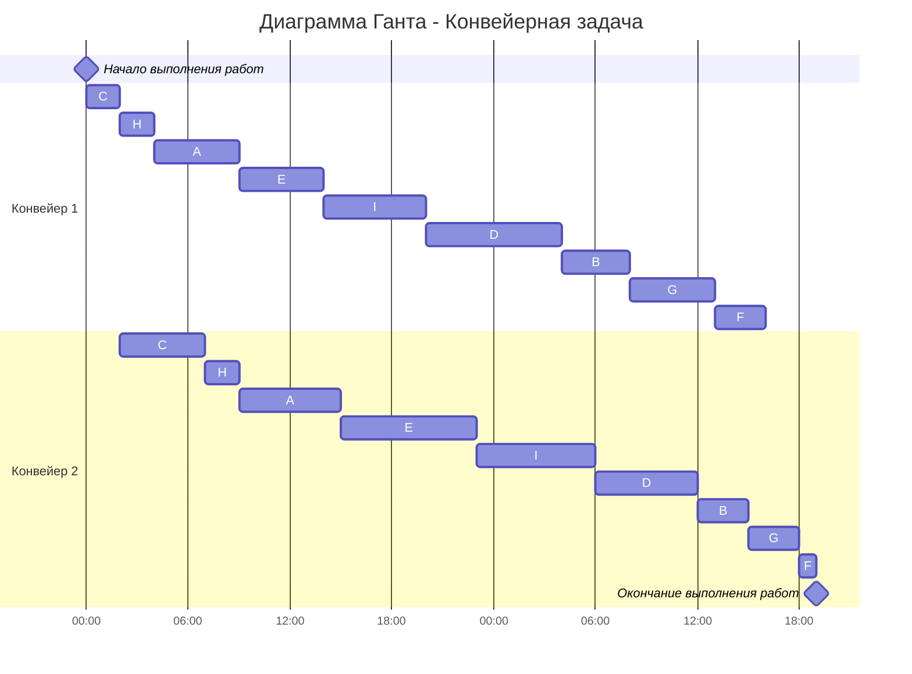

# Вариант 2
## Задание
Для каждой задачи необходимо: 
1. Выбрать алгоритм решения задачи и обосновать свой выбор.
2. Применить выбранный алгоритм, в решении отобразить ход выполнения алгоритма с **подробными комментариями**.
3. В ответе указать длительность полученного расписания.
4. В ответе вывести полученное расписание в виде диаграммы Ганта.
---
## Оптимальное расписание
Имеется 7 независимых заданий и 4 универсальных исполнителя. Длительность заданий: 4, 7, 4, 4, 6, 8, 7.

---
## Конвейерная задача
Имеется 9 независимых заданий, каждое из которых состоит из двух последовательных этапов, и 2 исполнителя, исполнитель 1 выполняет только первый этап задания, исполнитель 2 - только второй. Длительность заданий (по этапам): (5, 6), (4, 3), (2, 5), (8, 6), (5, 8), (3, 1), (5, 3), (2, 2), (6, 7).

#### Решение
Так как в задаче есть 2 исполнителя, задания независимы и выполняются по этапам, постановка задачи соответствует конвейерной задаче, для решения которой можно применить **алгоритм Джонсона**.

Для каждого задания введём обозначение:

- $A (5, 6);$
- $B (4, 3);$
- $C (2, 5);$
- $D (8, 6);$
- $E (5, 8);$
- $F (3, 1);$
- $G (5, 3);$
- $H (2, 2);$ 
- $I (6, 7).$

Пусть этапу каждого задания соответствует нижний индекс, тогда $A_1$ обозначает первый этап первого задания.

Теперь разделим все задания на две группы. В первую группу отнесём те, у которых длительность второго этапа не меньше, чем у первого, т.е. выполняется неравенство $N_1 \le N_2$. Во вторую группу выделим все остальные задания, для которых $N_1 > N_2$.

| Первая группа $(N_1 \le N_2)$ | Вторая группа $(N_1 > N_2)$|
|:------------:|:------------:|
| $A (5, 6)$ | $B (4, 3)$ |
| $C (2, 5)$ | $D (8, 6)$ |
| $E (5, 8)$ | $F (3, 1)$ |
| $H (2, 2)$ | $G (5, 3)$ |
| $I (6, 7)$ |  |

Отсортируем задания в **первой группе** в порядке *возрастания* длительности *первого* этапа:

1. $C (2, 5)$
2. $H (2, 2)$
3. $A (5, 6)$
4. $E (5, 8)$
5. $I (6, 7)$

**Вторую группу** заданий отсортируем в порядке *убывания* длительности *второго* этапа:

1. $D (8, 6)$
2. $B (4, 3)$
3. $G (5, 3)$
4. $F (3, 1)$

Согласно алгоритму Джонсона, кратчайшее расписание будет включать в себя сначала выполнение заданий из первой группы в отсортированном порядке, затем - из второй группы также в отсортированном порядке. В итоге имеем расписание:

1. $C (2, 5)$
2. $H (2, 2)$
3. $A (5, 6)$
4. $E (5, 8)$
5. $I (6, 7)$
6. $D (8, 6)$
7. $B (4, 3)$
8. $G (5, 3)$
9. $F (3, 1)$

Изобразим полученное расписание в виде диаграммы Ганта:

